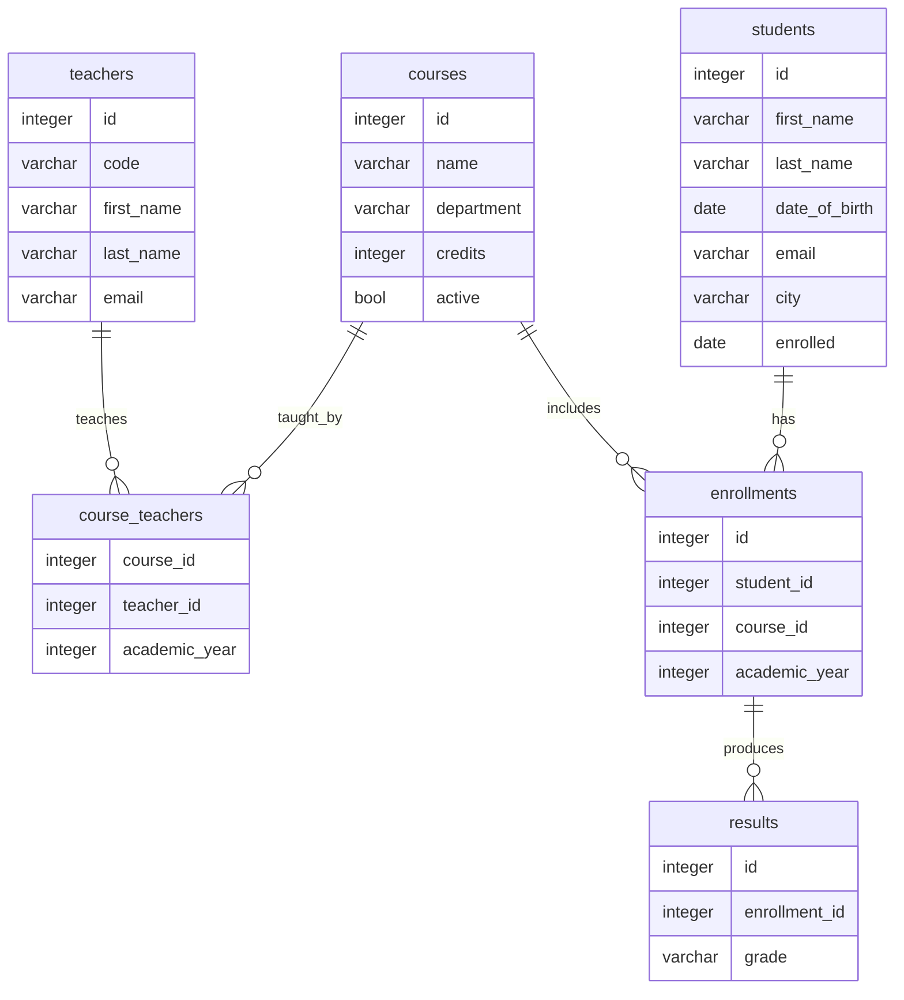

# Relational Databases

### 1. What is a Relational Database?

A relational database is a type of database that stores data in structured tables, where the relationships between the data are explicitly recorded. This model was introduced in the 1970s by Edgar F. Codd and has since formed the basis of many database management systems (DBMS).

In a relational database:

- Data is organized into rows (records) and columns (attributes).
- Tables are linked by keys (primary and foreign).
- Structured Query Language (SQL) is used to query and manipulate data.
- Examples of relational database systems (RDBMS) include:
  - MySQL (open source, widely used in web applications)
  - PostgreSQL (advanced, with strong ACID compliance)
  - Oracle Database (widely used in enterprise environments)
  - Microsoft SQL Server (popular in business applications)

&nbsp;

### 2. Basic Concepts of Relational Databases

Relational databases use a few fundamental concepts to manage data efficiently:

&nbsp;

#### :books: Tables and structure

A table represents a data set. For example, a university database might have the following tables:

The `course_id` in `enrollments` is a foreign key that references the `id` in `courses`, creating a relationship between the two tables.

&nbsp;

#### :key: Keys

Relational databases use keys to structure data:

- Primary Key – A unique identifier for a record (e.g. `id` in `students`, `teachers` and `courses`).
- Foreign Key – A reference to another table (e.g. `course_id` and `student_id` in `enrollments`).

&nbsp;

#### :pencil: Normalization

To avoid redundancy and inconsistent data, relational databases are often normalized:

- 1NF (First Normal Form) – Each field contains atomic data, not multiple values ​​in a single cell.
- 2NF (Second Normal Form) – Remove partial dependencies on non-primary attributes.
- 3NF (Third Normal Form) – Eliminate transitive dependencies between attributes.

&nbsp;
  
*:mortar_board: We will learn more about normalization later on in this course.*

&nbsp;

#### :revolving_hearts: Relationships between tables

Relational databases support several types of relationships:

- One-to-one (1:1) – For example, a table of users and their unique profile information.
- One-to-many (1:N) – For example, customers and their orders (one customer can have multiple orders).
- Many-to-many (N:M) – For example, students and their courses (a student can take multiple courses, and a course has multiple students).

&nbsp;

### 3. Benefits of Relational Databases

Why do many organizations choose relational databases? Here are some key benefits:

- ✔ Data consistency – Relationships and normalization prevent data loss and inconsistent data.
- ✔ Powerful query capabilities – SQL provides advanced ways to retrieve and manipulate data.
- ✔ Data integrity – Primary and foreign keys keep data consistent and accurate. 
- ✔ Transactions & ACID Compliance – Relational databases support secure transactions using ACID principles:
  - Atomicity (everything happens or nothing)
  - Consistency (the database remains in a valid state)
  - Isolation (transactions do not affect each other)
  - Durability (data is preserved after a crash)