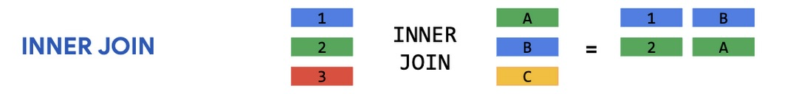
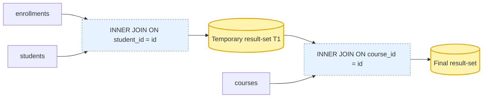
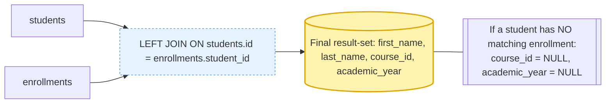
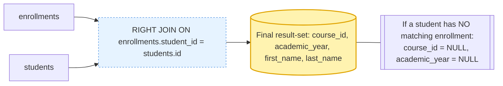
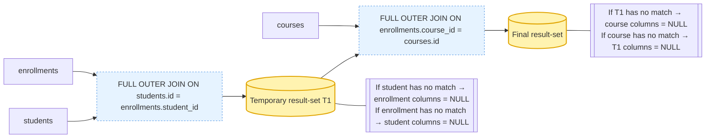
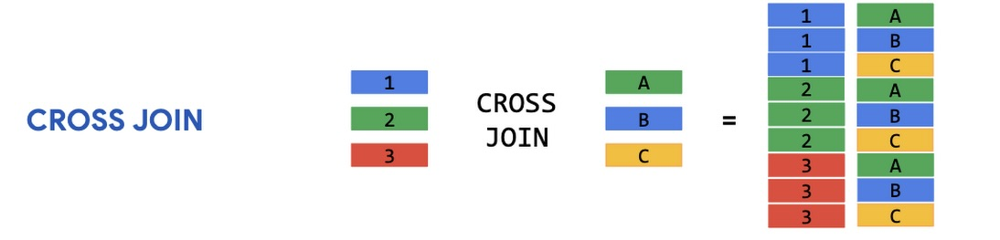

# SQL Joins

## Introduction

SQL joins are used to combine rows from two or more tables based on a related column. In this document, we'll explore different types of joins using the given database schema.

:information_source: Just as a reminder, we have the following tables in our [University dataset](data/university.sql):

---

- `students`
- `teachers`
- `courses`
- `course_teachers`
- `enrollments`
- `results`

---

&nbsp;

### Inner Join

An `INNER JOIN` retrieves records where there is a matching value in both tables. Any non-matching rows are discarded.



**Example:** Get students and their enrolled courses

```sql
SELECT 
    students.first_name, 
    students.last_name, 
    courses.name AS course_name
FROM enrollments
INNER JOIN students ON enrollments.student_id = students.id
INNER JOIN courses ON enrollments.course_id = courses.id;
```

**How it works:**

- Matches enrollments with students. The result is a temporary result-set T1.
- Then matches this T1 with courses.
- If a student is NOT enrolled in any course, they won’t appear.



<details markdown="1">
<summary>View this query result</summary>

| first_name  | last_name | course_name |
|------|-------------|:-------------|
| Sandra | Durand | Supply Chain Management |
| Sandra | Durand | Database Management Systems |
| Sandra | Durand | Molecular Biology |
| Sandra | Durand | Statics and Dynamics |
| ... | ... | ... |

</details>

&nbsp;
&nbsp;

### :arrow_left: Left Join

A `LEFT JOIN` returns all records from the left table, plus matching records from the right table. If no match exists, NULL is returned from the right-side columns.

 Join")

**Example:** Get all students and their enrollment info (including students not enrolled)
To list all courses and any enrollments (if present):

````sql
SELECT 
    students.first_name, 
    students.last_name, 
    enrollments.course_id, 
    enrollments.academic_year 
FROM students
LEFT JOIN enrollments ON students.id = enrollments.student_id;
````

**How it works:**

- Matches all students with enrollments.
- If a student does not have an enrollment, the fetched values for enrollment ('course_id'and 'academic_year') will be 'NULL'.



<details markdown="1">
<summary>View this query result</summary>

| first_name  | last_name | course_id | academic_year |
|------|-------------|:---:|:----:|
| Sandra | Durand | 97 | 2024 |
| Sandra | Durand | 3 | 2024 |
| Sandra | Durand | 87 | 2024 |
| Sandra | Durand | 31 | 2024 |
| ... | ... | ... |

</details>

&nbsp;
&nbsp;

### :arrow_right: Right Join

A `RIGHT JOIN` works similarly to LEFT JOIN, but keeps all records from the right table while including only matching rows from the left.

 Join")

**Example:** Get all students and their corresponding enrollments (even if some students did not enroll)

````sql
SELECT 
    enrollments.course_id, 
    enrollments.academic_year, 
    students.first_name, 
    students.last_name 
FROM enrollments
RIGHT JOIN students ON enrollments.student_id = students.id;

````

**How it works:**

- Matches enrollments with all students.
- If a student does not have an enrollment, the fetched values for enrollment ('course_id' and 'academic_year' will be 'NULL'.



Typically, LEFT JOIN is preferred over RIGHT JOIN for readability.

<details markdown="1">
<summary>View this query result</summary>

| course_id | academic_year | first_name  | last_name |
|:---:|:----:|------|-------------|
| 97 | 2024 | Sandra | Durand |
| 3 | 2024 | Sandra | Durand |
| 87 | 2024 | Sandra | Durand |
| 31 | 2024 | Sandra | Durand |
| 51 | 2024 | Sandra | Durand |
| ... | ... | ... |

</details>

&nbsp;
&nbsp;

### :arrow_double_down: Full Outer Join

A `FULL OUTER JOIN` returns all records from both tables, filling NULLs where matches don’t exist.

 Join")

**Example:** Get all students and enrollments (including unmatched records)

````sql
SELECT 
    students.first_name, 
    students.last_name, 
    enrollments.course_id, 
    enrollments.academic_year 
FROM students
FULL OUTER JOIN enrollments ON students.id = enrollments.student_id;
FULL OUTER JOIN courses ON enrollments.course_id = courses.id;

````

**How it works:**

- Matches students with enrollments. 
    - If a student does not have a match, the fetched values for enrollment will be NULL. 
    - If an enrollment does not have a match, the fetched values for student will be NULL. 
    - The result is a temporary result-set T1.
- Matches T1 with courses. 
    - If T1 does not have a match, the fetched values for course will be NULL. 
    - If a course does not have a match, the fetched values for T1 will be NULL.
 

<details markdown="1">
<summary>View this query result</summary>

| first_name  | last_name | course_id | academic_year |
|------|-------------|:---:|:----:|
| Sandra | Durand | 97 | 2024 |
| Sandra | Durand | 3 | 2024 |
| Sandra | Durand | 87 | 2024 |
| Sandra | Durand | 31 | 2024 |
| ... | ... | ... |

</details>

&nbsp;

### :twisted_rightwards_arrows: Cross Join

A `CROSS JOIN`s generates a Cartesian product, meaning every row in one table joins with every row in another.



**Example:** Get all possible student-course combinations

````sql
SELECT 
    students.first_name, 
    students.last_name, 
    courses.name AS course_name 
FROM students
CROSS JOIN courses;

````

**How it works:**

- If we have 100 students and 10 courses, this returns 1,000 rows.
- Not commonly used unless explicitly needed.
- Can be dangerous if tables contain large numbers of rows!

<details markdown="1">
<summary>View this query result</summary>

| first_name  | last_name | course_name |
|------|-------------|:-------------|
| Luuk | Wagner | Introduction to Programming |
| Luuk | Wagner | Data Structures and Algorithms |
| Luuk | Wagner | Database Management Systems |
| Luuk | Wagner | Operating Systems |
| ... | ... | ... |

</details>

&nbsp;
&nbsp;

### :arrow_right_hook: Self Join

A `SELF JOIN`s generates a Cartesian product, meaning every row in one table joins with every row in another.

**Example:** Finding students from the same city

````sql
SELECT 
    s1.first_name AS s1_first_name,
    s1.last_name AS s1_last_name,
    s2.first_name AS s2_first_name,
    s2.last_name AS s2_last_name,
    s1.city
FROM students s1
JOIN students s2 
    ON s1.city = s2.city 
    AND s1.id <> s2.id;

````

**How it works:**

- Retrieve student pairs (`student1`, `student2`) and their shared city.
- Match students living in the same city (`s1.city = s2.city`).
- Ensure a student isn’t paired with themselves (`s1.id <> s2.id`).

<details markdown="1">
<summary>View this query result</summary>

| s1_first_name  | s1_last_name | s2_first_name | s2_last_name | city |
|------|-------------|-------------|-------------|-------------|
| Luuk | Wagner | Carmen | Lammers | Pijnacker-Nootdorp |
| Luuk | Wagner | Puck | Hoekstra | Pijnacker-Nootdorp |
| Luuk | Wagner | Daniel | van der Meer | Pijnacker-Nootdorp |
| ... | ... | ... | ... | ... |

</details>

&nbsp;
&nbsp;

### Real-World Considerations:

- **INNER JOIN** is the default choice for extracting accurate relationships.
- **LEFT JOIN** is great for auditing data (seeing missing connections).
- **FULL JOIN** isn't always available in some databases *(MySQL doesn't support it natively)*.
- **CROSS JOIN** should be handled with caution due to potentially huge result sets.
- **SELF JOIN** is highly useful in social networks or employee management scenarios.

&nbsp;
&nbsp;

### Conclusion

SQL joins aren’t just theoretical constructs; they’re powerful tools that shape data-driven decisions. Mastering them ensures efficient data retrieval, enhanced reporting, and strong relational database design.

&nbsp;
&nbsp;
