# SQL Joins

## Introduction

SQL joins are used to combine rows from two or more tables based on a related column. In this document, we'll explore different types of joins using the given database schema.

:information_source: Just as a reminder, we have the following tables in our [University dataset](data/university.sql):

---

- `students`
- `teachers`
- `courses`
- `course_teachers`
- `enrollments`
- `results`

---

We will discuss the following join types:

- [Inner join](#inner-join)
- [Left join](#arrow_left-left-join)
- [Right join](#arrow_right-right-join)
- [Full outer join](#arrow_double_down-full-outer-join)
- [Cross join](#twisted_rightwards_arrows-cross-join)
- [Self join](#arrow_right_hook-self-join)

#### General JOIN syntax

The general JOIN syntax is as follows:

```sql
SELECT <columns>
FROM <table_x>
<join_type> JOIN <table_y>
    ON <condition>;
```
Replace `<join_type>` with `INNER`, `LEFT`, `RIGHT`, or `FULL OUTER`.

A `CROSS JOIN` has no `ON` clause: it combines every row from the first table with every row from the second table.

```sql
SELECT <columns>
FROM <table_x>
CROSS JOIN <table_y>;
```

#### How to read the JOIN illustrations

In the illustrations below, blocks with the same colour belong to the same logical unit: their colours indicate that they match based on the JOIN condition. The numbers and letters are dummy data, not the values used to determine a match. Each illustration illustrates which blocks are included and how they are combined for that JOIN type.

&nbsp;


### Inner Join

An `INNER JOIN` combines rows from two tables when they satisfy the condition specified in the `ON` clause. Rows without a match are excluded from the result.

In the illustration, matching rows are indicated by the same colour; the numbers and letters represent other data in those rows.

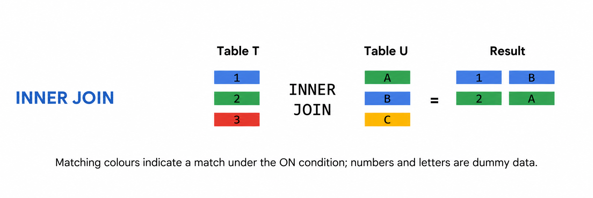

**Example:** Get students and their enrolled courses

This ERD shows the tables and columns relevant to the example. Relationship lines describe the database structure; the SQL query determines how rows are combined and which rows appear in the result.

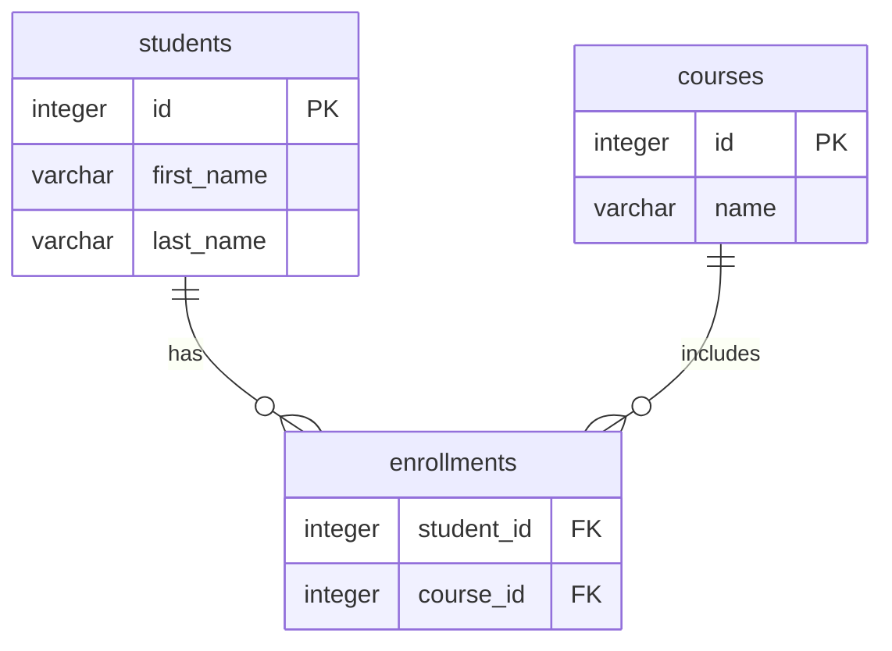
```mermaid
erDiagram
    students {
        integer id PK
        varchar first_name
        varchar last_name
    }

    enrollments {
        integer student_id FK
        integer course_id FK
    }

    courses {
        integer id PK
        varchar name
    }

    students ||--o{ enrollments : "has"
    courses ||--o{ enrollments : "includes"
```

```sql
SELECT 
    students.first_name, 
    students.last_name, 
    courses.name AS course_name
FROM enrollments
INNER JOIN students ON enrollments.student_id = students.id
INNER JOIN courses ON enrollments.course_id = courses.id;
```

**How it works:**

- Matches enrollments with students. The result is a temporary result-set T1.
- Then matches this T1 with courses.
- If a student is NOT enrolled in any course, they won’t appear.

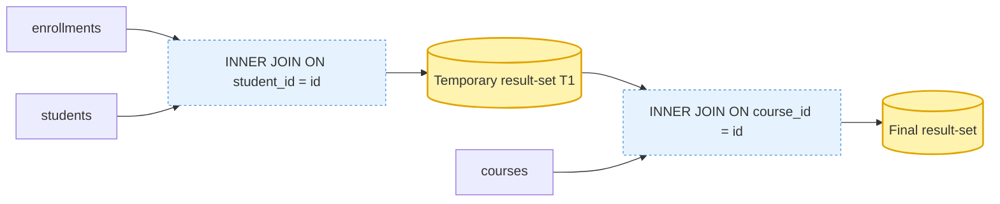
```mermaid


flowchart LR
    E[enrollments] --> J1[INNER JOIN ON student_id = id]
    S[students] --> J1
    J1 --> T1[(Temporary result-set T1)]

    T1 --> J2[INNER JOIN ON course_id = id]
    C[courses] --> J2
    J2 --> Result[(Final result-set)]

    %% Styles for result sets
    style T1 fill:#fff3b0,stroke:#e0a400,stroke-width:2px
    style Result fill:#fff3b0,stroke:#e0a400,stroke-width:2px

    %% Optional: style join nodes (subtle)
    style J1 fill:#e6f3ff,stroke:#4a90e2,stroke-width:1px,stroke-dasharray: 3 3
    style J2 fill:#e6f3ff,stroke:#4a90e2,stroke-width:1px,stroke-dasharray: 3 3

```

<details markdown="1">
<summary>View this query result</summary>

| first_name  | last_name | course_name |
|------|-------------|:-------------|
| Sandra | Durand | Supply Chain Management |
| Sandra | Durand | Database Management Systems |
| Sandra | Durand | Molecular Biology |
| Sandra | Durand | Statics and Dynamics |
| ... | ... | ... |

</details>

&nbsp;
&nbsp;

### :arrow_left: Left Join

A `LEFT JOIN` includes every row from the left table and combines it with matching rows from the right table, based on the `ON` condition.

If multiple right-side rows match, the left-side data is repeated in the result: once for each matching right-side row. 
If no match exists, the left-side row is included once, with NULL in the right-side columns.

In the illustration, matching rows are indicated by the same colour; the numbers and letters represent other data in those rows.

 Join")

**Example:** Get all students and their enrollment info (including students not enrolled)

This ERD shows the tables and columns relevant to the example. Relationship lines describe the database structure; the SQL query determines how rows are combined and which rows appear in the result.

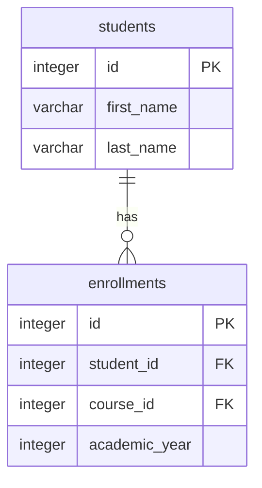
```mermaid
erDiagram
    students {
        integer id PK
        varchar first_name
        varchar last_name
    }

    enrollments {
        integer id PK
        integer student_id FK
        integer course_id FK
        integer academic_year
    }

    students ||--o{ enrollments : "has"
```

To list all courses and any enrollments (if present):

````sql
SELECT 
    students.first_name, 
    students.last_name, 
    enrollments.course_id, 
    enrollments.academic_year 
FROM students
LEFT JOIN enrollments ON students.id = enrollments.student_id;
````

**How it works:**

- Matches all students with enrollments.
- If a student does not have an enrollment, the fetched values for enrollment ('course_id'and 'academic_year') will be 'NULL'.

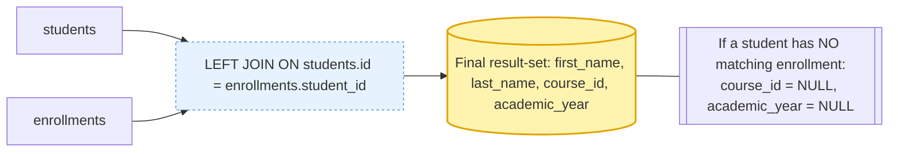
```mermaid

flowchart LR
    S[students] --> J1[LEFT JOIN ON students.id = enrollments.student_id]
    E[enrollments] --> J1
    J1 --> Result[(Final result-set: first_name, last_name, course_id, academic_year)]

    %% Styles for result set (yellow highlight)
    style Result fill:#fff3b0,stroke:#e0a400,stroke-width:2px

    %% Optional: style join node (subtle)
    style J1 fill:#e6f3ff,stroke:#4a90e2,stroke-width:1px,stroke-dasharray: 3 3

    %% Annotation: non-matching rows
    noteN[["If a student has NO matching enrollment:<br/>course_id = NULL, academic_year = NULL"]]
    Result --- noteN
```

<details markdown="1">
<summary>View this query result</summary>

| first_name  | last_name | course_id | academic_year |
|------|-------------|:---:|:----:|
| Sandra | Durand | 97 | 2024 |
| Sandra | Durand | 3 | 2024 |
| Sandra | Durand | 87 | 2024 |
| Sandra | Durand | 31 | 2024 |
| ... | ... | ... |

</details>

&nbsp;
&nbsp;

### :arrow_right: Right Join

A `RIGHT JOIN` is the mirror image of a `LEFT JOIN`: it includes every row from the right table and combines it with matching rows from the left table, based on the `ON` condition. 

If multiple left-side rows match, the right-side data is repeated in the result: once for each matching left-side row. 
If no match exists, the right-side row is included once, with NULL in the left-side columns.

In the illustration, matching rows are indicated by the same colour; the numbers and letters represent other data in those rows.

 Join")

**Example:** Get all students and their corresponding enrollments (even if some students did not enroll)

This ERD shows the tables and columns relevant to the example. Relationship lines describe the database structure; the SQL query determines how rows are combined and which rows appear in the result.


```mermaid
erDiagram
    students {
        integer id PK
        varchar first_name
        varchar last_name
    }

    enrollments {
        integer id PK
        integer student_id FK
        integer course_id FK
        integer academic_year
    }

    students ||--o{ enrollments : "has"
```


````sql
SELECT 
    enrollments.course_id, 
    enrollments.academic_year, 
    students.first_name, 
    students.last_name 
FROM enrollments
RIGHT JOIN students ON enrollments.student_id = students.id;

````

**How it works:**

- Matches enrollments with all students.
- If a student does not have an enrollment, the fetched values for enrollment ('course_id' and 'academic_year' will be 'NULL'.

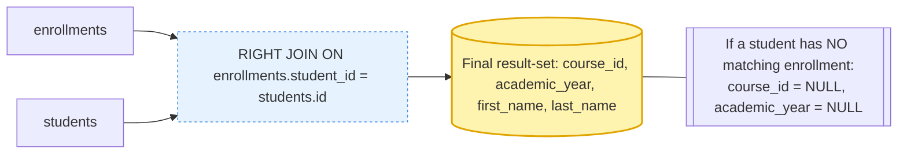
```mermaid

flowchart LR
    E[enrollments] --> J1[RIGHT JOIN ON enrollments.student_id = students.id]
    S[students] --> J1
    J1 --> Result[(Final result-set: course_id, academic_year, first_name, last_name)]

    %% Styles for result set (yellow highlight)
    style Result fill:#fff3b0,stroke:#e0a400,stroke-width:2px

    %% Optional: style join node (subtle)
    style J1 fill:#e6f3ff,stroke:#4a90e2,stroke-width:1px,stroke-dasharray: 3 3

    %% Annotation: non-matching rows
    noteN[["If a student has NO matching enrollment:<br/>course_id = NULL, academic_year = NULL"]]
    Result --- noteN
```

Typically, LEFT JOIN is preferred over RIGHT JOIN for readability.

<details markdown="1">
<summary>View this query result</summary>

| course_id | academic_year | first_name  | last_name |
|:---:|:----:|------|-------------|
| 97 | 2024 | Sandra | Durand |
| 3 | 2024 | Sandra | Durand |
| 87 | 2024 | Sandra | Durand |
| 31 | 2024 | Sandra | Durand |
| 51 | 2024 | Sandra | Durand |
| ... | ... | ... |

</details>

&nbsp;
&nbsp;

### :arrow_double_down: Full Outer Join

A `FULL OUTER JOIN` includes every row from both tables. Rows that match based on the `ON` condition are combined. 

If a row matches multiple rows in the other table, its data is repeated in the result: once for each match. 
Rows without a match are included once, with NULL in the columns from the other table.

In the illustration, matching rows are indicated by the same colour; the numbers and letters represent other data in those rows.

 Join")

**Example:** Get all students and enrollments (including unmatched records)

This ERD shows the tables and columns relevant to the example. Relationship lines describe the database structure; the SQL query determines how rows are combined and which rows appear in the result.


```mermaid
erDiagram
    students {
        integer id PK
        varchar first_name
        varchar last_name
    }

    enrollments {
        integer student_id FK
        integer course_id FK
    }

    courses {
        integer id PK
        varchar name
    }

    students ||--o{ enrollments : "has"
    courses ||--o{ enrollments : "includes"
```


````sql
SELECT 
    students.first_name, 
    students.last_name, 
    enrollments.course_id, 
    enrollments.academic_year 
FROM students
FULL OUTER JOIN enrollments ON students.id = enrollments.student_id;
FULL OUTER JOIN courses ON enrollments.course_id = courses.id;

````

**How it works:**

- Matches students with enrollments. 
    - If a student does not have a match, the fetched values for enrollment will be NULL. 
    - If an enrollment does not have a match, the fetched values for student will be NULL. 
    - The result is a temporary result-set T1.
- Matches T1 with courses. 
    - If T1 does not have a match, the fetched values for course will be NULL. 
    - If a course does not have a match, the fetched values for T1 will be NULL.
 
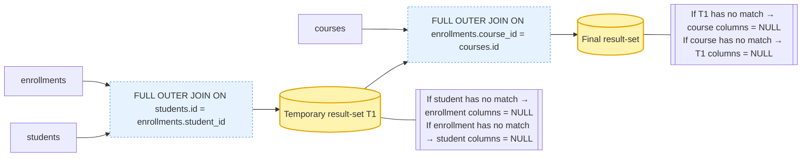
```mermaid
flowchart LR
    S[students] --> J1[FULL OUTER JOIN ON students.id = enrollments.student_id]
    E[enrollments] --> J1
    J1 --> T1[(Temporary result-set T1)]

    T1 --> J2[FULL OUTER JOIN ON enrollments.course_id = courses.id]
    C[courses] --> J2
    J2 --> Result[(Final result-set)]

    %% Styles for result sets
    style T1 fill:#fff3b0,stroke:#e0a400,stroke-width:2px
    style Result fill:#fff3b0,stroke:#e0a400,stroke-width:2px

    %% Style join nodes
    style J1 fill:#e6f3ff,stroke:#4a90e2,stroke-width:1px,stroke-dasharray: 3 3
    style J2 fill:#e6f3ff,stroke:#4a90e2,stroke-width:1px,stroke-dasharray: 3 3

    %% Notes for NULL behavior
    note1[["If student has no match → enrollment columns = NULL<br/>If enrollment has no match → student columns = NULL"]]
    note2[["If T1 has no match → course columns = NULL<br/>If course has no match → T1 columns = NULL"]]
    T1 --- note1
    Result --- note2
```
<details markdown="1">
<summary>View this query result</summary>

| first_name  | last_name | course_id | academic_year |
|------|-------------|:---:|:----:|
| Sandra | Durand | 97 | 2024 |
| Sandra | Durand | 3 | 2024 |
| Sandra | Durand | 87 | 2024 |
| Sandra | Durand | 31 | 2024 |
| ... | ... | ... |

</details>

&nbsp;

### :twisted_rightwards_arrows: Cross Join

A `CROSS JOIN` generates a Cartesian product: every row from the first table is combined with every row from the second table. No `ON` condition is used. 

If the first table has M rows and the second has N rows, the result contains M × N rows.

In the illustration below every row from the left table is combined with every row from the right table, regardless of colour. With three rows in each table, the result contains 3 × 3 = 9 rows.

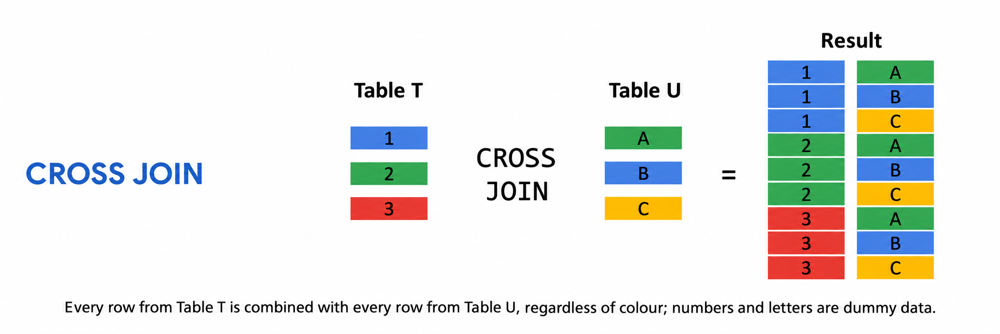

**Example:** Get all possible student-course combinations

There is no direct relationship between students and courses in the full ERD; they are linked through enrollments. Therefore, no relationship line is shown between them here. This CROSS JOIN combines every student with every course, regardless of enrollment.

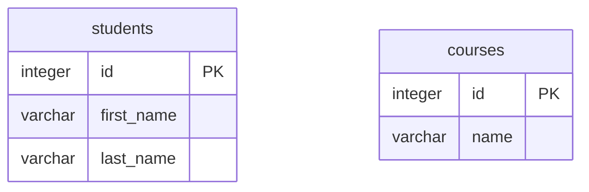
```mermaid
erDiagram
    students {
        integer id PK
        varchar first_name
        varchar last_name
    }

    courses {
        integer id PK
        varchar name
    }
```

````sql
SELECT 
    students.first_name, 
    students.last_name, 
    courses.name AS course_name 
FROM students
CROSS JOIN courses;

````

**How it works:**

- Every student is combined with every course

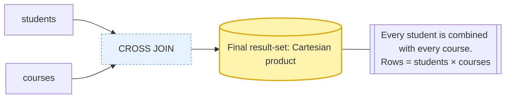
```mermaid
flowchart LR
    S[students] --> J[CROSS JOIN]
    C[courses] --> J
    J --> Result[(Final result-set: Cartesian product)]

    %% Style result set
    style Result fill:#fff3b0,stroke:#e0a400,stroke-width:2px

    %% Style join node
    style J fill:#e6f3ff,stroke:#4a90e2,stroke-width:1px,stroke-dasharray: 3 3

    %% Note
    noteN[["Every student is combined with every course.<br/>Rows = students × courses"]]
    Result --- noteN
```

- If we have 100 students and 10 courses, this returns 1,000 rows.
- Useful when you need all possible combinations, for example to generate a list of every course option for every student, or to create test data. These combinations do not indicate actual enrollments.
- The result size grows quickly: 100,000 students × 1,000 courses produces 100 million rows. Processing such a large result can overload the database server and slow down other users’ queries.

<details markdown="1">
<summary>View this query result</summary>

| first_name  | last_name | course_name |
|------|-------------|:-------------|
| Luuk | Wagner | Introduction to Programming |
| Luuk | Wagner | Data Structures and Algorithms |
| Luuk | Wagner | Database Management Systems |
| Luuk | Wagner | Operating Systems |
| ... | ... | ... |

</details>

&nbsp;
&nbsp;

### :arrow_right_hook: Self Join

A self join combines rows from a table with other rows from the same table. Different aliases are used to distinguish the two references to the table.

There is no separate `SELF JOIN` keyword: you use a join type such as `INNER JOIN` or `LEFT JOIN`.

In the illustration below, the same table is used twice, with aliases a and b. Rows are combined when they satisfy the ON condition, as indicated by matching colours. In this example, A from alias a matches C from alias b, B matches A, and C matches B. The letters represent dummy data, not the values used to determine a match.

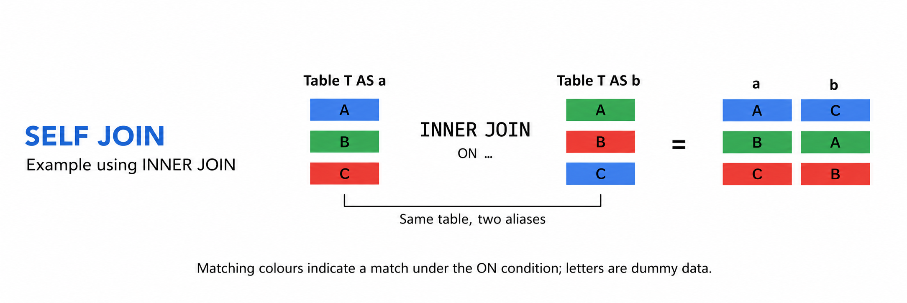

**Example:** Finding students from the same city

In this example, an `INNER JOIN` finds pairs of different students who live in the same city.
Only one table is shown because a self join references the same table twice, using the aliases `s1` and `s2`. In this example, the query matches different students who live in the same city. This comparison does not represent a relationship defined in the ERD, so no relationship line is shown.

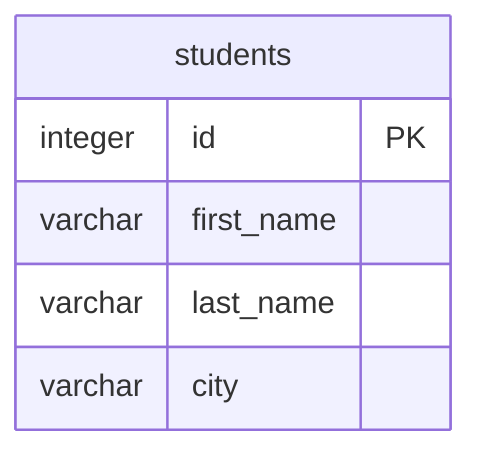
```mermaid
erDiagram
    students {
        integer id PK
        varchar first_name
        varchar last_name
        varchar city
    }
```

````sql
SELECT 
    s1.first_name AS s1_first_name,
    s1.last_name AS s1_last_name,
    s2.first_name AS s2_first_name,
    s2.last_name AS s2_last_name,
    s1.city
FROM students s1
INNER JOIN students s2 
    ON s1.city = s2.city 
    AND s1.id <> s2.id;

````

**How it works:**

- The students table is referenced twice, using the aliases `s1` and `s2`. These aliases do not create copies of the table.
- The condition `s1.city = s2.city` matches students who live in the same city.
- The condition `s1.id <> s2.id` prevents a student from being matched with themselves.
- Each matching pair appears twice: once in each direction. To include each pair only once, use `s1.id < s2.id` instead.

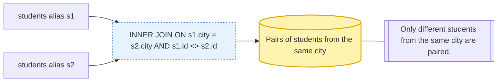
```mermaid

flowchart LR
    S1[students alias s1] --> J[INNER JOIN ON s1.city = s2.city AND s1.id <> s2.id]
    S2[students alias s2] --> J
    J --> Result[(Pairs of students from the same city)]

    %% Style result set
    style Result fill:#fff3b0,stroke:#e0a400,stroke-width:2px

    %% Style join node
    style J fill:#e6f3ff,stroke:#4a90e2,stroke-width:1px,stroke-dasharray: 3 3

    %% Note
    noteN[["Only different students from the same city are paired."]]
    Result --- noteN
```

<details markdown="1">
<summary>View this query result</summary>

| s1_first_name  | s1_last_name | s2_first_name | s2_last_name | city |
|------|-------------|-------------|-------------|-------------|
| Luuk | Wagner | Carmen | Lammers | Pijnacker-Nootdorp |
| Luuk | Wagner | Puck | Hoekstra | Pijnacker-Nootdorp |
| Luuk | Wagner | Daniel | van der Meer | Pijnacker-Nootdorp |
| ... | ... | ... | ... | ... |

</details>

&nbsp;
&nbsp;

### Choosing the right JOIN

- **INNER JOIN**: Use when you only need rows with a match in both tables, such as students and the courses they are enrolled in.
- **LEFT JOIN**: Use when you need every row from the left table, even without a match. For example, list all students, including those without enrollments.
- **RIGHT JOIN**: The mirror image of a LEFT JOIN. You can rewrite it as a LEFT JOIN by swapping the tables.
- **FULL OUTER JOIN**: Use when you need every row from both tables, including unmatched rows on either side. This is useful when comparing datasets and identifying missing connections.
- **CROSS JOIN**: Use when you need every possible combination. Check the table sizes first: M rows combined with N rows produce M × N result rows.
- **SELF JOIN**: Use when you need to relate rows within the same table, such as finding students from the same city or linking employees to their managers.

&nbsp;
&nbsp;

### Conclusion

Choose your JOIN based on which rows you want to keep and how they should be combined. For joins with an `ON` clause, the condition determines which rows match. Remember that one row can have multiple matches, causing its data to be repeated in the result. A `CROSS JOIN` combines all rows without a matching condition.

&nbsp;
&nbsp;
