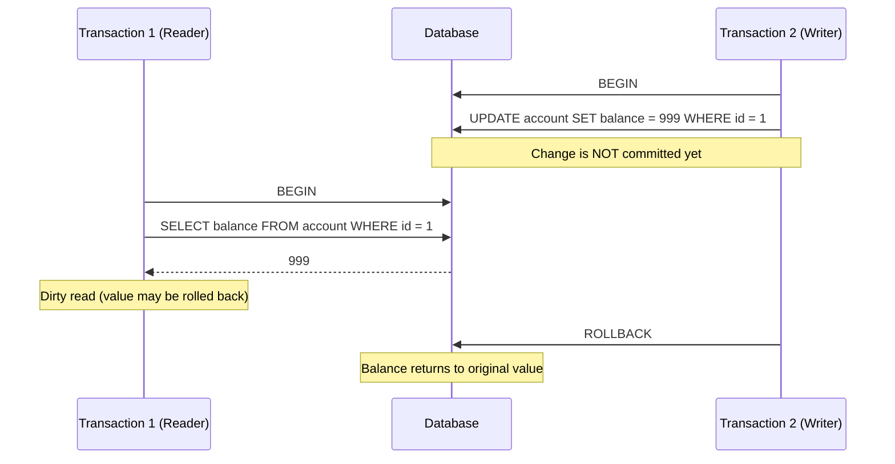
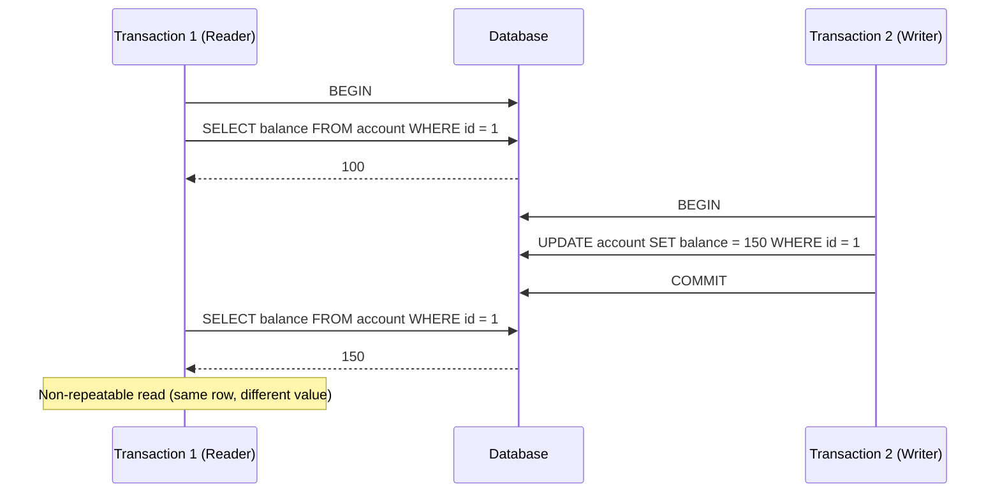
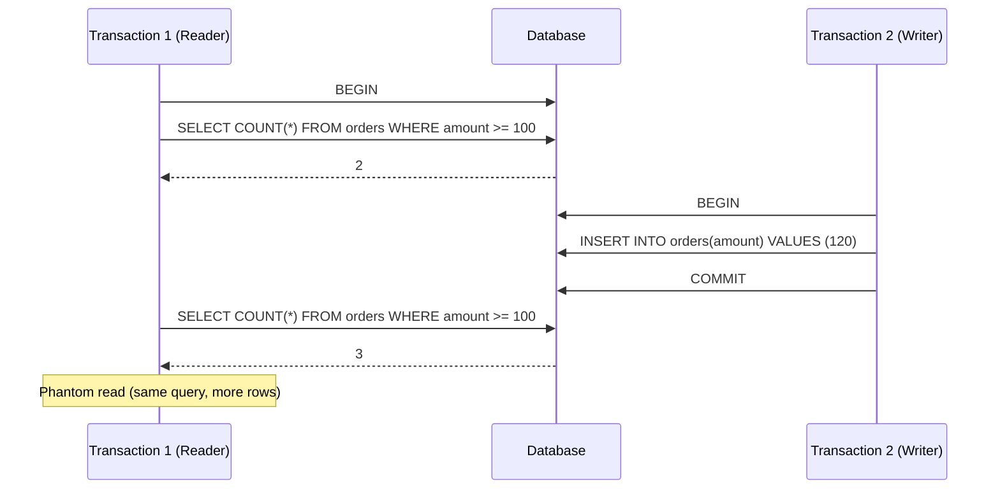

# Transactions

Transactions in SQL are crucial for ensuring the integrity and consistency of a database, especially in scenarios where multiple related changes need to be executed together. A transaction is a sequence of operations performed as a single logical unit of work, which follows the ACID properties:

1. **Atomicity** - Ensures that all operations in a transaction are completed; otherwise, none of them are applied.
2. **Consistency** - Guarantees that the database remains in a valid state before and after the transaction.
3. **Isolation** - Ensures transactions execute independently without interfering with each other.
4. **Durability** - Persists the effects of a successful transaction permanently.

&nbsp;

## Transaction control

Following are the few commands that control transactions:

- **BEGIN TRANSACTION** - will start a transaction *(SQL native equivalent = `START TRANSACTION`)*
- **COMMIT** − To save the changes, alternatively you can use **END TRANSACTION** command.
- **ROLLBACK** − To rollback the changes

> *Transactional control commands are only used with the commands `INSERT`, `UPDATE` and `DELETE`*. 
> *They cannot be used while creating tables or dropping them because these operations are automatically committed in the database.*

&nbsp;

#### `BEGIN TRANSACTION` command

Transactions can be started using the `BEGIN TRANSACTION` or shorthand `BEGIN` command. 
*(SQL native equivalent is `START TRANSACTION` or `START`), examples are all in PostgreSQL syntax*.
A transaction usually persists until the next `COMMIT` or `ROLLBACK` command is encountered. 
Transactions will also `ROLLBACK` if the database is closed in between or if an error occurs before the transaction is finished.

**Syntax**

````sql
BEGIN;

or

BEGIN TRANSACTION;
````

&nbsp;

#### `COMMIT` command

The `COMMIT` command is the transactional command used to save changes invoked by a transaction to the database.
It will save all transactions tot the database since the last `COMMIT` or `ROLLBACK` command.

**Syntax**

````sql
COMMIT;

or

END TRANSACTION;
````

&nbsp;

#### `ROLLBACK` command

The `ROLLBACK` command is the transactional command used to undo the transactions that have not already been saved to the database.
It can only be used to undo transactions since the last `COMMIT` or `ROLLBACK` command.

**Syntax**

````sql
ROLLBACK;
````

&nbsp;

### Examples

#### Enrolling a Student in a Course

When enrolling a student in a course, you might need to insert data into the enrollments table and potentially update other related records.

````sql
BEGIN TRANSACTION;

INSERT INTO enrollments (student_id, course_id, academic_year)
VALUES (1, 3, 2025);

-- Ensure course is active before enrolling students
IF EXISTS (SELECT * FROM courses WHERE id = 3 AND active = FALSE) THEN
    ROLLBACK;
    PRINT 'Transaction rolled back: Course is not active.';
ELSE
    COMMIT;
    PRINT 'Transaction committed: Enrollment successful.';
END IF;
````

*Transactions prevent errors like enrolling students in inactive courses.*

&nbsp;


#### Transaction with multiple operations

````sql
BEGIN TRANSACTION;

-- Bulk enrollment of students into a course
INSERT INTO enrollments (student_id, course_id, academic_year)
SELECT id, 3, 2025 FROM students WHERE city = 'Rotterdam';

-- Activate course before enrolling
UPDATE courses SET active = TRUE WHERE id = 3;

-- Check for errors before committing
IF NOT EXISTS (SELECT * FROM courses WHERE id = 3 AND active = TRUE) THEN
    ROLLBACK;
    PRINT 'Transaction failed: Course activation error.';
ELSE
    COMMIT;
    PRINT 'Transaction successful: Students enrolled.';
END IF;
````

*Transactions help maintain database integrity.*

&nbsp;

#### Transaction with savepoint

Savepoints allow partial rollbacks witihin a transaction

````sql
BEGIN TRANSACTION;

-- Enroll student
INSERT INTO enrollments (student_id, course_id, academic_year)
VALUES (1, 3, 2025);

SAVEPOINT enrollment_saved;

-- Insert result
INSERT INTO results (enrollment_id, grade)
VALUES (1, 'A');

-- Something goes wrong, rollback only results insert
ROLLBACK TO enrollment_saved;

COMMIT;
````

> [!WARNING]
> Rolling back to a savepoint **does not** end the transaction; you can continue executing further commands after a rollback.

&nbsp;

You can **release** a savepoint when it's no longer needed via:

````sql
RELEASE SAVEPOINT enrollment_saved;
````

&nbsp;

### Common read anomalies

When multiple transactions run concurrently, several read anomalies can occur if isolation is too low:

- **Dirty read**  
  A transaction reads data that has been modified by another transaction that has not yet been committed.  
  If that other transaction rolls back, the first transaction has read data that never actually existed.

- **Non-repeatable read**  
  A transaction reads the same row twice and gets different values, because another committed transaction modified the row in between.

- **Phantom read**  
  A transaction re-executes a query and sees additional rows that were inserted or deleted by another committed transaction.

#### Dirty read example


#### Non-repetable read example


#### Phantom read example


### Isolation levels

SQL provides isolation levels to handle concurrent transactions safely. Each isolation level determines which read anomalies are allowed:


|Isolation Level|Dirty Read|Non-repeatable Read|Phantom Read|
|---------------|----------|-------------------|------------|
|Read Uncommitted|Allowed|Allowed|Allowed|
|Read Committed|Prevented|Allowed|Allowed|
|Repeatable Read|Prevented|Prevented|Allowed*|
|Serializable|Prevented|Prevented|Prevented

> **Note:**  
> In PostgreSQL, `READ UNCOMMITTED` behaves the same as `READ COMMITTED`.  
> Dirty reads are not possible in PostgreSQL.

\* According to the SQL standard, phantom reads may still occur in `REPEATABLE READ`.


You can set the isolation level like this:

````sql
SET TRANSACTION ISOLATION LEVEL SERIALIZABLE;
START TRANSACTION;
````

**Why not always use SERIALIZABLE?**

At first glance, it may seem logical to always use the SERIALIZABLE isolation level, since it prevents all read anomalies. However, stronger isolation comes with important trade-offs.

Choosing an isolation level is a balance between data correctness, performance, and concurrency:
- Higher isolation → stronger guarantees, but lower concurrency and performance
- Lower isolation → better performance and scalability, but more tolerance for anomalies

In practice, the right isolation level depends on the type of workload and the consequences of inconsistent reads.

| Isolation Level      | Consistency Guarantees                                                              | Performance & Concurrency                                             | Typical Use Cases                                           |
| -------------------- | ----------------------------------------------------------------------------------- | --------------------------------------------------------------------- | ----------------------------------------------------------- |
| **READ UNCOMMITTED** | Weakest guarantees. Dirty reads, non-repeatable reads, and phantom reads may occur. | Highest concurrency, lowest overhead.                                 | Rarely used in practice; mainly theoretical.                |
| **READ COMMITTED**   | Prevents dirty reads. Data may change between queries.                              | Good performance and concurrency.                                     | Reporting, dashboards, general CRUD applications.           |
| **REPEATABLE READ**  | Prevents dirty and non-repeatable reads. Phantom reads may still occur.             | Lower concurrency than READ COMMITTED.                                | Consistent reads within a transaction, analytical queries.  |
| **SERIALIZABLE**     | Strongest guarantees. Transactions behave as if executed one after another.         | Lowest concurrency, highest overhead; transactions may need to retry. | Financial transactions, reservations, inventory management. |


## See Transaction Isolation in Action

During class or as homework, explore transaction isolation levels in practice using the following exercise:

[Isolation Levels Exercise](data/isolation_levels/isolation_levels_lab.pdf)
