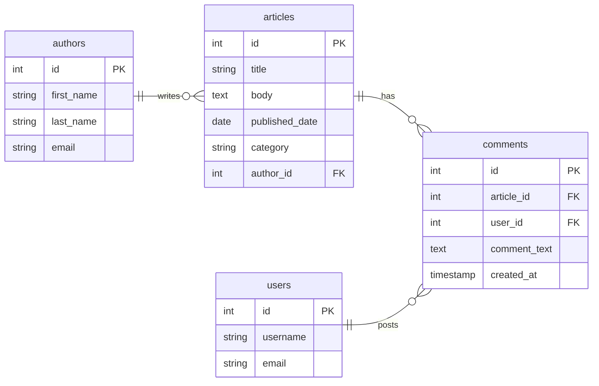

# Full-Text Search

Traditional SQL searches using `LIKE` or `ILIKE` are inefficient when dealing with large text-based datasets because they scan entire columns without indexing words efficiently. PostgreSQL Full-Text Search (FTS) solves this by breaking text into meaningful words (**lexemes**) and storing indexed versions for **fast retrieval**.

FTS allows:

- Natural language search instead of simple pattern matching.
- Ranking results based on relevance.
- Advanced query capabilities, such as phrase matching.

&nbsp;

Key-concepts:

- **Documents and Lexemes**
  - A document is a set of text data stored in a column.
  - PostgreSQL normalizes words into lexemes (root forms), so `"running"`, `"ran"`, and `"runs"` are treated as `"run"`.

- **`tsvector` and `tsquery` data types**
  - `tsvector`: Stores indexed text for efficient searching.
  - `tsquery`: Represents search queries with logical operators.

- **Stop words and Stemming**
  - Stop words (e.g., `"the"`, `"is"`, `"and"`) are ignored to improve search efficiency.
  - Stemming ensures `"running"`, `"ran"`, and `"runs"` match `"run"`.

&nbsp;

Let's take a look at another dataset we have [Articles]("data/articles.sql"), which contains 4 tables, we use this dataset for our examples on full-text searching.



&nbsp;

## Basic Full-Text Search

PostgreSQL uses two key functions:

- `to_tsvector()`: Converts text into a searchable format by breaking it into words (lexemes).
- `to_tsquery()`: Converts a search phrase into a structured query.

&nbsp;

Searching for articles **containing specific keywords** like `"performance"` can be done by using `to_tsvector()` on the column in combination with `@@ to_tsquery()`. Since we know our text is in English and our column is `body` we will use `to_tsvector('english', body)` for the query.

```sql
SELECT * FROM articles
WHERE to_tsvector('english', body) @@ to_tsquery('AI');
```

This query will search all articles where the body contains the word `AI` in it.

### Multiple keywords for the search

When you want search for multiple keywords, you can seperate each of them with a `|`, this will function as an `OR` operator on the `to_tsquery()` function inside the WHERE-clause.

```sql
SELECT * FROM articles
WHERE to_tsvector('english', body) @@ to_tsquery('cloud | computing');
```

The above query will search all articles where the body contains the words `cloud` **or** `computing`.

### Questions

1. Could you come up with a good use for full-text search on the case for the project part?
2. Is there a table inside the `University` dataset we could use full-text search on?

&nbsp;

## Highlighting and Ranking Results

In our previous examples we got the full body back that matches any of the given query keywords.
You might want to highlight theses results in the text you search in, this can be done by using `ts_headline(column, tsquery)`.

```sql
SELECT title, ts_headline(body, to_tsquery('performance')) AS summary
FROM articles
WHERE to_tsvector('english', body) @@ to_tsquery('performance');
```

The above query will highlight the word that matched the query keyword `performance`.

&nbsp;

Sometimes you want all articles back from the database, but want to rank them by relevance based on the provide keywords.
This can be done via the `ts_rank(tsvector, tsquery)` function. This function returns a score on which you can use `ORDER BY`.

```sql
SELECT title, ts_rank(to_tsvector(body), to_tsquery('cloud | computing')) AS relevance
FROM articles
ORDER BY relevance DESC;
```

In the above query, higher-ranked results will appear first.

&nbsp;

### Questions

1. Could you come up with a good use for highlighting or ranking on the case for the project part?
2. Can you query the comments while using highlighting to search for comments containing `cloud`?
3. How would a query look like if we want to combine both ranking and highlighting?

&nbsp;

## Advanced Full-Text Search

### Searching multiple columns

PostgreSQL's full-text search allows searching across multiple columns and prioritizing specific fields using weights. This is useful when certain columns (e.g., `title`) should have higher relevance than others (e.g., `body`).

```sql
SELECT title, body
FROM articles
WHERE to_tsvector('english', title || ' ' || body) @@ to_tsquery('PostgreSQL');
```

The above query uses `title || ' ' || body` to merge both columns into a searchable text vector.
By combining it with `@@ to_tsquery('PostgreSQL')` it finds articles containing "PostgreSQL" in either column.

&nbsp;

### Prioritization using weights

PostgreSQL allows assigning weights (`A`, `B`, `C`, `D`) to columns via `setweight(vector, weight)`:

- `A` (Highest Priority): Most relevant (e.g., title).
- `B` (Medium Priority): Important but secondary (e.g., body).
- `C` and `D` (Lower Priority): Less relevant fields.

By using `ts_rank_cd(setweight, tsquery)` instead of `ts_rank`, we can use the given `setweight` for ranking based on weight.

&nbsp;

Let's assign weights to `title` and `body`:

```sql
SELECT title, ts_rank_cd(setweight(to_tsvector(title), 'A') || setweight(to_tsvector(body), 'B'), to_tsquery('PostgreSQL'))
FROM articles
ORDER BY rank DESC;
```

In the above query we use `setweight(to_tsvector('english', title), 'A')` which gives higher priority to `title`.
By also using `setweight(to_tsvector('english', body), 'B')` we assign a lower priority to `body`.
Wrapping everything with the `ts_rank_cd()` function, ranks results based on relevance.

&nbsp;
&nbsp;
