# Conceptual Design – Entity-Relationship Diagram (ERD)

An **Entity-Relationship (ER) Diagram** is a visual tool used in database design to organize data and show how different pieces of information relate to each other. Think of an ER diagram as a blueprint for how a database should store information efficiently. Businesses, schools, websites, and apps all use ER diagrams to structure their databases before they start coding.

&nbsp;

## Types

ERDs come in different types, each serving it's own purposes.

### Conceptual

This type of ERD provides a high-level overview of the system, focusing primarly on the major entities and relationships without going into details about attributes. This type is very useful for initial database design stages and for communicating with non-technical stakeholders because of it's level of abstraction.

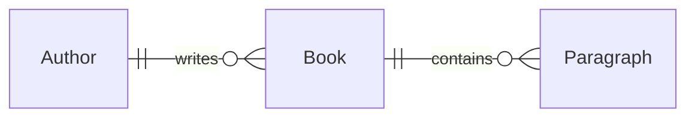

The diagram above shows an **conceptual diagram**, it represenets the `Author` which `writes` zero or more `Book`s which on their hand will contain zero or more `Paragraph`s. The entity and the relations are very abstract but understandable, it does not show any details.

&nbsp;

### Logical

A logical ERD includes the entities, the relationships and the attributes but does not detail the implementation. This type is useful for data modeling and capturing all necessary data requirements (or validating them).

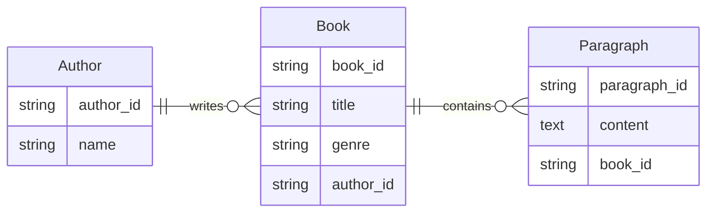

The above diagram shows the **logical diagram** or our earlier conceptual diagram.

&nbsp;

### Physical

A physical diagram provides the most detail, it includes all database tables, columns, data types and constraints. It is essential for database administrators and developers during the implementation phase.

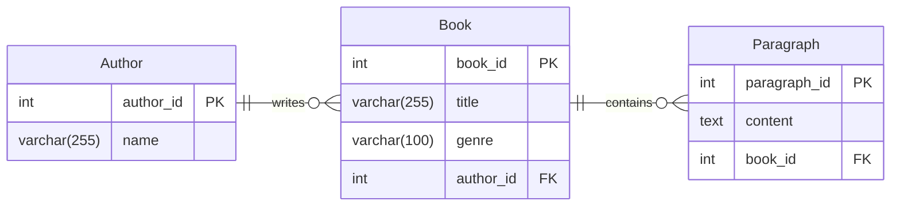

The above diagram shows the **Physical diagram** and is the last diagram step before converting it to a physical database. It contains the most information, including datatypes and constraints (Primary Key, length, foreign key). It still remains it's relationship and attributes. If a many to many relation would have been present, there would have been an extra table to cover that relationship in a physical database.

&nbsp;

> [!NOTE]
> On this page we will focus on the Conceptual en Logical ERDs, later we will focus on the physical implementation.

&nbsp;

## Key Components

An ER diagram consists of three main components, each playing an essential role.

&nbsp;

### Entities – *The Nouns of a Database*

An entity is a representation of a class of object. It can be a person, place, thing, etc. Entities usually have attributes that describe them.

In crow’s foot notation, an entity is represented by a rectangle, with its name on the top. The name is singular (entity) rather than plural (entities).

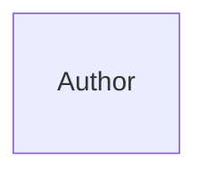

> [!NOTE]
> Some teams prefer plural table names in the database, this is a design choose and is not wrong.
> As long as you are consistent this is a choose you as a team make and enforce.

&nbsp;

### Attributes – *Details That Describe an Entity*

Attributes represent the characteristics of an entity. These attributes become columns in a database table.

The attribute(s) that uniquely distinguishes an instance of the entity is the identifier. Usually, this type of attribute is marked with an asterisk or PK (Primary Key), which help distinguish one record from another.

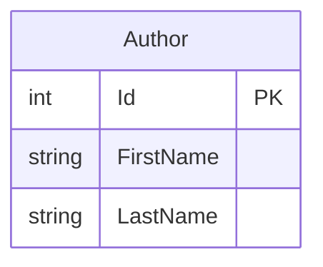

&nbsp;

### Relationships – *Connecting Entities Together*

Relationships define how entities are linked to each other. Without relationships, data would exist in isolated tables without any connection. They are presented as a straight line. Usually, each relationship has a name, expressed as a verb, written on the relationship line. This describes what kind of relationship connects the objects.

#### Cardinality

There are several notations for ERD's, but the **Crow's foot** notation (also known as the information engineering notation or the IE notation) is mostly used in modeling ERD's. The following diagram is an abstract representation of this notation:

| Value (left) | Value (right) | Meaning |
|--------------|---------------|---------|
| `\|o`        | `o\|`         | Zero or one |
| `\|\|`       | `\|\|`        | Exactly one |
| `}o`         | `o{`          | Zero or more (no upper limit) |
| `}\|`        | `\|{`         | One or more (no upper limit) |

Relationships have two indicators. These are shown on both sides of the line.

1. The first one refers to the *maximum* number of times that an instance of one entity can be associated with instances in the related entity. Options are `one` or `many`, can you recognize them in the table above?
2. The second one refers to the *minimum* number of times one instance can be related to others. It can be `zero` or `one`, and accordingly describes the relationship as `optional` or `mandatory`. Can you recognize them in the table above?

The combination of these two indicators is always in a specific order. Placed on the outside edge of the relationship, the symbol of multiplicity comes first. The symbol indicating whether the relationship is mandatory or optional is shown after the symbol of multiplicity.

&nbsp;

#### One-to-One (1:1)

Each entity in the relationship can only be linked to one other entity.
Example: A person has one passport, and each passport belongs to only one person.

##### Logical example

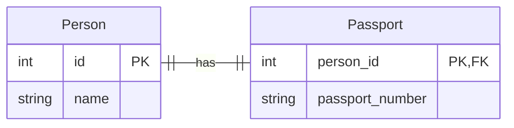

> [!NOTE]
> In the above logical example the Primary Key (PK) and Foreing Key (FK) are also shown, this is optional to include.

&nbsp;

#### One-to-Many (1:N)

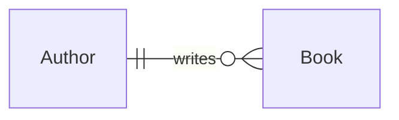

One entity can be associated with many instances of another entity, but the second entity is linked to only one instance of the first. Example: A customer can place multiple orders, but each order belongs to only one customer.

##### Logical example

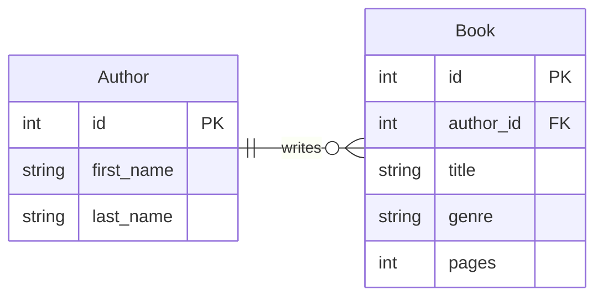

> [!NOTE]
> In the above logical example the Primary Key (PK) and Foreing Key (FK) are also shown, this is optional to include.

&nbsp;

#### Many-to-Many (M:N)

Multiple instances of one entity can be associated with multiple instances of another entity. Example: Students enroll in multiple courses, and courses have multiple students.

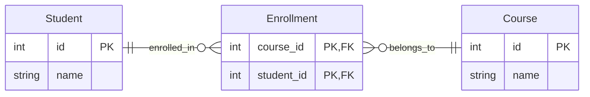

> [!NOTE]
> In the above logical example the Primary Key (PK) and Foreing Key (FK) are also shown, this is optional to include.
> The above logical example also shows an extra table, this is required because databases need to store more information to create a many to many relation.

&nbsp;

#### Self-Referencing Relationship

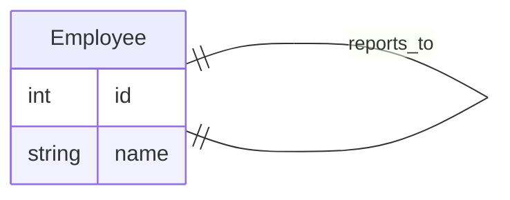

An entity relates to itself. Example: An employee reports to another employee, forming a hierarchy.

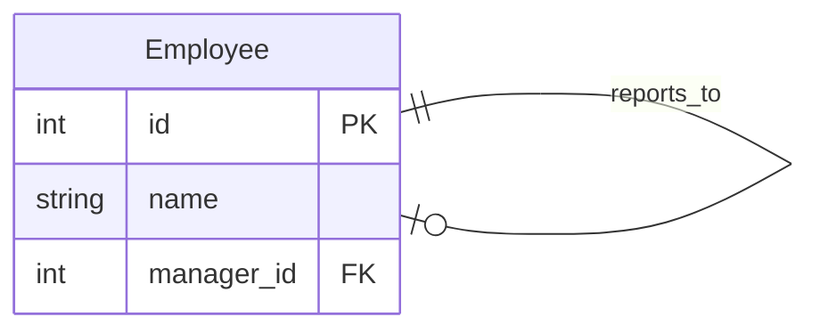

> [!NOTE]
> In the above logical example the Primary Key (PK) and Foreing Key (FK) are also shown, this is optional to include.
> The above logical example also adds a new attribute field `manager_id` which holds the relation to the other employee (manager).

&nbsp;

## Drawing an ERD

Entity-Relationship Diagrams (ERDs) are essential for designing clear database structures. While drawing ERDs manually provides flexibility, digital tools add precision and efficiency.

### Manually

Hand-drawn ERDs are useful for brainstorming and conceptualizing ideas before committing to a final design. Here’s how:

- **Gather Requirements** – Understand the system’s entities and relationships.
- **Sketch Entities** – Use rectangles to represent entities, labeling them with meaningful names.
- **Define Attributes** – List key attributes inside or near each entity.
- **Draw Relationships** – Use lines to connect entities, annotating them with relationship names.
- **Indicate Cardinality** – Add 1:1, 1:M, or M:M symbols to show connection types.
- **Refine & Validate** – Adjust based on feedback and ensure logical consistency.

> [!tip]
> Use graph paper or whiteboards for clarity. Stick to simple shapes and consistent notation.

### Tools

If you need sharper diagrams, collaboration, or automated features, ERD tools are ideal. Popular options include:

- Draw.io (diagrams.net) - Free and browser based, Drag-and-drop ERD elements, supports exporting;
- Lucidchart - Intuitive interface with templates, cloud-based, great for team collaboration;
- MySQL Workbench - Specifically for database design, Supports forward engineering (directly creating databases from ERDs);
- DBML (Database Markup Language) - Simple text-based schema language, write by human-readable format, version controllable;
- Mermaid.js - Text-based ER diagram generation, works well for programmers who prefer code over visuals

> [!NOTE]
> We use `Mermaid.js` for all our diagrams, check out the sourcecode of this page to see how this works in Markdown.

&nbsp;
