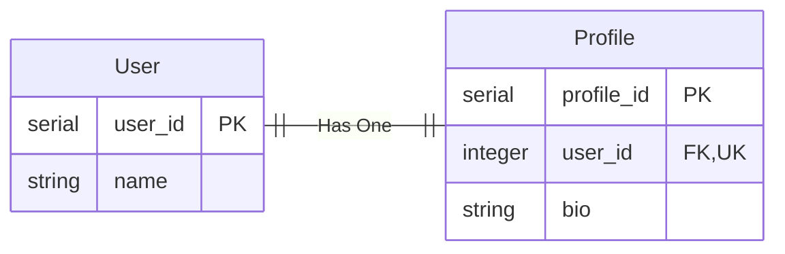
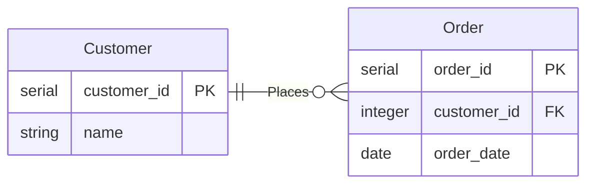
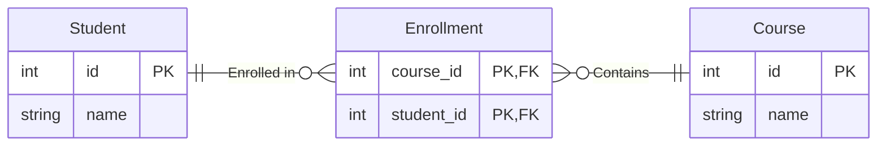

# Relationships Between Tables

In relational databases like PostgreSQL, tables often relate to each other to model real-world connections between data entities. These relationships define how records in one table correspond to records in another, ensuring data integrity and efficient querying.

By establishing proper relationships, databases remain organized, prevent redundancy, and enable powerful queries.

## Basics

Relationships are created using foreign keys, which reference a primary key in another table.

```sql
CREATE TABLE child_table (
    id SERIAL PRIMARY KEY,
    parent_id INTEGER REFERENCES parent_table(id) ON DELETE CASCADE
);
```

These foreing keys are used to:

- **Maintain referential integrity** (ensure data consistency across tables).
- **Prevent orphaned records** (avoid child records pointing to non-existent parents).
- **Enable efficient querying** (retrieve related data easily).

&nbsp;

## Types of Table Relationships

### One-to-One (1:1) Relationship

A **one-to-one** relationship links records uniquely between two tables. Each row in Table A relates to **only one row** in Table B, and vice versa.



A user profile is linked to **exactly one** account details record.

```sql
CREATE TABLE users (
    user_id SERIAL PRIMARY KEY,
    name VARCHAR(100) NOT NULL
);

CREATE TABLE user_profiles (
    profile_id SERIAL PRIMARY KEY,
    user_id INTEGER UNIQUE REFERENCES users(user_id) ON DELETE CASCADE,
    bio TEXT
);
```

The `user_id` in `user_profiles` uniquely references `users(user_id)`, ensuring a **1:1 relationship**.

&nbsp;

### One-to-Many (1:N) Relationship

A **one-to-many** relationship connects one record in Table A to **multiple** records in Table B. This is the most common relationship type.



A customer places **multiple** orders.

```sql
CREATE TABLE customers (
    customer_id SERIAL PRIMARY KEY,
    name VARCHAR(100) NOT NULL
);

CREATE TABLE orders (
    order_id SERIAL PRIMARY KEY,
    customer_id INTEGER REFERENCES customers(customer_id) ON DELETE CASCADE,
    order_date DATE DEFAULT CURRENT_DATE
);
```

A **single** customer can place **many** orders.
`customer_id` in `orders` references `customers(customer_id)`, enabling a **1:M relationship**.


&nbsp;

### Many-to-Many (M:N) Relationship

A **many-to-many** relationship involves multiple records in Table A being linked to multiple records in Table B. This requires an **intermediate table**.



Students enroll in **multiple** courses, and each course has **multiple** students.

```sql
CREATE TABLE students (
    student_id SERIAL PRIMARY KEY,
    name VARCHAR(100) NOT NULL
);

CREATE TABLE courses (
    course_id SERIAL PRIMARY KEY,
    title VARCHAR(100) NOT NULL
);

CREATE TABLE enrollments (
    student_id INTEGER REFERENCES students(student_id) ON DELETE CASCADE,
    course_id INTEGER REFERENCES courses(course_id) ON DELETE CASCADE,
    PRIMARY KEY (student_id, course_id)
);
```

The `enrollments` table connects `students` and `courses`, enabling an **M:N relationship**.

&nbsp;

### Querying Relationships in Practice

Retrieving related data efficiently is key to using relationships effectively.

#### Joining tables in Queries

By using an `INNER JOIN` (one-to-many) we can query multiple tables and combine the result as one.

```sql
SELECT customers.name, orders.order_date
FROM customers
JOIN orders ON customers.customer_id = orders.customer_id;
```

This will retrieve the customer names and their order dates.

&nbsp;

For **many-to-many** queries we have to combine multiple tables together using multiple joins.

```sql
SELECT students.name, courses.title
FROM students
JOIN enrollments ON students.student_id = enrollments.student_id
JOIN courses ON enrollments.course_id = courses.course_id;
```

This will list all students with their enrolled courses.

&nbsp;

#### Deleting Records with `CASCADE`

When we use `CASCADE` on our tables, the database engine will enforce the constraint when deleting or updating data (depending on the cascade constraint set). In our previous examples we created a table `customers` and a table `orders`, where the order had a `CASCADE` constraint enforced.

```sql
DELETE FROM customers WHERE customer_id = 1;
```

Running the above query will automatically delete all related orders due to `ON DELETE CASCADE`.

&nbsp;

#### Updating Foreign Key Records

An organization may have a departments table where employees belong to a specific department. If a department's ID changes, the update should cascade to the employees table to keep all relationships intact.

```sql
CREATE TABLE departments (
    dept_id SERIAL PRIMARY KEY,
    dept_name VARCHAR(100) NOT NULL
);

CREATE TABLE employees (
    emp_id SERIAL PRIMARY KEY,
    name VARCHAR(100) NOT NULL,
    dept_id INTEGER REFERENCES departments(dept_id) ON UPDATE CASCADE
);
```

When we want to  update the departments, for example we want to adjust the department ID of one record.
This will automatically adjust all related employees due to `ON UPDATE CASCADE`.

```sql
UPDATE departments SET dept_id = 10 WHERE dept_id = 5;
```

&nbsp;
