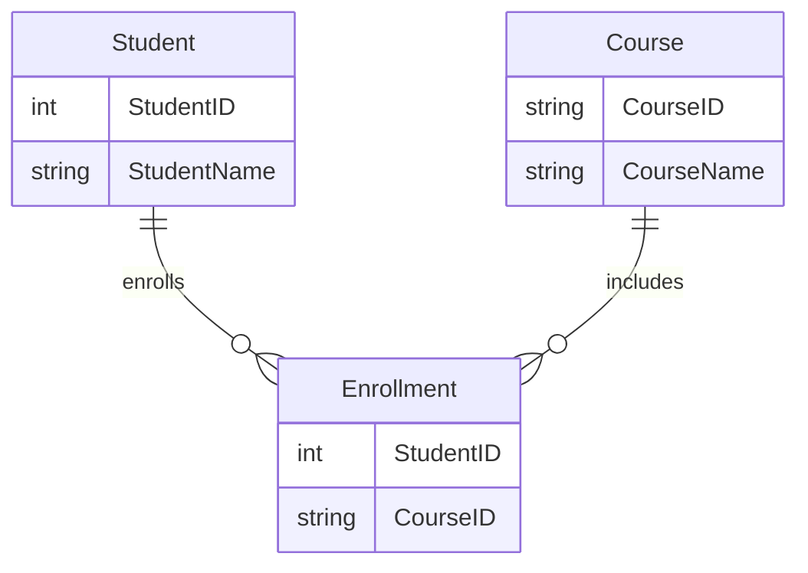
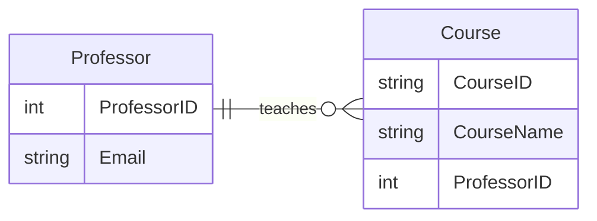
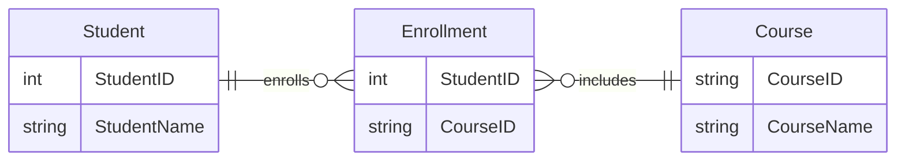
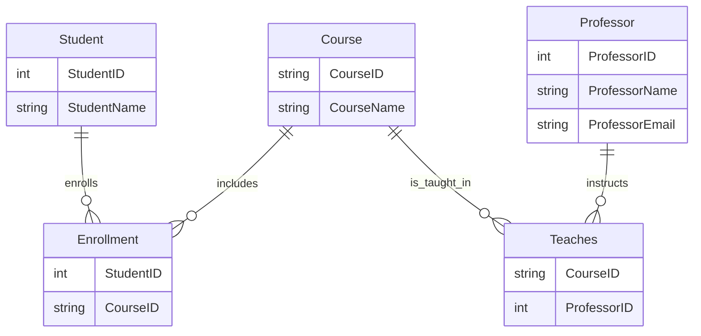

# Anomalies in Unnormalized Databases

Data anomalies are inconsistencies or errors that arise when a database is poorly structured—typically due to redundant or unnormalized data. These anomalies compromise data integrity, consistency, and efficiency.

## Types of Anomalies

There are three primary types of anomalies:

### Insert Anomaly

Occurs when you **cannot insert data** into a table without the presence of unrelated data.

#### Example

Suppose we have a single table storing both student and course enrollment data:

```sql
| StudentID | StudentName | CourseID | CourseName |
|-----------|-------------|----------|------------|
| 1         | Alice       | CS101    | Databases  |
```

Now, you want to add a new course **before any student enrolls**. You can't—because the table requires a `StudentID`.

#### Why it happens

This happens when **multiple entities** (like Students and Courses) are stored in the same table. The design assumes that every course must have a student, which isn't always true.

#### Solution

Split the tables:



Now, you can insert a course independently.

&nbsp;

### Update Anomaly

Occurs when updating a single piece of data requires multiple updates across rows.

#### Example

```sql
-- Redundant data
| CourseID | CourseName | ProfessorEmail     |
|----------|------------|--------------------|
| CS101    | Databases  | prof@uni.edu       |
| CS102    | AI         | prof@uni.edu       |
```

If the professor changes their email, you must update **every row**. Miss one? You’ve got inconsistent data.

#### Why it happens

This is due to **data redundancy**—the same piece of information (`email`) is stored in multiple places.

#### Solution

Separate professors into their own table:



Now, one update to the `Professor` table updates the email for all courses.

&nbsp;

### Deletion Anomaly

Occurs when **deleting data** unintentionally removes other valuable data.

#### Example

```sql
-- ENROLLMENT table
| StudentID | CourseID | CourseName |
|-----------|----------|------------|
| 1         | CS101    | Databases  |
```

If the only student enrolled in CS101 drops the course and you delete the row, you also lose the course information.

#### Why it happens

This happens when **multiple entities are stored together**, and deleting one entity (student enrollment) removes another (course).

#### Solution



Again, normalize the data into separate tables for `Student`, `Course`, and `Enrollment`.

&nbsp;

## Try it yourself :rocket:

### Part 1: Analyze the Table Below

A database designer created the following table for a university’s course registrations:

| StudentID | StudentName | CourseID | CourseName     | ProfessorName  | ProfessorEmail    |
|-----------|-------------|----------|----------------|----------------|-------------------|
| 101       | Alice Smith | CS101    | Databases      | Dr. Fox        | <fox@uni.edu>     |
| 101       | Alice Smith | CS102    | Networks       | Dr. Lin        | <lin@uni.edu>     |
| 102       | Bob Lee     | CS101    | Databases      | Dr. Fox        | <fox@uni.edu>     |

&nbsp;

**Question 1:** Identify all possible anomalies in this table. Provide specific examples:

- Insertion anomaly
- Update anomaly
- Deletion anomaly

&nbsp;

**Question 2:** Why do these anomalies occur? Hint: Consider redundancy and entity relationships.

&nbsp;

### Part 2: Normalize the Data

Redesign the table structure by dividing it into three or more normalized tables, removing redundancy and eliminating the identified anomalies.

- Draw ER diagrams (or tables) for the new structure on paper.
- Indicate primary keys and foreign keys.
- Explain how your new schema prevents each of the anomalies identified in Part 1.

&nbsp;

### Bonus challange

Suppose a new requirement is added: each professor may teach multiple courses, and some courses are co-taught by more than one professor. Modify your schema to accommodate this and preserve normalization. What normal form are you aiming for now?

&nbsp;

<details>
<summary>Possible solution</summary>



&nbsp;

Splitting data into:

- Student(StudentID, StudentName)
- Course(CourseID, CourseName)
- Professor(ProfessorID, ProfessorName, Email)
- A junction table for Teaches(CourseID, ProfessorID)
- A junction table for Enrollment(StudentID, CourseID)

</details>

&nbsp;
&nbsp;

