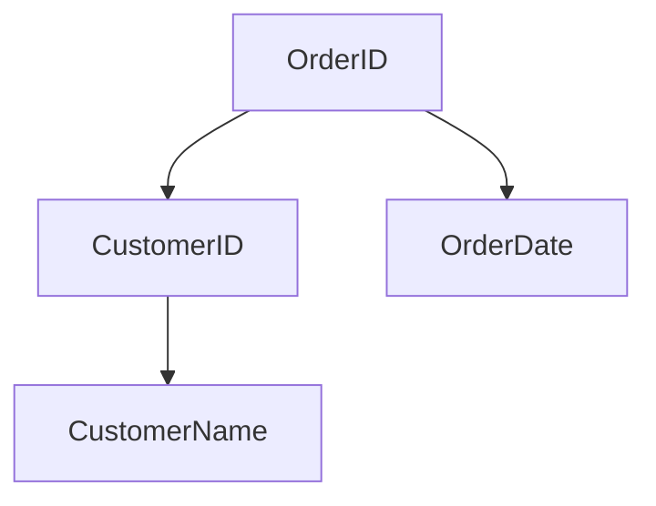

# Dependencies

In the context of relational databases, a dependency describes a relationship between attributes (columns) in a table. The most important type is the functional dependency, which is the backbone of normalization.

## Functional Dependencies

A functional dependency exists when the value of one attribute (or a group of attributes) determines the value of another attribute.

### Definition

If attribute `A` functionally determines attribute `B`, we write it as:

```cli
A → B
```

This means: *If two rows have the same value for `A`, they must have the same value for `B`.*

### Example

| StudentID | StudentName |
|-----------|-------------|
| 101       | Alice       |
| 102       | Bob         |

Here, `StudentID → StudentName` because each student ID uniquely determines a name.

&nbsp;

### Types

#### 1. Trivial Dependency

Occurs when `B` is a subset of `A`.

Example: `{StudentID, StudentName} → StudentID`.

This is always true and doesn’t help with normalization.

&nbsp;

#### 2. Non-Trivial Dependency

Occurs when `B` is not a subset of `A`.

Example: `StudentID → StudentName`

This is meaningful and used in normalization.

&nbsp;

#### 3. Transitive Dependency

If `A → B` and `B → C`, then `A → C`.

This is problematic in 3NF and beyond.

&nbsp;

#### 4. Partial Dependency

Occurs when a non-prime attribute is functionally dependent on part of a composite primary key.

This violates 2NF.

&nbsp;

### Real-world example

Let's say we hafve this table:

| OrderID | CustomerID | CustomerName | OrderDate |
|---------|------------|--------------|-----------|
| 5001    | C001       | Alice        | 2025-06-01|

#### Functional dependencies

- `OrderID → CustomerID, OrderDate`
- `CustomerID → CustomerName`

#### Problem

`CustomerName` depends on `CustomerID`, not `OrderID`. This is a **transitive dependency** and violates **3NF**.

#### Solution



- Separate `Customer(CustomerID, CustomerName)`
- Keep `Order(OrderID, CustomerID, OrderDate)`

&nbsp;

## PostgreSQL and Dependencies

PostgreSQL tracks **object-level dependencies** (e.g., between tables, views, constraints) to maintain schema integrity. For example, if a table has a foreign key to another, PostgreSQL won’t let you drop the referenced table unless you use `CASCADE`.

For attribute-level dependencies (like functional dependencies), PostgreSQL doesn’t enforce them directly—but you can model them using:

- **Primary keys**
- **Unique constraints**
- **Foreign keys**

These constraints help enforce the logic implied by functional dependencies.

&nbsp;
&nbsp;
