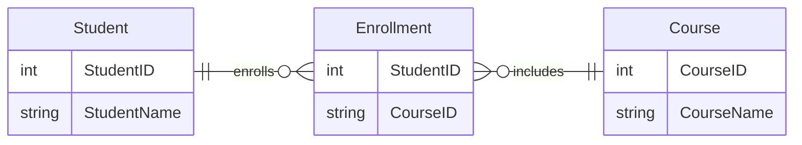
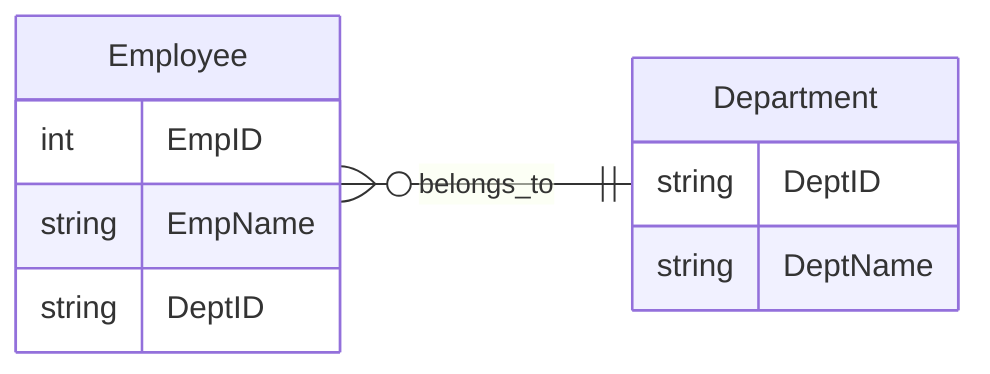
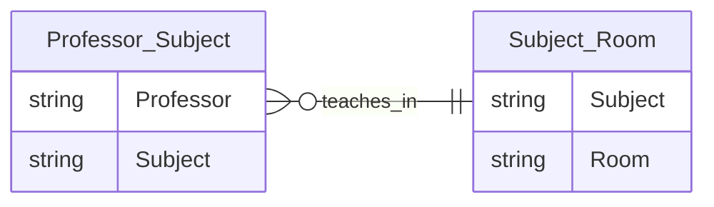
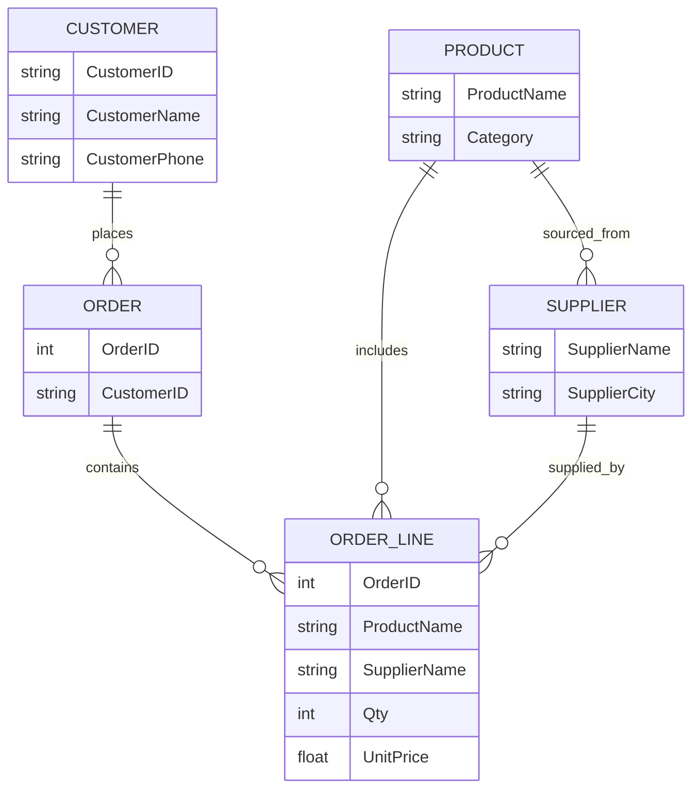

# Normal forms (0NF, 1NF, 2NF, 3NF, Boyce Codd NF)

Normal forms are rules or guidelines for structuring relational databases. Each form addresses specific types of redundancy and dependency issues. The goal is to ensure data integrity, minimize duplication, and simplify maintenance.

## Overview

| Normal Form | Goal | Key Requirement |
|-------------|------|------------------|
| 0NF         | Unstructured | No normalization; data may contain repeating groups |
| 1NF         | Atomicity | All attributes must contain only atomic (indivisible) values |
| 2NF         | Eliminate Partial Dependencies | Must be in 1NF and all non-key attributes fully depend on the entire primary key |
| 3NF         | Eliminate Transitive Dependencies | Must be in 2NF and no transitive dependencies |
| BCNF        | Stronger 3NF | Every determinant must be a candidate key |
| 4NF         | Eliminate Multivalued Dependencies | Must be in BCNF and no multivalued dependencies |
| 5NF         | Eliminate Join Dependencies | Must be in 4NF and no join dependencies |
| 6NF         | Temporal/Decomposition | Used in temporal databases; every join dependency is a consequence of candidate keys |

&nbsp;

## 0NF (Unnormalized Form)

0NF refers to a table (or dataset) that has not been normalized at all. It may contain:

- Repeating groups
- Multivalued attributes
- Nested records
- No clear primary key

This is often how data looks when it's first collected—think spreadsheets, CSVs, or denormalized reports.

```sql
| CustomerID | Name       | Contacts             |
|------------|------------|----------------------|
| C001       | Alice Wong | 123-4567, 987-6543   |
| C002       | Bob Smith  | 555-1212             |
```

- The `Contacts` field contains **multiple phone numbers** in a single cell.
- This violates the principle of **atomicity** (each field should hold a single value).

&nbsp;

## 1NF (First Normal Form)

1NF ensures that each field holds a single value, making data easier to query and manipulate.

A table is in 1NF if:

- All attributes contain **atomic (indivisible)** values.
- Each record is **unique**.
- There are **no repeating groups** or arrays.

### Violation

```sql
| StudentID | Name     | Courses             |
|-----------|----------|---------------------|
| 1         | Alice    | DB, AI, Networks     |
```

`Courses` contains multiple values → violates 1NF.

### Fix

```sql
| StudentID | Name     | Course     |
|-----------|----------|------------|
| 1         | Alice    | DB         |
| 1         | Alice    | AI         |
| 1         | Alice    | Networks   |
```

Now each field is atomic.

&nbsp;

## 2NF (Second Normal Form)

2NF removes partial dependencies, which occur when a non-key attribute depends on part of a composite key.

A table is in 2NF if:

- It is in **1NF**.
- **Every non-prime attribute** is **fully functionally dependent** on the **entire primary key**.

### Violation

```sql
| StudentID | CourseID | StudentName | CourseName |
|-----------|----------|-------------|------------|
| 1         | CS101    | Alice       | Databases  |
```

- Composite key: `(StudentID, CourseID)`
- `StudentName` depends only on `StudentID` → partial dependency.

### Fix

```sql
| StudentID | Name     | Course     |
|-----------|----------|------------|
| 1         | Alice    | DB         |
| 1         | Alice    | AI         |
| 1         | Alice    | Networks   |
```

Now each field is atomic.



---

### 3NF (Third Normal Form)

Transitive dependencies can cause update anomalies and data inconsistency.

A table is in 3NF if:

- It is in **2NF**.
- There are **no transitive dependencies** (i.e., non-key attributes depending on other non-key attributes).

### Violation

```sql
| EmpID | EmpName | DeptID | DeptName |
|-------|---------|--------|----------|
| 1     | Alice   | D01    | HR       |
```

- `EmpID → DeptID`
- `DeptID → DeptName` → transitive dependency.

### Fix



Now each non-key attribute depends only on the key.

&nbsp;

### BCNF (Boyce-Codd Normal Form)

BCNF handles edge cases where 3NF is technically satisfied but anomalies still exist due to **non-candidate key dependencies**.

A table is in BCNF if:

- It is in **3NF**.
- **Every determinant** is a **candidate key**.

### Violation

Let’s say we have a table where:

- A professor teaches a subject.
- Each subject is assigned to a unique classroom.
- But multiple professors can teach the same subject.

```sql
| Professor | Subject | Room  |
|-----------|---------|-------|
| Dr. Fox   | DB      | R101  |
| Dr. Lin   | DB      | R101  |
| Dr. Kim   | AI      | R102  |
```

- `Subject → Room` but `Subject` is not a candidate key → violates BCNF.
- `Professor → Subject` is the actual candidate key.

This table is in 3NF:

- All non-key attributes depend on the key.
- No transitive dependencies.

### Fix

We can decompose the table into two:

1. `Subject → Room`
2. `Professor → Subject`



Now, each dependency is preserved, and all determinants are candidate keys.

&nbsp;

## PostgreSQL Reference

PostgreSQL doesn’t enforce normal forms directly, but it provides the tools to implement them:

- **Primary and foreign keys**: Enforce entity relationships.
- **Unique constraints**: Help define candidate keys.
- **Views and joins**: Allow recomposition of normalized data.

&nbsp;

## Try it yourself :rocket:

The company “MegaMart” tracks product orders in a table that looks like this:

| OrderID | CustomerName | CustomerPhone | ProductName      | Category   | SupplierName | SupplierCity | Qty | UnitPrice |
|---------|--------------|---------------|------------------|------------|---------------|--------------|-----|-----------|
| 1001    | Alice Smith  | 555-1234      | Wireless Mouse   | Peripherals| TechSupply    | Boston       | 2   | 25.00     |
| 1001    | Alice Smith  | 555-1234      | USB-C Cable      | Cables     | TechSupply    | Boston       | 3   | 8.00      |
| 1002    | Bob Lee      | 555-5678      | Mechanical KB    | Peripherals| KeyMakers     | Chicago      | 1   | 89.99     |
| 1003    | Alice Smith  | 555-1234      | USB-C Cable      | Cables     | TechSupply    | Boston       | 4   | 8.00      |

**Hint**: Every row represents a line item in an order (not the entire order).

### 1. Identify Functional Dependencies

Look for all possible functional dependencies that exist in the current table. Mark clearly which ones are:

- Partial dependencies
- Transitive dependencies
- Candidate keys
- Determinants that violate BCNF

### 2. Identify Normal Form Violations

For each of the following normal forms, determine whether the current table satisfies it. If not, explain why:

- 1NF
- 2NF
- 3NF
- BCNF

### 3. Normalize the Table

Step-by-step:

- Convert it to 1NF (if needed)
- Then to 2NF – eliminating partial dependencies
- Then 3NF – eliminating transitive dependencies
- Finally, decompose into BCNF – ensuring all determinants are candidate keys

For each step:

- Write the schema (i.e. table names and attributes)
- Identify primary and foreign keys
- Justify your design decisions

### Bonus challange :rocket:

Scenario update: Due to a new supplier partnership, some products now come from more than one supplier (e.g. "USB-C Cable" can come from both "TechSupply" and "CableWorld"). How would this affect your BCNF schema? Can your design handle it?

&nbsp;

<details>
<summary>Possible solution</summary>

Here's a high-level breakdown of expected solutions you can use to guide discussion or grading:

- **Composite key**: Likely OrderID + ProductName (maybe even OrderID + ProductName + SupplierName depending on assumptions)
- **Partial dependency**: CustomerName depends only on OrderID, not full composite key
- **Transitive**: SupplierName → SupplierCity, CustomerName → CustomerPhone
- **BCNF Violation**: ProductName → Category, SupplierName → SupplierCity



</details>

&nbsp;
&nbsp;
