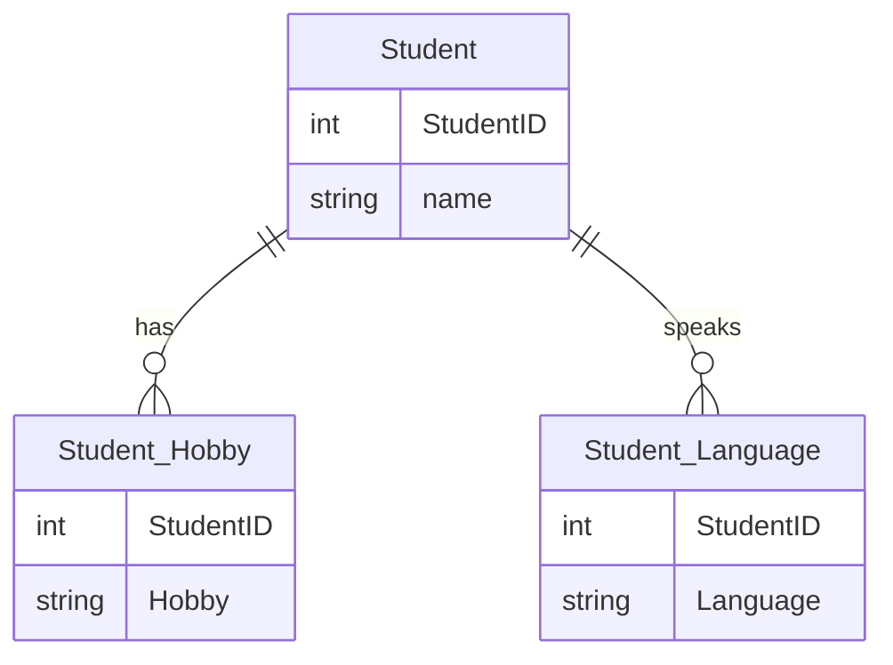
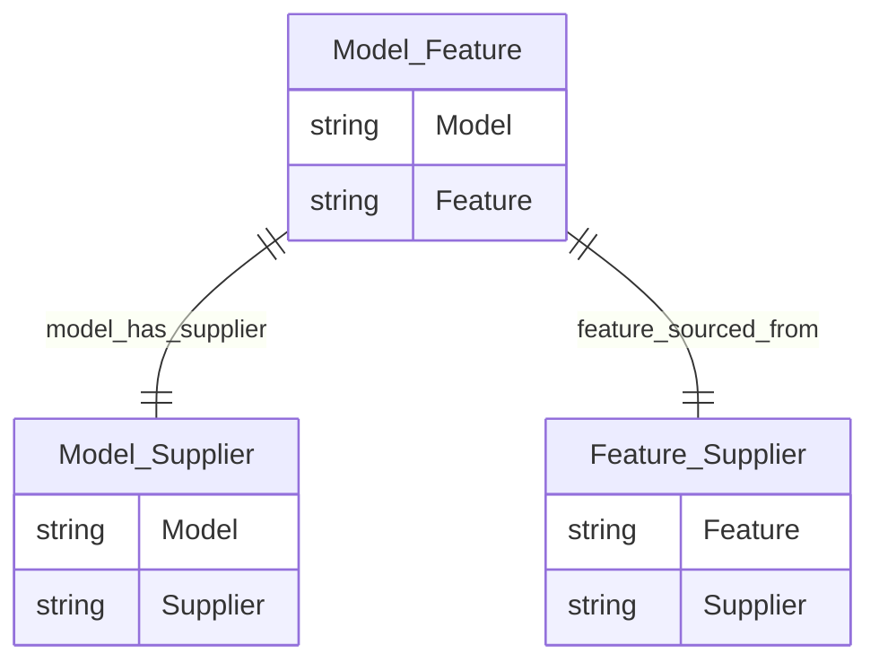
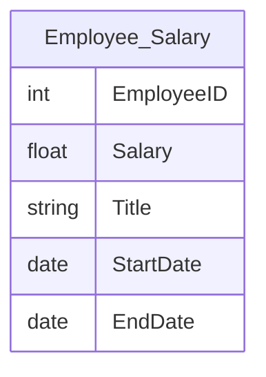
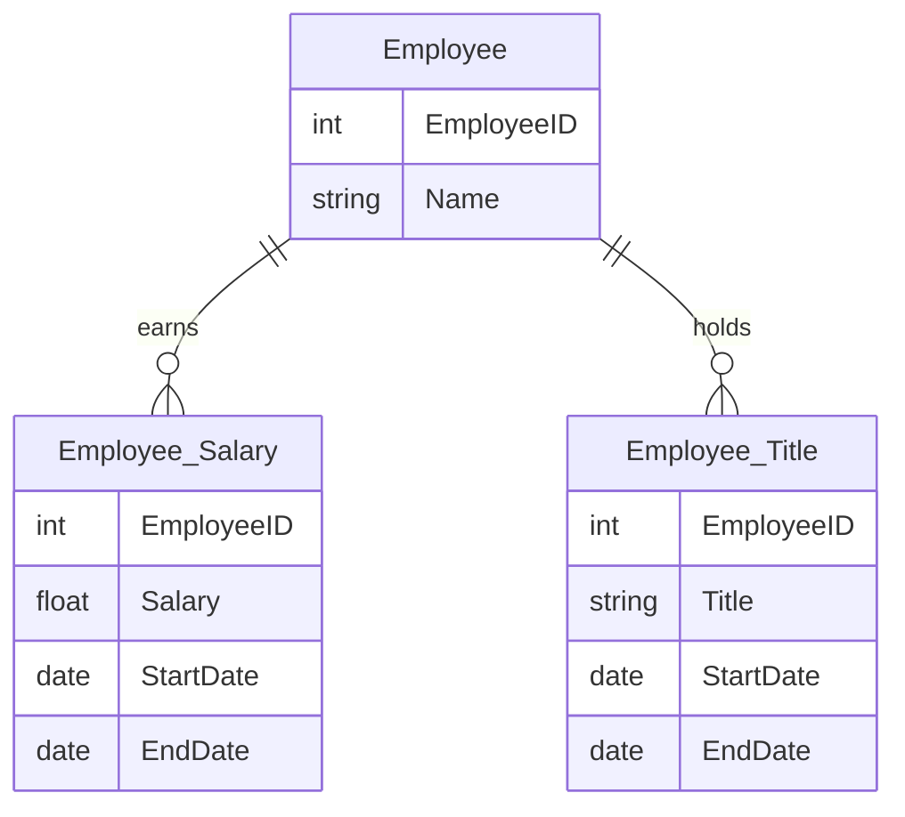

# Higher Normal Forms (4NF, 5NF, 6NF)

Let’s venture into the higher normal forms—4NF, 5NF, and 6NF—which address more complex types of redundancy and dependencies that can still exist even after achieving BCNF. These are especially relevant in advanced database design, data warehousing, and temporal systems.

## Fourth Normal Form (4NF)

In the 4th Normal Form we try to fix multivalued dependencies.
A multivalued dependency occurs when one attribute in a table independently determines multiple values of another attribute, and those values are not related to each other.

A table is in 4NF if:

- It is in **BCNF**.
- It has **no multivalued dependencies** (MVDs).

### Violation

```sql
| Student | Language | Hobby     |
|---------|----------|-----------|
| Alice   | English  | Painting  |
| Alice   | English  | Chess     |
| Alice   | French   | Painting  |
| Alice   | French   | Chess     |
```

- Alice speaks two languages and has two hobbies.
- But Language and Hobby are unrelated—they’re both multivalued attributes of Student.

This creates **redundant combinations** (Cartesian product) and bloats the table.

### Fix



Split into two independent tables:

- `Student_Language(Student, Language)`
- `Student_Hobby(Student, Hobby)`

Now each multivalued dependency is isolated.

## Fifth Normal Form (5NF)

In the 5th Normal Form, we try to solve join dependencies.
A join dependency exists when a table can be reconstructed from multiple projections, but not all projections are necessary to preserve the original data.

A table is in 5NF (also called Project-Join Normal Form) if:

- It is in **4NF**.
- Every **join dependency** is implied by the candidate keys.

### Violation

```sql
| Model   | Feature   | Supplier   |
|---------|-----------|------------|
| XPhone  | Camera    | LensCorp   |
| XPhone  | Battery   | PowerMax   |
| XPhone  | Camera    | PowerMax   |
| XPhone  | Battery   | LensCorp   |
```

- Each `Model` has multiple `Features`.
- Each `Feature` can be supplied by multiple `Suppliers`.
- But not every **Model-Feature-Supplier** combination is valid.

### Fix



Decompose into three tables:

- `Model_Feature(ModelID, Feature)`
- `Model_Supplier(ModelID, Supplier)`
- `Feature_Supplier(Feature, Supplier)`

This design avoids unnecessary combinations by keeping relationships factored and only recombining when needed, e.g., through **natural joins**. Every join dependency is preserved and recoverable through relational algebra.

## Sixth Normal Form (6NF)

6NF is typically used for temporal data, versioning, or systems requiring highly decomposed relations—like tracking changes in individual attributes over time.

A table is in 6NF if:

- It is in **5NF**.
- It has **no non-trivial join dependencies at all**—even those implied by candidate keys

### When to use it

- **Temporal databases** (e.g., tracking changes over time)
- **Data warehousing**
- **Highly decomposed systems** where each fact is stored in its own relation

### Example

Tracking employee salaries over time:



- `Employee_Salary(EmployeeID, Salary, Title, StartDate, EndDate)`

&nbsp;

In 6NF, you might split this further into:



- `Employee_Salary(EmployeeID, Salary, StartDate, EndDate)`
- `Employee_Title(EmployeeID, Title, StartDate, EndDate)`

In this structure:

- Each attribute-change event (salary, title, etc.) is tracked independently.
- Ensures no temporal join dependencies remain.
- Enables fine-grained auditing and versioning.

This allows fine-grained versioning and temporal querying.

&nbsp;

## PostgreSQL Context

PostgreSQL supports higher normal forms through:

- **Table partitioning** (useful for 6NF temporal data)
- **Views and joins** to reconstruct decomposed tables
- **Advanced constraints** and **foreign keys** to enforce integrity

&nbsp;
&nbsp;
