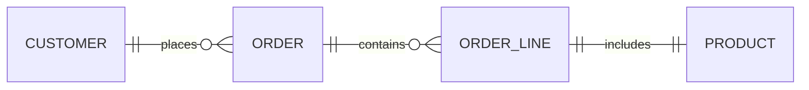

# Normalization vs. Performance Optimization

Let’s talk performance—because while normalization is great for data integrity, it can sometimes clash with speed and efficiency. This section will help your students understand the trade-offs between a beautifully normalized schema and a system that actually performs well under load.

## Pros of Normalization

- **Reduces redundancy** → less storage
- **Improves consistency** → fewer anomalies
- **Simplifies updates** → change data in one place

But...

## Trade-Offs

- **More joins**: Highly normalized schemas often require joining many tables to answer a single query.
- **Complex queries**: Query planners must work harder to optimize joins.
- **Indexing overhead**: More tables = more indexes = more maintenance.

&nbsp;

## Example

Imagine a normalized e-commerce schema:



To get a customer’s order history with product names and prices, you’d need to join **four tables**. That’s fine for small datasets, but at scale, it can slow things down.

&nbsp;

## Performance Tips

PostgreSQL is highly capable of handling normalized schemas efficiently—if tuned properly. Here are some key strategies:

### 1. Use Indexes Wisely

- Index foreign keys and join columns.
- Use **composite indexes** for multi-column filters.
- Consider **partial indexes** for frequently queried subsets.

### 2. Analyze and Vacuum

- Run `ANALYZE` to update planner statistics.
- Use `VACUUM` to reclaim space and maintain performance.

### 3. Use EXPLAIN (`ANALYZE`)

- Understand how queries are executed.
- Identify slow joins or missing indexes.

### 4. Denormalize Selectively

- For read-heavy workloads, consider **materialized views** or **summary tables**.
- Denormalize only when profiling shows it’s worth it.

&nbsp;

## Hands-on

Let’s get hands-on! Here’s a classroom lab exercise that puts normalization to the test—literally. Students will work with a small dataset in both normalized and denormalized forms, then run basic queries to compare performance and structure.

### 1. Denormalized Schema

```sql
CREATE TABLE OrdersDenormalized (
    OrderID SERIAL PRIMARY KEY,
    CustomerName TEXT,
    CustomerPhone TEXT,
    ProductName TEXT,
    Category TEXT,
    SupplierName TEXT,
    SupplierCity TEXT,
    Qty INT,
    UnitPrice NUMERIC(10, 2)
);
```

Insert sample data (feel free to add more rows)

```sql
INSERT INTO OrdersDenormalized (CustomerName, CustomerPhone, ProductName, Category, SupplierName, SupplierCity, Qty, UnitPrice)
VALUES 
('Alice', '555-1234', 'Mouse', 'Peripherals', 'TechSupply', 'Boston', 2, 25.00),
('Alice', '555-1234', 'Keyboard', 'Peripherals', 'KeyMakers', 'Chicago', 1, 45.00),
('Bob', '555-4321', 'USB-C Cable', 'Cables', 'TechSupply', 'Boston', 4, 8.00);
```

### 2. Normalized Schema

```sql
CREATE TABLE Customer (
    CustomerID SERIAL PRIMARY KEY,
    Name TEXT,
    Phone TEXT
);

CREATE TABLE Supplier (
    SupplierID SERIAL PRIMARY KEY,
    Name TEXT,
    City TEXT
);

CREATE TABLE Product (
    ProductID SERIAL PRIMARY KEY,
    Name TEXT,
    Category TEXT
);

CREATE TABLE Orders (
    OrderID SERIAL PRIMARY KEY,
    CustomerID INT REFERENCES Customer(CustomerID)
);

CREATE TABLE OrderLine (
    OrderID INT REFERENCES Orders(OrderID),
    ProductID INT REFERENCES Product(ProductID),
    SupplierID INT REFERENCES Supplier(SupplierID),
    Qty INT,
    UnitPrice NUMERIC(10, 2)
);
```

Insert sample data (feel free to add more rows)

```sql
-- Customers --
INSERT INTO Customer (CustomerID, Name, Phone) VALUES
(1, 'Alice Smith', '555-1234'),
(2, 'Bob Lee', '555-4321');

-- Suppliers --
INSERT INTO Supplier (SupplierID, Name, City) VALUES
(1, 'TechSupply', 'Boston'),
(2, 'KeyMakers', 'Chicago');

-- Products --
INSERT INTO Product (ProductID, Name, Category) VALUES
(1, 'Mouse', 'Peripherals'),
(2, 'Keyboard', 'Peripherals'),
(3, 'USB-C Cable', 'Cables');

-- Orders --
INSERT INTO Orders (OrderID, CustomerID) VALUES
(1001, 1),
(1002, 2),
(1003, 1);

-- OrderLines --
INSERT INTO OrderLine (OrderID, ProductID, SupplierID, Qty, UnitPrice) VALUES
(1001, 1, 1, 2, 25.00),       -- Alice orders 2 Mice from TechSupply
(1001, 3, 1, 3, 8.00),        -- Alice orders 3 USB-C Cables from TechSupply
(1002, 2, 2, 1, 45.00),       -- Bob orders 1 Keyboard from KeyMakers
(1003, 3, 1, 4, 8.00);        -- Alice orders 4 USB-C Cables from TechSupply
```

### Task 1: Query comparison

Have students write equivalent SQL queries for both schemas:

- Get all products ordered by Alice
- Total sales amount per supplier
- Customers who bought cables

Let them notice:

- How many JOINs the normalized schema requires
- How direct (but redundant) the denormalized queries are

&nbsp;

### Task 2: Analyze Query Plan

Run `EXPLAIN ANALYZE` on each version of one query (e.g., total sales per supplier) and compare:

- Estimated cost
- Join strategy (Hash Join vs. Nested Loop)
- Number of rows scanned

&nbsp;

### Task 3: Discussion

- Which queries were simpler to write? Why?
- Which schema would scale better in a transactional app?
- Where could views or materialized views help?
- Can denormalization be justified?

&nbsp;
&nbsp;
