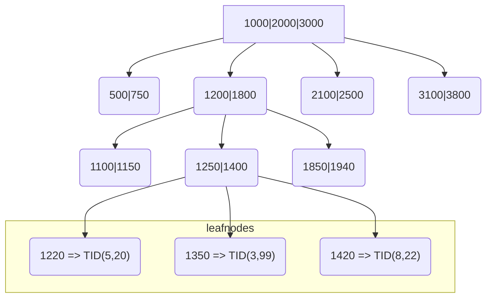

# Indexing – Speeding Up Data Retrieval

## Introduction to Indexes
Imagine a very large book — perhaps 2,000 pages long — with information scattered throughout. If you want to find all mentions of a certain topic, flipping through every page would take forever. That’s why books have an index at the back: a list of important terms with corresponding page numbers. Instead of reading everything, you can jump directly to what you're looking for.

In a database, the same principle applies. A table is like that big book — it contains a lot of rows (records), and searching without guidance can be slow. An index helps the database locate specific rows much faster, without scanning the entire table.

## What is a Index
An index is a data structure that improves the speed of data retrieval on a table. It provides a mapping from a column’s value to the physical location of rows, similar to how a book’s index maps words to pages.

Without an index, PostgreSQL must perform a sequential scan — checking every row — which is slow for large tables. With an index, PostgreSQL can use a more efficient access path.

### Common Index Types in PostgreSQL

| Index Type | Description                                                                     | Use Cases                                                            |
| ---------- | ------------------------------------------------------------------------------- | -------------------------------------------------------------------- |
| **B-tree** | The default index type; organizes values in a balanced tree structure.          | Fast for exact matches and range queries (`=`, `<`, `>`, `BETWEEN`)  |
| **BRIN**   | Block Range Index; stores min/max metadata per block instead of row-level data. | Best for very large, **naturally ordered** tables (e.g., timestamps) |
| **GIN**    | Generalized Inverted Index; used for indexing composite or array values.        | Full-text search, JSONB, arrays                                      |
| **GiST**   | Generalized Search Tree; supports complex data types like geometry.             | Spatial data, ranges, custom indexing                                |


In the figure below, you see a visual representation of a B-tree index. The blue rectangles represent the nodes of the tree, with the ones at the bottom (inside the yellow box) called leaf nodes.
The leaf nodes contain the actual mapping between indexed values and row pointers, known in PostgreSQL as Tuple Identifiers (`TIDs`). Each `TID` points to the physical location of a row in the table, using a `(page, offset)` format.
In a B-tree, a node with N keys always has N+1 child nodes, which ensures that the search space is correctly partitioned.





### Benefits of Using Indexes
- Faster queries: Especially for SELECTs with filters or joins.
- Enables efficient sorting and searching.
- Supports constraints: e.g., enforcing uniqueness.

### Drawbacks of Indexes
- Insert/Update overhead: Indexes must be updated when the table changes, which adds write cost.
- More storage usage: Indexes take up disk space.
- Too many indexes hurt performance: Each additional index slows down inserts, updates, and deletes.

### Design Tip
Indexing is a powerful optimization tool, but not every column should be indexed.
Before creating an index, ask yourself:

- Will this column be frequently searched or filtered?
- Will the index reduce the need to scan large portions of the table?
- Is the table large enough that indexing brings real value?

Indexing should be based on actual data access patterns. Good index design comes from understanding how your application queries the data.

## Creating a Block Range Index (BRIN)

A BRIN index (Block Range Index) is a compact and efficient index type in PostgreSQL, designed for very large tables where values are physically ordered on disk — such as timestamped logs or sequential IDs.

Unlike B-tree indexes, a BRIN does not store pointers to individual rows. Instead, it stores a summary — typically the minimum and maximum values — for each block of rows (e.g., every 128 pages. A page is the smallest storage unit in PostgreSQL, fixed at 8KB).

The following SQL creates a Block Range Index (BRIN) on the salary column of the employees table.

````sql
CREATE INDEX idx_employee_salary ON employees USING BRIN (salary);
`````


### Full Example for Context and Testing

1. Create the employees table
````sql
CREATE TABLE employees (
    id SERIAL PRIMARY KEY,
    name TEXT,
    salary NUMERIC
);
````
2. Insert simulated data (100,000 rows)
````sql
INSERT INTO employees (name, salary)
SELECT
    'Employee ' || generate_series(1, 100000),
    generate_series(30000, 130000, 1);  -- salaries from 30k to 130k
````
This creates salaries that are physically ordered, which is ideal for BRIN indexing.

3. Run a query before or after indexing
````sql
EXPLAIN ANALYZE
SELECT * FROM employees WHERE salary BETWEEN 75000 AND 75500;
````

Before indexing, this will likely trigger a Seq Scan.
After indexing, you should see a Bitmap Index Scan or BRIN Index Scan.

### When BRIN works well
BRIN indexes are highly efficient when:
- The data is naturally ordered (e.g., ascending salary or created_at values)
- Each block covers a tight range of values
- You frequently query ranges (e.g., "find all salaries between 70,000 and 75,000")

In this case, PostgreSQL can use the BRIN index to skip entire blocks that are clearly outside the filter range.

### When BRIN becomes ineffective
If the table’s data is not physically clustered (e.g., values are inserted randomly), the value ranges per block become too broad. The BRIN index can no longer help PostgreSQL eliminate irrelevant blocks efficiently — and the query may revert to a full table scan.

### Reorder data physically in the table
If your data is no longer physically ordered, you should consider reordering it to restore index efficiency. The `CLUSTER` command will rearrange the rows in the table based on the order defined by an index. However, `CLUSTER` requires a index that points to every row and defines a strict order - such as a B-Tree index. A BRIN index does not meet this requirement, as it only stores range summaries. In our example of the `employees` table, we can follow these steps:

1. Create a temporay B-Tree index

````sql
CREATE INDEX idx_temp_salary ON employees (salary);
````
2. Reorder the table based upon the indexed column.
````sql
CLUSTER employees USING idx_temp_salary;
````
This rewrites the table on disk, physically ordering the rows by salary. This improves the effectiveness of the existing BRIN index.

3. Drop the temporary B-Tree index
````sql
DROP INDEX idx_temp_salary;
````   
