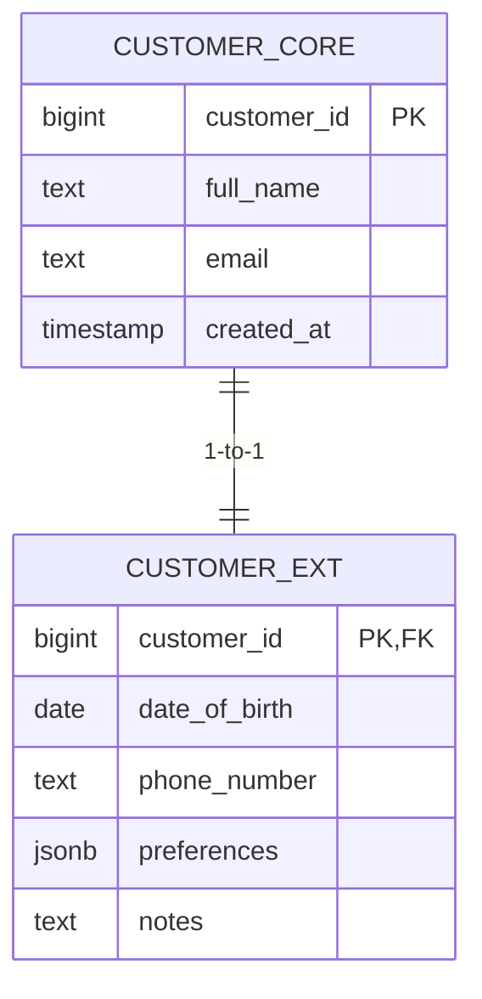

# Partitioning – Breaking Large Tables into Smaller Pieces

When dealing with large datasets, partitioning can help improve performance and maintainability. PostgreSQL supports two general types of partitioning:

- Horizontal partitioning: splitting a table by rows
- Vertical partitioning: splitting a table by columns

## Horizontal partitioning

Horizontal partitioning is the process of splitting a large table into smaller pieces, called partitions, where each partition holds a subset of the rows based on the value of one or more columns.
From the user's perspective, it behaves like a single logical table — but under the hood, the data is physically separated.

In the example below, we partition a sales table by sale_date, using yearly ranges.

### Create the logical parent table
````sql
CREATE TABLE sales (
    id SERIAL,
    sale_date DATE,
    amount NUMERIC
) PARTITION BY RANGE (sale_date);
`````

This logically partitions the sales table by sale_date, meaning the data is transparently stored across multiple physical partitions behind the scenes. Queries that filter on sale_date can benefit from improved performance through partition pruning — but only after specific partitions have been created.

- No rows can be inserted into sales directly until partitions are defined.
- The table acts as a logical container; the actual data is stored in child tables (partitions).

### Define physical partitions per year

````sql
-- Partition for 2023
CREATE TABLE sales_2023 PARTITION OF sales
    FOR VALUES FROM ('2023-01-01') TO ('2024-01-01');

-- Partition for 2024
CREATE TABLE sales_2024 PARTITION OF sales
    FOR VALUES FROM ('2024-01-01') TO ('2025-01-01');

-- Partition for 2025
CREATE TABLE sales_2025 PARTITION OF sales
    FOR VALUES FROM ('2025-01-01') TO ('2026-01-01');
`````

- Each partition is a separate physical table behind the scenes.
- The range boundaries (FROM ... TO) define the values of sale_date each partition accepts.
- Any insert with a date outside these ranges will result in an error unless a default partition is defined.

### Optional: Add a default partition

````sql
CREATE TABLE sales_other PARTITION OF sales DEFAULT;
`````
- This catch-all partition handles rows that do not match any of the defined ranges.
- Useful for preventing insert errors when new or unexpected dates are encountered.

### Query the partitioned table

````sql
SELECT SUM(amount)
FROM sales
WHERE sale_date BETWEEN '2024-05-01' AND '2024-05-31';
`````
- PostgreSQL automatically uses partition pruning, scanning only the relevant partition(s).
- This improves query performance, especially on large datasets, by skipping irrelevant partitions.

### Design tip
Horizontal partitioning can be done not only by dates, but also by numeric values, text categories, or even hashed values. As a database designer, you should analyze the most common query patterns before deciding how to partition — the right partitioning strategy depends entirely on how the data is accessed.

### Comparision: Horizontal Partitioning vs Indexes

| Feature                | Horizontal Partitioning                            | Indexes                                       |
| ---------------------- | -------------------------------------------------- | --------------------------------------------- |
| **Main goal**          | Reduce scanned data volume                         | Speed up row lookup                           |
| **How it works**       | Splits table into physical sub-tables (partitions) | Builds a search tree alongside the table      |
| **Best for**           | Filtering on partition key (e.g. date, region)     | Filtering on other columns or point lookups   |
| **Query optimizer**    | Can skip entire partitions (partition pruning)     | Must scan index structure for the whole table |
| **Performance impact** | Reduces I/O and planning time for large datasets   | Improves access speed within a large table    |
| **Can be combined?**   | Yes – with indexes per partition                   | Yes – especially inside partitions          |


## Vertical Partitioning (column-wise)
Vertical partitioning is the process of splitting a large table into smaller ones by moving specific columns into separate tables. The goal is to reduce row width and isolate columns with different access patterns or sensitivity. This can improve I/O efficiency, cache locality, and security boundaries — at the cost of extra joins when queries need the full record.

In the text below the term **PII** is used. This abbreviation stands for *Personally Identifiable Information* — data that can be used to identify an individual, either directly (e.g., name, social security number) or indirectly (e.g., date of birth, address, IP address).

---

### When it helps
- **Performance:** Narrower hot tables (frequently read) keep more rows per page in memory and reduce I/O.  
- **Security & compliance:** Sensitive fields (PII) can be isolated in a separate table/schema with tighter privileges.  
- **Update frequency:** Separate “hot” frequently updated columns from “cold” rarely changing columns.  
- **Cache efficiency:** Narrow rows fit better in memory/cache; indexes can be smaller and more selective.  

> 💡 **Note:** PostgreSQL has no native “vertical partitioning” feature.  
> You model it using **1-to-1 tables** that share the same primary key.

---

### Pattern 1 — Core + Extension table (1:1 split)

Keep frequently accessed columns in a **core** table; move rare/sensitive/large columns to an **extension** table.

```sql
-- Core table: lean, hot columns only
CREATE TABLE customer_core (
    customer_id BIGSERIAL PRIMARY KEY,
    full_name   TEXT NOT NULL,
    email       TEXT NOT NULL UNIQUE,
    created_at  TIMESTAMP NOT NULL DEFAULT now()
);

-- Extension table: cold or sensitive columns
CREATE TABLE customer_ext (
    customer_id BIGINT PRIMARY KEY
        REFERENCES customer_core(customer_id) ON DELETE CASCADE,
    date_of_birth DATE,
    phone_number  TEXT,
    preferences   JSONB,
    notes         TEXT
);

-- Hot path: only core data
SELECT customer_id, full_name, email
FROM customer_core
WHERE email = 'alice@example.com';

-- When you need the extras
SELECT c.customer_id, c.full_name, e.preferences
FROM customer_core c
JOIN customer_ext  e USING (customer_id)
WHERE c.customer_id = 42;
```

### Pattern 2 — Security boundary for PII

Place personally identifiable information (PII) in a **separate schema** with stricter privileges.

```sql
CREATE SCHEMA pii AUTHORIZATION db_admin;

CREATE TABLE pii.customer_pii (
    customer_id BIGINT PRIMARY KEY
        REFERENCES public.customer_core(customer_id) ON DELETE CASCADE,
    ssn         TEXT,
    address     TEXT
);

-- Grant minimal privileges
REVOKE ALL ON SCHEMA pii FROM app_read;
REVOKE ALL ON pii.customer_pii FROM app_read;
GRANT SELECT ON public.customer_core TO app_read;
```

**Benefit:** Clear separation of duties and simplified audits.

---

### Pattern 3 — Hot/Cold split by update frequency

Keep frequently updated flags/counters separate from rarely changing identity data.

```sql
CREATE TABLE device_identity (
    device_id   BIGSERIAL PRIMARY KEY,
    serial      TEXT UNIQUE NOT NULL,
    model       TEXT NOT NULL
);

CREATE TABLE device_state (
    device_id   BIGINT PRIMARY KEY
        REFERENCES device_identity(device_id) ON DELETE CASCADE,
    last_seen   TIMESTAMP,
    status      TEXT,
    error_count INTEGER
);
```

**Why it helps:** Updates to `device_state` do not rewrite wide identity rows → less bloat.

---

### Pattern 4 — Optional/rare columns

If only a small percentage of rows use certain columns, move them out to avoid wide sparse rows.

```sql
CREATE TABLE user_marketing_optin (
    user_id  BIGINT PRIMARY KEY REFERENCES users(user_id) ON DELETE CASCADE,
    opted_in BOOLEAN NOT NULL,
    meta     JSONB
);
```

---

### Reconstructing a “full row”

Provide a **read-only view** that joins core + extension.

```sql
CREATE VIEW customer_full AS
SELECT c.*, e.date_of_birth, e.phone_number, e.preferences, e.notes
FROM customer_core c
LEFT JOIN customer_ext e USING (customer_id);
```

Use this for analytics; keep hot paths on the **core** table only.

---

### Indexing considerations
- Index **core** columns that drive lookups/joins.  
- Index extension columns only if often queried.  
- Keep covering indexes lean by excluding large attributes.  

---

### PostgreSQL specifics
- **TOAST:** Large TEXT/JSONB are TOAST-ed; splitting avoids touching TOAST on hot reads.  
- **VACUUM/Bloat:** Wide row updates create churn; core-only updates reduce this.  
- **FK + ON DELETE CASCADE:** Maintain 1:1 integrity.  
- **Permissions & RLS:** Vertical splits combine well with stricter access rules.  

---

### Trade-offs
- If most queries always need **all** columns, vertical partitioning may add unnecessary joins.  
- If tables are not wide or not updated frequently, benefits are small.  
- Extra maintenance: migrations, integrity checks, and test coverage.  

---

### Design checklist
- **Access patterns:** Which columns are hot vs cold?  
- **Update behavior:** Which change often vs rarely?  
- **Row width:** Do wide columns slow down reads?  
- **Security:** Do some fields need stricter access?  
- **Indexes:** Can you keep core indexes small?  
- **Hot path:** Can SLO-critical queries hit only the core?  

---

### Minimal migration template

```sql
BEGIN;

-- 1) Create extension table
CREATE TABLE customer_ext (
    customer_id BIGINT PRIMARY KEY
        REFERENCES customer_core(customer_id) ON DELETE CASCADE,
    phone_number TEXT,
    preferences  JSONB,
    notes        TEXT
);

-- 2) Move data
INSERT INTO customer_ext (customer_id, phone_number, preferences, notes)
SELECT customer_id, phone_number, preferences, notes
FROM customer_core;

-- 3) Drop moved columns from core
ALTER TABLE customer_core
    DROP COLUMN phone_number,
    DROP COLUMN preferences,
    DROP COLUMN notes;

COMMIT;
```

> ⚠️ Always stage migrations and test joins before dropping columns.

---

### Visual: Core ↔ Extension (1:1)



## Horizontal vs Vertical Partitioning – Summary

| Characteristic       | Horizontal Partitioning                    | Vertical Partitioning                               |
| -------------------- | ------------------------------------------ | --------------------------------------------------- |
| **Split by**         | Row values (e.g. by date)                  | Columns (e.g. rarely used or sensitive fields)      |
| **Primary use case** | Performance with large amounts of row data | Performance or security with wide tables            |
| **Result**           | Multiple tables containing subsets of rows | Multiple tables containing subsets of columns       |
| **Common scenarios** | Time-series data, logging, geographic data | Sensitive data, wide tables, column-specific access |


