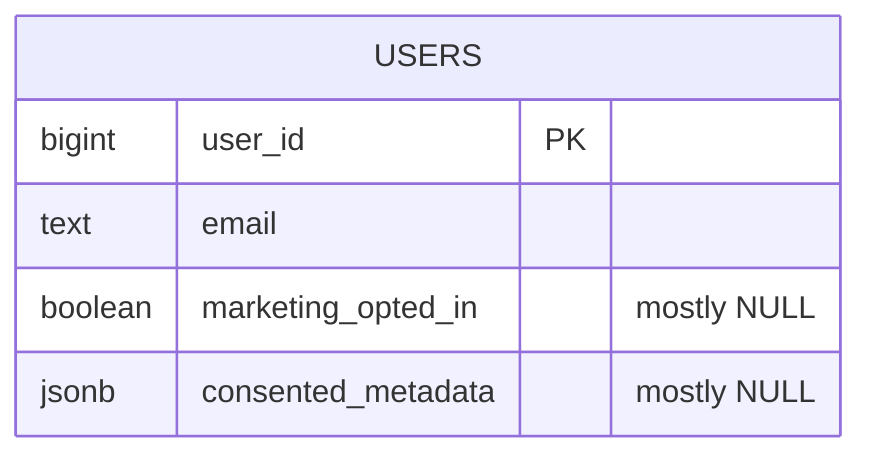
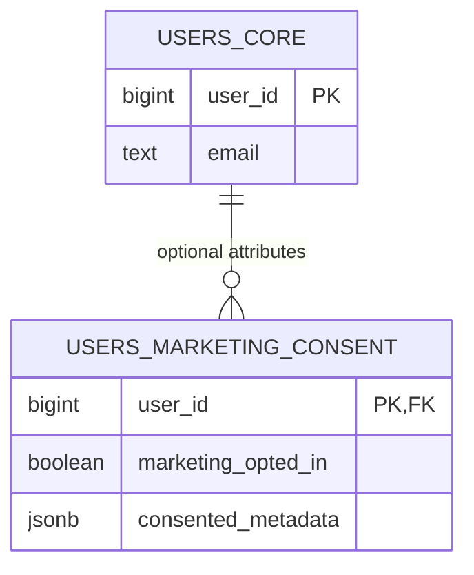

# Partitioning – Breaking Large Tables into Smaller Pieces

When dealing with large datasets, partitioning can help improve performance and maintainability. PostgreSQL supports two general types of partitioning:

- Horizontal partitioning: splitting a table by rows
- Vertical partitioning: splitting a table by columns

## Horizontal partitioning

Horizontal partitioning is the process of splitting a large table into smaller pieces, called partitions, where each partition holds a subset of the rows based on the value of one or more columns.
From the user's perspective, it behaves like a single logical table — but under the hood, the data is physically separated.

In the example below, we partition a sales table by sale_date, using yearly ranges.

### Create the logical parent table
````sql
CREATE TABLE sales (
    id BIGINT GENERATED BY DEFAULT AS IDENTITY,
    sale_date DATE NOT NULL,
    amount NUMERIC
) PARTITION BY RANGE (sale_date);
`````
> 💡 **Note:** The column ```id``` is **not** a primary key in this table. The ```AS IDENTITY``` only controls automatic value generation; it does not imply uniqueness or a primary key by itself. [PostgreSQL Identity columns](https://www.postgresql.org/docs/current/ddl-identity-columns.html)

This logically partitions the sales table by sale_date, meaning the data is transparently stored across multiple physical partitions behind the scenes. Queries that filter on sale_date can benefit from improved performance through partition pruning — but only after specific partitions have been created.

- No rows can be inserted into sales directly until partitions are defined.
- The table acts as a logical container; the actual data is stored in child tables (partitions).

### Define physical partitions per year

````sql
-- Partition for 2023
CREATE TABLE sales_2023 PARTITION OF sales
    FOR VALUES FROM ('2023-01-01') TO ('2024-01-01');

-- Partition for 2024
CREATE TABLE sales_2024 PARTITION OF sales
    FOR VALUES FROM ('2024-01-01') TO ('2025-01-01');

-- Partition for 2025
CREATE TABLE sales_2025 PARTITION OF sales
    FOR VALUES FROM ('2025-01-01') TO ('2026-01-01');
`````

- Each partition is a separate physical table behind the scenes.
- The range boundaries (FROM ... TO) define the values of sale_date each partition accepts.
- Any insert with a date outside these ranges will result in an error unless a default partition is defined.

### Add a default partition

````sql
CREATE TABLE sales_other PARTITION OF sales DEFAULT;
`````
- This catch-all partition handles rows that do not match any of the defined ranges.
- Useful for preventing insert errors when new or unexpected dates are encountered.
- A default partition is optional.
  
### Insert the sales

````sql
INSERT INTO sales (sale_date, amount) VALUES
('2023-01-15', 120.50),
('2023-02-03', 89.99),
('2023-03-21', 450.00),
('2023-05-10', 39.95),
('2023-07-18', 199.00),
('2023-09-05', 75.25),
('2023-11-11', 320.00),
('2024-01-02', 150.00),
('2024-03-17', 89.90),
('2024-04-25', 220.00),
('2024-06-14', 35.75),
('2024-08-30', 480.00),
('2024-10-09', 65.40),
('2025-01-20', 130.00),
('2025-02-14', 200.00),
('2025-05-05', 499.99),
('2025-07-22', 59.95),
('2025-12-31', 300.00),
('2022-12-31', 99.99),   
('2026-01-01', 149.95);
````

### Query the partitioned table

````sql
SELECT SUM(amount)
FROM sales
WHERE sale_date BETWEEN '2025-01-01' AND '2025-03-31';
`````
- PostgreSQL automatically uses partition pruning, meaning only the relevant partition(s) are scanned.
- This improves performance on large datasets, because irrelevant partitions are skipped entirely.
- Performance benefits occur only when the ```WHERE``` clause filters on the partition key (sale_date). For filters on other columns, PostgreSQL must scan all partitions.

With the ```EXPLAIN``` keyword PostgreSQL shows the execution plan generated by the planner/optimizer. This confirms that only the matching partition is scanned:

```sql
EXPLAIN
SELECT SUM(amount)
FROM sales
WHERE sale_date BETWEEN '2025-01-01' AND '2025-03-31';
```

If the ```WHERE``` clausule spans multiple partitions, PostgreSQL will prune irrelevant ones and scan only the required partitions:

```sql
EXPLAIN
SELECT SUM(amount)
FROM sales
WHERE sale_date BETWEEN '2024-05-01' AND '2025-02-28';
````


### Check the number of rows in each partition

```sql
SELECT 'sales_2023' AS partition, COUNT(*) AS rows FROM sales_2023
UNION ALL
SELECT 'sales_2024', COUNT(*) FROM sales_2024
UNION ALL
SELECT 'sales_2025', COUNT(*) FROM sales_2025
UNION ALL
SELECT 'sales_other', COUNT(*) FROM sales_other;
````

- This query counts the number of rows in each partition.
- By using UNION ALL, the results of the four separate SELECT queries are combined into one result set.
- The first column (partition) is a fixed text value to indicate which partition the count belongs to. The second column (rows) shows how many rows are actually stored in that partition.
- This confirms that PostgreSQL correctly distributed the data across the partitions based on the sale_date.
- It also demonstrates that rows outside the defined ranges are placed into the sales_other partition.

### Dropping the logical parent table also drops the partitions
When the logical parent table is dropped, the underlying partition tables are also dropped. 

```sql
DROP TABLE sales;
--- All partition tables are dropped as well
```
If you only want to drop the logical parent but keep the underlying partition tables, you must detach the partitions first:

```sql
ALTER TABLE sales DETACH PARTITION sales_2023;
ALTER TABLE sales DETACH PARTITION sales_2024;
ALTER TABLE sales DETACH PARTITION sales_2025;
ALTER TABLE sales DETACH PARTITION sales_other;
DROP TABLE sales;
```

### Design tip
Horizontal partitioning can be done not only by dates, but also by numeric values, text categories, or even hashed values. As a database designer, you should analyze the most common query patterns before deciding how to partition — the right partitioning strategy depends entirely on how the data is accessed.

***Example: LIST Partitioning***

Useful when you want to split data into a fixed set of categories (e.g., regions).

#### Create the logical parent table
```sql
CREATE TABLE sales (
    id      BIGINT GENERATED BY DEFAULT AS IDENTITY,
    region  TEXT NOT NULL,
    amount  NUMERIC,
    CONSTRAINT sales_pk PRIMARY KEY (region, id)
) PARTITION BY LIST (region);
````
> 💡 **Note:** The column ```id``` is **part of** the primary key in this table. This primay key is the **composite** ```(region, id)``` defined via the ```CONSTRAINT```. The ```AS IDENTITY``` only controls automatic value generation.

- In PostgreSQL, a primary key (or unique constraint) on a partitioned table must always include all partition key columns.
- Because the table is partitioned by ```region```, the primary key cannot be defined on ```id``` alone. The solution is to define a composite primary key on ```(region, id)```. This ensures that uniqueness is guaranteed across all partitions, while still allowing ```id``` to be automatically generated.

#### Define physical partitions per region

```sql
CREATE TABLE sales_eu PARTITION OF sales
    FOR VALUES IN ('Europe');

CREATE TABLE sales_us PARTITION OF sales
    FOR VALUES IN ('USA');

CREATE TABLE sales_asia PARTITION OF sales
    FOR VALUES IN ('Asia');

--- Optional: create a default partition 
CREATE TABLE sales_default PARTITION OF sales DEFAULT;
```

#### Insert sales-data
```sql
INSERT INTO sales (region, amount) VALUES
('Europe', 100.00),
('Europe', 250.50),
('Europe', 75.25),
('Europe', 480.00),
('Europe', 39.95),
('USA', 150.00),
('USA', 320.40),
('USA', 89.90),
('USA', 210.00),
('USA', 65.40),
('Asia', 500.00),
('Asia', 130.75),
('Asia', 79.99),
('Asia', 220.00),
('Asia', 305.10),
('Africa', 99.99),     
('SouthAmerica', 199), 
('Oceania', 149.95); 
```
#### Query the partitioned table
```sql
-- Query only on Europe
EXPLAIN
SELECT SUM(amount)
FROM sales
WHERE region = 'Europe';

-- Query on both Europe and Asia
EXPLAIN
SELECT SUM(amount)
FROM sales
WHERE region IN ('Europe', 'Asia');
```

***Example: HASH Partitioning***

Useful when you want to distribute rows evenly across partitions, for example to balance write load without a natural range or list key.

#### Create the logical parent table
```sql
CREATE TABLE orders (
    order_id  BIGINT GENERATED BY DEFAULT AS IDENTITY,
    customer_id INT NOT NULL,
    order_date DATE NOT NULL,
    CONSTRAINT orders_pk PRIMARY KEY (customer_id, order_id)
) PARTITION BY HASH (customer_id);

```

#### Define physical partitions per customer_id

```sql

CREATE TABLE orders_p0 PARTITION OF orders
    FOR VALUES WITH (MODULUS 4, REMAINDER 0);

CREATE TABLE orders_p1 PARTITION OF orders
    FOR VALUES WITH (MODULUS 4, REMAINDER 1);

CREATE TABLE orders_p2 PARTITION OF orders
    FOR VALUES WITH (MODULUS 4, REMAINDER 2);

CREATE TABLE orders_p3 PARTITION OF orders
    FOR VALUES WITH (MODULUS 4, REMAINDER 3);

--- Each row is assigned to a partition based on a hash of customer_id
--- The MODULUS is 4, beccause there are four partitions (buckets).
--- If the result of `hash(value) % MODULUS` is the same as the REMAINDER then use that partition.
```
#### Insert orders-data

```sql
INSERT INTO orders (customer_id, order_date) VALUES
(1, '2024-01-10'),
(2, '2024-01-11'),
(3, '2024-01-12'),
(4, '2024-01-13'),
(5, '2024-01-14'),
(6, '2024-01-15'),
(7, '2024-01-16'),
(8, '2024-01-17'),
(9, '2024-01-18'),
(10, '2024-01-19'),
(11, '2024-01-20'),
(12, '2024-01-21'),
(13, '2024-01-22'),
(14, '2024-01-23'),
(15, '2024-01-24'),
(16, '2024-01-25');
```

Assume the hash function works like `customer_id % 4` (simplified for illustration):

| customer\_id | Calculation (`customer_id % 4`) | Partition  |
| ------------ | ------------------------------- | ---------- |
| 1            | 1 % 4 = 1                       | orders\_p1 |
| 2            | 2 % 4 = 2                       | orders\_p2 |
| 3            | 3 % 4 = 3                       | orders\_p3 |
| 4            | 4 % 4 = 0                       | orders\_p0 |
| 5            | 5 % 4 = 1                       | orders\_p1 |
| 6            | 6 % 4 = 2                       | orders\_p2 |
| 7            | 7 % 4 = 3                       | orders\_p3 |
| 8            | 8 % 4 = 0                       | orders\_p0 |

Based on the modulus of the hash of customer_id, the corresponding partition is chosen.

#### Query the partitioned table
```sql
-- Query only for a single customer
EXPLAIN
SELECT SUM(order_id)
FROM orders
WHERE customer_id = 3;

-- Query for multiple customers
EXPLAIN
SELECT SUM(order_id)
FROM orders
WHERE customer_id IN (2, 7, 10);
```

### Summary Horizontal Partitioning Methods in PostgreSQL

| Method   | Best suited for | Example use case | Pros | Cons |
|----------|-----------------|------------------|------|------|
| **RANGE** | Data with a natural order (dates, numbers) | Sales partitioned per year or per month | Easy to query by ranges, good for pruning old data | Risk of uneven distribution (recent partitions much larger) |
| **LIST**  | A fixed set of discrete categories | Customers partitioned by region (`Europe`, `USA`, `Asia`) | Simple to understand, queries on categories route directly | Not flexible if categories change often; risk of skew if some categories dominate |
| **HASH**  | Even distribution when no natural key exists | Orders spread evenly across 4 partitions by `customer_id` | Balances write/read load automatically, prevents hot partitions | Partitions are not human-readable (no natural grouping); pruning by value is less effective |


### Comparision: Horizontal Partitioning vs Indexes

| Feature                | Horizontal Partitioning                            | Indexes                                       |
| ---------------------- | -------------------------------------------------- | --------------------------------------------- |
| **Main goal**          | Reduce scanned data volume                         | Speed up row lookup                           |
| **How it works**       | Splits table into physical sub-tables (partitions) | Builds a search tree alongside the table      |
| **Best for**           | Filtering on partition key (e.g. date, region)     | Filtering on other columns or point lookups   |
| **Query optimizer**    | Can skip entire partitions (partition pruning)     | Must scan index structure for the whole table |
| **Performance impact** | Reduces I/O and planning time for large datasets   | Improves access speed within a large table    |
| **Can be combined?**   | Yes – with indexes per partition                   | Yes – especially inside partitions          |

>💡 Note on **point lookups**:
>A point lookup is a query that searches for a single specific row (or a very small set of rows) based on an exact value.
>Example:
> ```sql
> SELECT * FROM customers WHERE customer_id = 12345;
>```
>Indexes are especially efficient for this type of query, because the index can directly locate the matching row without scanning the full table.


## Vertical Partitioning (column-wise)
Vertical partitioning is the process of splitting a large table into smaller ones by moving specific columns into separate tables. The goal is to reduce row width and isolate columns with different access patterns. This can improve I/O efficiency and cache locality — at the cost of extra joins when queries need the full record.

**Cache locality**\
Cache locality describes how well the data you frequently need fits together in memory/pages. In PostgreSQL (and most databases), data is physically stored in fixed-size pages (8 KB).
- Wide rows (wide tables): each row occupies more space → fewer rows fit into a page → the database needs to read more pages to access the same number of logical rows. This leads to poor cache locality.
- Narrow rows (after vertical partitioning): each row is smaller → more rows fit into a single page → the database can fetch more relevant data per page. This improves cache locality.

```mermaid
flowchart TD
    
    subgraph Narrow_Row_Page["Page (8 KB) – Narrow rows"]
        N1["Row 1 (few columns)"]
        N2["Row 2 (few columns)"]
        N3["Row 3 (few columns)"]
        N4["Row 4 (few columns)"]
        N5["Row 5 (few columns)"]
    end

    subgraph Wide_Row_Page["Page (8 KB) – Wide rows"]
        W1["Row 1 (many columns)"]
        W2["Row 2 (many columns)"]
        W3["Row 3 (many columns)"]
    end

    W1:::wide 
    N1:::narrow 

    classDef wide fill:#f99,stroke:#333,stroke-width:1px;
    classDef narrow fill:#9f9,stroke:#333,stroke-width:1px;
```


*Figure: Comparison of cache locality. Wide rows (left) reduce the number of rows per page, which increases the number of pages the database must read. Narrow rows (right) allow more rows to fit into a single page, improving I/O efficiency.*

---

### When vertical partitioning helps
- **Performance:** Narrower hot tables (frequently read) keep more rows per page in memory and reduce I/O.  
- **Update frequency:** Separate “hot” frequently updated columns from “cold” rarely changing columns.  
- **Cache efficiency:** Narrow rows fit better in memory/cache; indexes can be smaller and more selective.  

> 💡 **Note:** PostgreSQL has no native “vertical partitioning” feature. You model it using **1-to-1 tables** that share the same primary key.

---

### Pattern 1 — Core + Extension table (1:1 split)

Keep frequently accessed columns in a **core** table; move rare/sensitive/large columns to an **extension** table.
#### Create core and extension table
```sql
-- Core table: lean, hot columns only
CREATE TABLE customer_core (
    customer_id BIGINT GENERATED BY DEFAULT AS IDENTITY PRIMARY KEY,
    full_name   TEXT NOT NULL,
    email       TEXT NOT NULL UNIQUE,
    created_at  TIMESTAMP NOT NULL DEFAULT now()
);

-- Extension table: cold or sensitive columns
CREATE TABLE customer_ext (
    customer_id BIGINT PRIMARY KEY
        REFERENCES customer_core(customer_id) ON DELETE CASCADE,
    date_of_birth DATE,
    phone_number  TEXT,
    preferences   JSONB,
    notes         TEXT
);
```

> 💡 In PostgreSQL, TEXT and VARCHAR(n) are stored in the same way. The choice for VARCHAR(255) is mostly about validation, not performance. For vertical partitioning, large means things like JSONB, BYTEA, or long TEXT fields (e.g. comments, descriptions) that can grow to many KB or MB.

##### Visual: Core ↔ Extension (1:1)


#### Insert some customers
```sql
-- Core customers
INSERT INTO customer_core (full_name, email)
VALUES
('Alice Johnson', 'alice.johnson@example.com'),
('Bob Smith', 'bob.smith@example.com'),
('Carla Gomez', 'carla.gomez@example.com'),
('David Wong', 'david.wong@example.com'),
('Eva Müller', 'eva.mueller@example.com');

-- Extension data (1:1 relation with the same customer_id values)
-- Note: the customer_id must match the IDs generated in customer_core
-- You can check them with: SELECT * FROM customer_core;

INSERT INTO customer_ext (customer_id, date_of_birth, phone_number, preferences, notes)
VALUES
(1, '1990-04-12', '+31-6-12345678', '{"newsletter": true, "language": "en"}', 'First customer, likes email contact'),
(2, '1985-09-23', '+31-6-23456789', '{"newsletter": false, "language": "nl"}', 'Prefers phone calls in the afternoon'),
(3, '1992-02-08', NULL, '{"newsletter": true, "language": "es"}', 'Moved abroad recently'),
(4, '1978-11-30', '+31-6-34567890', '{"newsletter": false, "language": "en"}', 'VIP customer'),
(5, NULL, '+49-170-9876543', '{"newsletter": true, "language": "de"}', 'No birthdate provided');
```


#### Query the tables
```sql
-- Hot path: only core data
SELECT customer_id, full_name, email
FROM customer_core
WHERE email = 'alice.johnson@example.com';

-- When you need the extras
SELECT c.customer_id, c.full_name, e.preferences
FROM customer_core c
JOIN customer_ext  e USING (customer_id)
WHERE c.customer_id = 4;
```

#### Optionaly create a view
```sql
--- Provide a **read-only view** that joins core + extension.
--- Use this for analytics; keep hot paths on the **core** table only.

CREATE VIEW customer_full AS
SELECT c.*, e.date_of_birth, e.phone_number, e.preferences, e.notes
FROM customer_core c
LEFT JOIN customer_ext e USING (customer_id);
```

---

### Pattern 2 — Hot/Cold split by update frequency

Keep frequently updated flags/counters separate from rarely changing identity data.

```sql
CREATE TABLE device_identity (
    device_id   BIGINT GENERATED BY DEFAULT AS IDENTITY PRIMARY KEY,
    serial      TEXT UNIQUE NOT NULL,
    model       TEXT NOT NULL
);

CREATE TABLE device_state (
    device_id   BIGINT PRIMARY KEY
        REFERENCES device_identity(device_id) ON DELETE CASCADE,
    last_seen   TIMESTAMP,
    status      TEXT,
    error_count INTEGER
);
```

**Why it helps:** 
- Updates to `device_state` do not rewrite the corresponding `device_identity` rows. In PostgreSQL, updates are not in-place modifications. Due to MVCC (Multi-Version Concurrency Control), every UPDATE creates a new row version (tuple) and marks the old one as obsolete. This means even a small update still writes a new tuple.
- Wide tables often have more indexes, because different queries need fast access on different subsets of columns. Each update may therefore trigger work on multiple indexes, even if the update itself only changes a single column.

---

### Pattern 3 — Optional/rare columns

If only a small percentage of rows use certain columns, move them out to avoid wide sparse rows. The term 'sparse' means *sparsely populated* — in a database context this refers to a column or table where most rows contain no value (`NULL`) for specific columns. 


*Figure: Example of a sparse columns. In the wide `USERS` table, most rows keep `NULL` values for opt-in data, which adds overhead.*

Create a separate table to hold the columns that are not populated for every user.

```sql
-- Core table keeps hot columns only
CREATE TABLE users_core (
    user_id BIGINT GENERATED BY DEFAULT AS IDENTITY PRIMARY KEY,
    email   TEXT NOT NULL
);

-- Extension table for optional/seldom-used attributes
CREATE TABLE user_marketing_consent (
    user_id  BIGINT PRIMARY KEY REFERENCES users_core(user_id) ON DELETE CASCADE,
    marketing_opted_in BOOLEAN NOT NULL,
    optin_metadata   JSONB
);
```



*Figure: The table vertical partitioned. By moving the sparse columns into a separate `USERS_MARKETING_CONSENT` table, the core table stays lean. Only users which explicit consent data require extra storage.*

**Why it helps:**\
If only a small percentage of rows actually need certain attributes, keeping those columns in the main table makes every row wider — even when the values are NULL. Each “empty” field still requires storage overhead (e.g. NULL markers), so most rows pay a cost for data they never use.

By moving such optional or rarely used attributes into a separate table, the core table remains lean and efficient. Queries on the hot path touch only the core data, while the extra attributes are stored in the extension table and accessed only when needed.


---

### Indexing considerations
- Index **core** columns that drive lookups/joins.  
- Index extension columns only if often queried.  
- Keep covering indexes lean by excluding large attributes.  

---

### Trade-offs
- If most queries always need **all** columns, vertical partitioning may add unnecessary joins.  
- If tables are not wide or not updated frequently, benefits are small.  
- Extra maintenance: migrations, integrity checks, and test coverage.  

---

### Design checklist
- **Access patterns:** Which columns are hot vs cold?  
- **Update behavior:** Which change often vs rarely?  
- **Row width:** Do wide columns slow down reads?  
- **Indexes:** Can you keep core indexes small?  
- **Hot path:** Can Service Level Objective (SLO) critical queries hit only the core?

**SLO critical query**: A query that is part of a Service Level Objective (SLO), meaning its performance is subject to explicit targets (e.g., 95% of requests must finish under 200 ms). These queries usually define the “hot path” of an application and guide design choices like indexing or partitioning.

*Example of an query part of a SLO*\
Suppose the Service Level Objective is: 95% of user lookups by email must finish within 100 ms.
In PostgreSQL, that translates into a very common query like:
```sql
SELECT customer_id, full_name, created_at
FROM customer_core
WHERE email = 'alice@example.com';
```
This query is on the hot path of the application (e.g., login or authentication). Its performance drives design choices such as indexing on email or vertical partitioning to keep the customer_core table lean. If this query becomes slow, the service may fail to meet its SLO.
  
---

### Minimal migration template

```sql
BEGIN;

-- 1) Create extension table
CREATE TABLE customer_ext (
    customer_id BIGINT PRIMARY KEY
        REFERENCES customer_core(customer_id) ON DELETE CASCADE,
    phone_number TEXT,
    preferences  JSONB,
    notes        TEXT
);

-- 2) Move data
INSERT INTO customer_ext (customer_id, phone_number, preferences, notes)
SELECT customer_id, phone_number, preferences, notes
FROM customer_core;

-- 3) Drop moved columns from core
ALTER TABLE customer_core
    DROP COLUMN phone_number,
    DROP COLUMN preferences,
    DROP COLUMN notes;

COMMIT;
```

> ⚠️ Always stage migrations and test joins before dropping columns.


## Horizontal vs Vertical Partitioning – Summary

| Characteristic       | Horizontal Partitioning                    | Vertical Partitioning                               |
| -------------------- | ------------------------------------------ | --------------------------------------------------- |
| **Split by**         | Row values (e.g. by date)                  | Columns (e.g. rarely used or sensitive fields)      |
| **Primary use case** | Performance with large amounts of row data | Performance or security with wide tables            |
| **Result**           | Multiple tables containing subsets of rows | Multiple tables containing subsets of columns       |
| **Common scenarios** | Time-series data, logging, geographic data | Wide tables, column-specific access |


