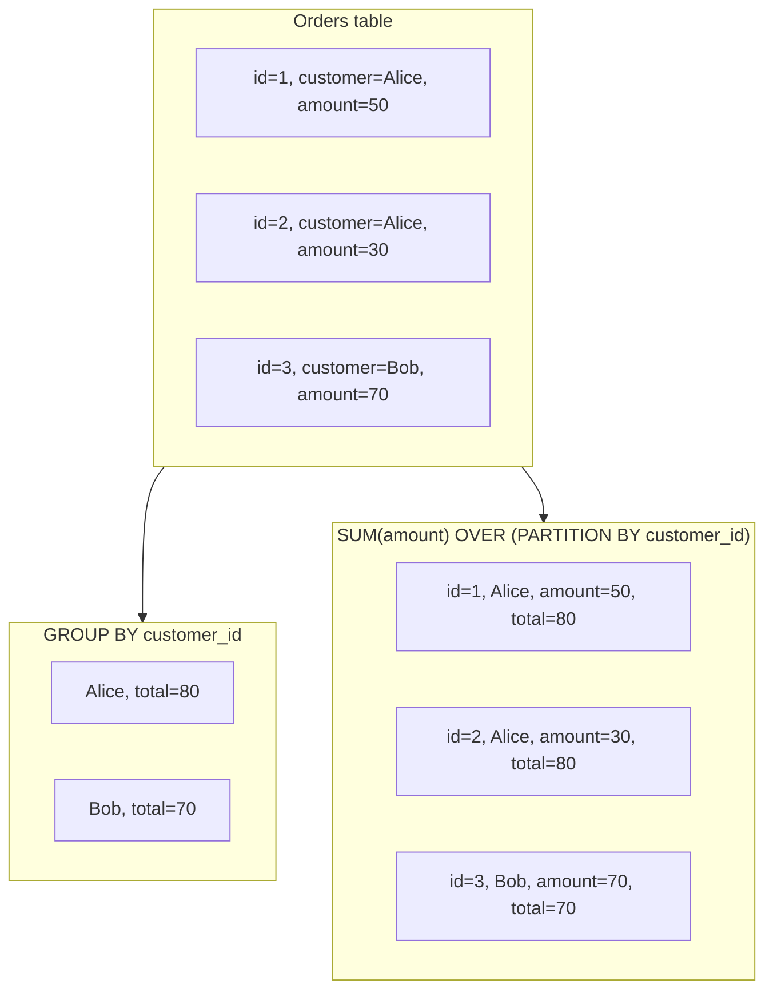

# Query Optimization – Writing Efficient SQL

- Bulk Inserts
- Insert .. Select
- Returning clausule
- Common Table Expressions (CTE's)
- upserts
- Window functions

## Bulk Inserts

Instead of inserting rows one by one, use **multi-row INSERT**:

```sql
INSERT INTO products (id, name, price)
VALUES
  (1, 'Keyboard', 49.99),
  (2, 'Mouse', 19.99),
  (3, 'Monitor', 199.99);
```

This is much faster because it requires only one transaction and one parse/plan phase.

For very large datasets, prefer **`COPY`** (direct load from CSV or STDIN).

```sql
COPY products (id, name, price)
FROM '/path/to/products.csv' DELIMITER ',' CSV HEADER;
```
## INSERT … SELECT

Insert the result of a query directly into another table:

```sql
INSERT INTO archive_orders (id, created_at, amount)
SELECT id, created_at, amount
FROM orders
WHERE created_at < now() - interval '1 year';
```

Avoids fetching rows into the application and re-inserting them.

---
## RETURNING Clause

Get inserted/updated values immediately without an extra select:

```sql
INSERT INTO users (username, created_at)
VALUES ('alice', now())
RETURNING id;
```

Useful when you need the new primary key directly.

---
## Common Table Expressions (CTEs) — `WITH` Clause

Use CTEs to combine multiple steps into one statement:

```sql
WITH moved AS (
    DELETE FROM queue
    WHERE status = 'ready'
    RETURNING id, payload
)
INSERT INTO processing (id, payload, started_at)
SELECT id, payload, now() FROM moved;
```

This combines a delete + insert in a single transactional step.

---
## Optimizing Inserts and Updates with Upserts  

### Context
We want to store **page view counts** per URL per hour.  

```sql
CREATE TABLE page_views (
    url TEXT NOT NULL,
    time_bucket TIMESTAMP NOT NULL,
    views INT NOT NULL,
    PRIMARY KEY (url, time_bucket)
);
```

A web application reports one “page view” at a time. For each `(url, time_bucket)` combination, we need to increase the counter.  

---

### Part 1 — Naïve approach (without upsert)

**Step 1.** Insert some sample data:  

```sql
INSERT INTO page_views (url, time_bucket, views)
VALUES ('/home', '2025-09-04 10:00', 5);
```

**Step 2.** Now add a new page view for the same `(url, time_bucket)`.  
The naïve approach requires multiple steps:

```sql
-- Step 2a: Check if record exists
SELECT views FROM page_views
WHERE url = '/home' AND time_bucket = '2025-09-04 10:00';

-- Step 2b: If record exists → update
UPDATE page_views
SET views = views + 1
WHERE url = '/home' AND time_bucket = '2025-09-04 10:00';

-- Step 2c: If record does not exist → insert
INSERT INTO page_views (url, time_bucket, views)
VALUES ('/home', '2025-09-04 10:00', 1);
```

👉 **Problems:**  
- Multiple queries per insert.  
- Risk of race conditions if many clients update at the same time.  
- Higher latency.  

---

### Part 2 — Upsert (PostgreSQL)

Postgres provides a single statement that does both **insert** and **update**:

```sql
INSERT INTO page_views (url, time_bucket, views)
VALUES ('/home', '2025-09-04 10:00', 1)
ON CONFLICT (url, time_bucket)
DO UPDATE SET views = page_views.views + EXCLUDED.views;
```

- If the record does not exist → a new row is inserted.  
- If the record exists → it is updated (`page_views.views + EXCLUDED.views`). The `page_views.views` refers to the current `views` and the `EXCLUDED.views` to the new views you tried to insert. 

👉 **Advantages:**  
- One query instead of multiple.  
- Atomic and concurrency-safe.  
- Fewer roundtrips → better performance.  

A similar syntax also exists for MySQL and MariaDB.

- **PostgreSQL**  
  [PostgreSQL SQL Insert documentation](https://www.postgresql.org/docs/current/sql-insert.html)
  
- **MySQL**  
  [MySQL insert on duplicate documentation](https://dev.mysql.com/doc/refman/8.4/en/insert-on-duplicate.html)

- **MariaDB**  
  [MariaDB insert on duplicate key documentation](https://mariadb.com/docs/server/reference/sql-statements/data-manipulation/inserting-loading-data/insert-on-duplicate-key-update)

👉 Tip: Ctrl+click (Windows) or Cmd+click (Mac) to open the framework documentation in a new tab.

### MERGE (PostgreSQL 15+)

SQL-standard alternative to upsert, more flexible for complex synchronization:

```sql
MERGE INTO inventory AS i
USING new_inventory AS n
ON i.sku = n.sku
WHEN MATCHED THEN
  UPDATE SET quantity = i.quantity + n.quantity
WHEN NOT MATCHED THEN
  INSERT (sku, quantity) VALUES (n.sku, n.quantity);
```

---

### Questions

#### 🧠 Why is the upsert approach more efficient?
<details>
<summary>Click to reveal the answer</summary>

Without `UPSERT` (`INSERT ... ON CONFLICT DO UPDATE`), applications often have to:
1. First run a `SELECT` to check if the row exists.  
2. Then run either an `INSERT` or an `UPDATE`.  

That means **two queries and two network roundtrips**.  
With an `UPSERT`, the database handles both cases in **one atomic query**, which reduces latency and load.  
</details>


#### 🧠 How does it help prevent race conditions?  
<details>
<summary>Click to reveal the answer</summary>

If two clients try to insert the same key at the same time:
- With manual `SELECT` + `INSERT`, you may get a conflict (duplicate key error).  
- With `UPSERT`, PostgreSQL detects the conflict and applies the `DO UPDATE` logic automatically.  

This ensures consistency **without requiring extra application-side locking**.  
</details>

#### 🧠 Can you think of situations where you **should not** use upserts?  

<details>
<summary>Click to reveal the answer</summary>

Upserts are very convenient, but there are a few cases where they may not be ideal:
- **High write contention:** if many transactions frequently update the same row, the conflict checks can become a bottleneck.  
- **Complex update logic:** sometimes you need more control than a simple `DO UPDATE` allows.  
- **Auditing requirements:** when you need to distinguish clearly between an `INSERT` and an `UPDATE` for logging or compliance reasons.  

In those cases, a more explicit application workflow may be better.  

</details>


## Window Functions

Window functions let you perform **aggregate-like calculations** across sets of rows, but **without collapsing the result into a single row per group**. Each row keeps its identity, while still carrying the aggregated information.  

### Example 1 — Aggregation with GROUP BY

```sql
SELECT customer_id, SUM(amount) AS total_per_customer
FROM orders
GROUP BY customer_id;
```

This query collapses rows: you only get one row per customer.


### Example 2 — Window function

```sql
SELECT id, customer_id, amount,
       SUM(amount) OVER (PARTITION BY customer_id) AS total_per_customer
FROM orders;
```

Here each row keeps its own `id` and `amount`, but also shows the **total per customer**.  
- `PARTITION BY customer_id` → defines the “window” (the set of rows per customer).  
- You can also use `ORDER BY` inside the window to compute running totals, ranks, or moving averages.  

#### Visual: GROUP BY vs Window Function




### Why it helps
- Avoids writing multiple subqueries.  
- Runs with a **single table scan**, which is faster.  
- Very powerful for analytics (rankings, percentiles, cumulative sums).  


### Example 3 — Running total

```sql
SELECT id, order_date, amount,
       SUM(amount) OVER (ORDER BY order_date) AS running_total
FROM orders;
```

This computes a cumulative sum ordered by date, directly in one query.  

### Example 4 - Running total per customer
```sql
SELECT id, customer_id, order_date, amount,
       SUM(amount) OVER (
         PARTITION BY customer_id
         ORDER BY order_date
       ) AS running_total
FROM orders;
```
This computes a cumulative sum per customer ordered by date. 

---

👉 In short: **window functions combine the detail view of each row with the power of aggregates, in one efficient query.**


