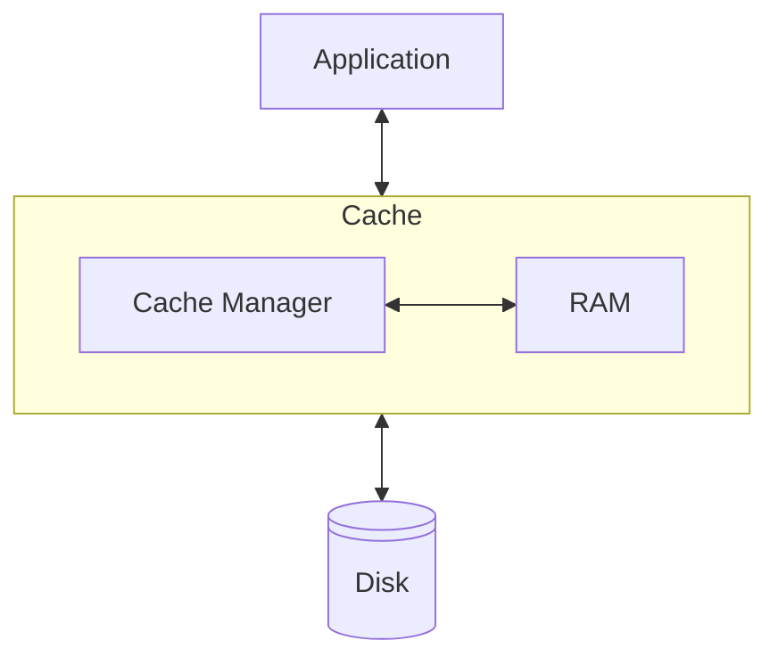
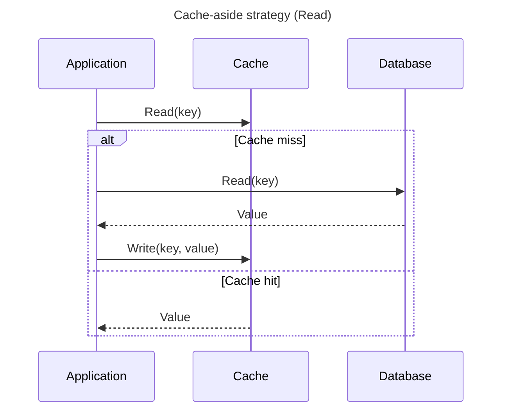
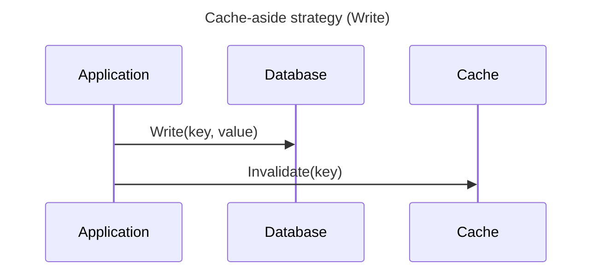
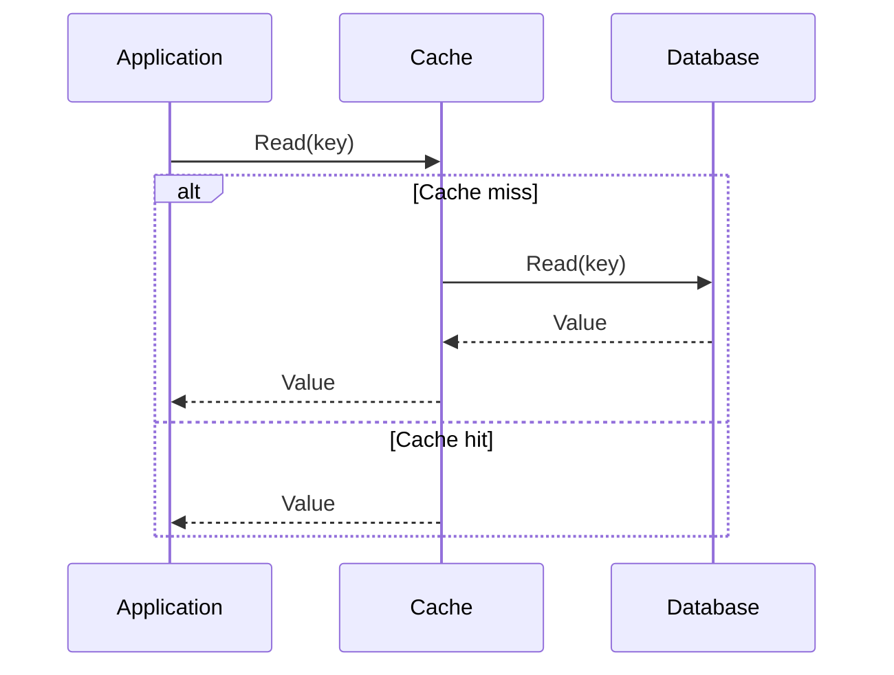
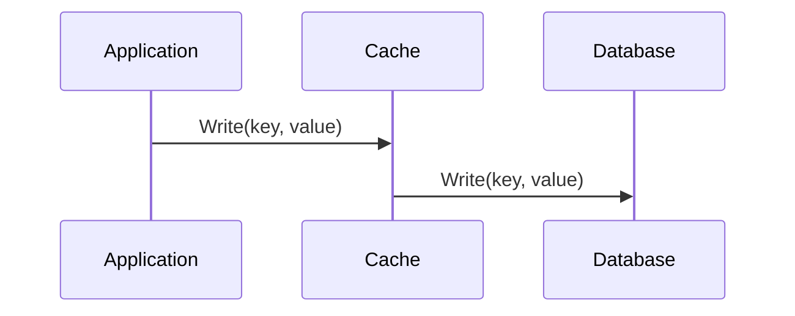
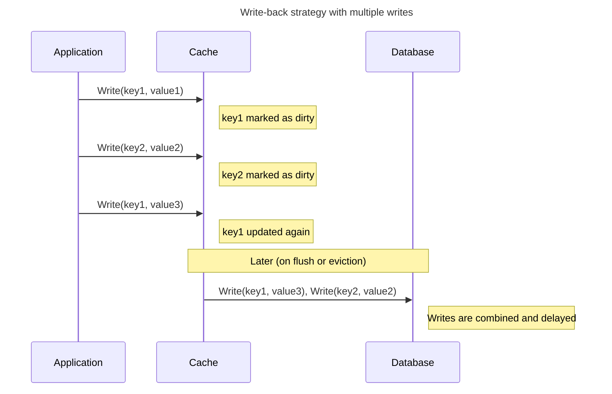
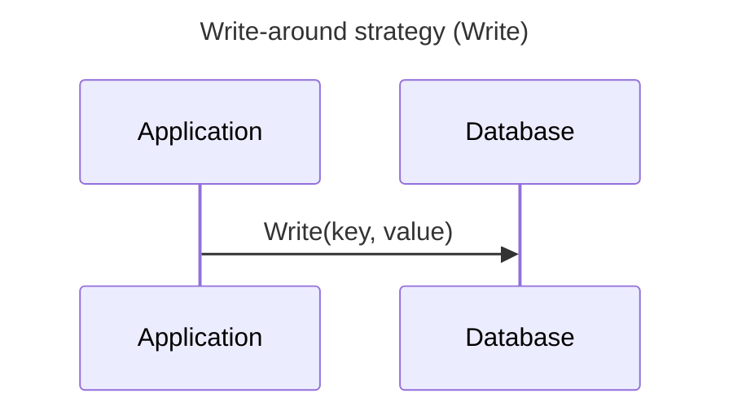
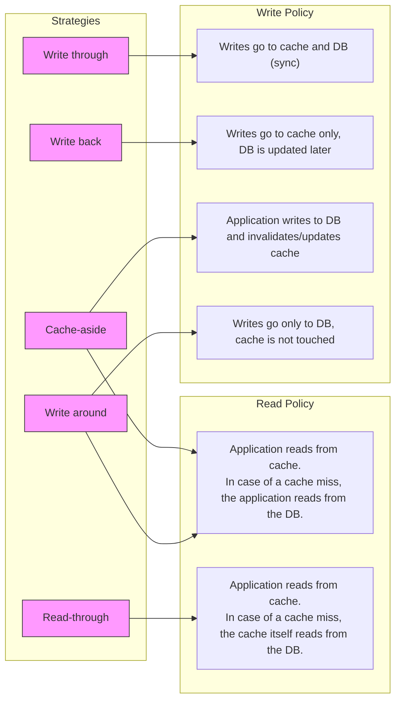

# Caching & Connection Pooling

## Caching introduction
Caching is a technique used to speed up **read operations** between two system components, especially when one component (like a disk or database) is much slower than the other (like RAM or a CPU).

To reduce the time needed to retrieve data, a **cache** stores requently accessed or recently used data in a faster, temporary storage layer - usually in RAM. When the same data is requested again, it can be quickly returned from the cache instead of being fetched from the slower original source.

In the diagram below, three components are shown: the *Application*, the *Cache* and the *Disk*. The application needs to read stored data on the disk, but disk access is relatively slow. To speed up these read operations, a  *Cache Manager* temporarily stores previously read data in RAM. If the application requests the same data again, it can be served directly from the cache - avoiding the slower disk read.


> **Write caching note:**
> Some caching strategies also involve storing writes in the cache. *Write-back caching* improves write performance by temporarily storing data in fast memory before writing it to the slower source at a later time. This strategy will be covered later in this workshop.

Because the cache has limited space, it can’t store everything. That’s why the Cache Manager must decide which data to keep and which to evict. This decision is governed by caching strategies such as LRU (Least Recently Used), LFU (Least Frequently Used) or Write-through / Write-back. We will explore these in the following sections.


### Caching Across System Layers
Caching occurs at multiple levels within a software system. The table below shows typical caching layers, each serving a different purpose to reduce latency and system load.

| **Level**              | **Example**                                    | **Purpose**                                                      |
| ---------------------- | ---------------------------------------------- | ---------------------------------------------------------------- |
| **Operating System**   | File system cache (e.g., Linux page cache)     | Caches disk blocks in RAM to reduce filesystem I/O |
| **Database**           | PostgreSQL shared buffers and query plan cache | Avoids repeated disk reads and redundant query planning           |
| **Application**        | In-memory cache (e.g., Redis, Memcached)       | Caches computed results, sessions or external API data            |
| **Custom aggregation** | Materialized views or precomputed summary tables       | Stores expensive query results for reuse                      |

In this workshop, we focus on caching at the **Application** and **Custom Aggregation** levels — the layers most relevant to application developers. 

## Stale Data and Dirty Data
The concepts **stale data** and **dirty data** are commonly used when discussing caching behavior.
They describe different types of inconsistencies that can occur between the cache and the original data source.

### Stale Data
Cached data can become **stale**, meaning it is outdated, inaccurate, or no longer valid due to changes in the original data source.

> 🔎 **Example:**  
> A customer profile is cached. Later, the customer updates their address.  
> The database is correct, but the cache still returns the old address. This is an example of **stale data**.

There are different invalidation policies to deal with this. The basic policies are:

- Time-based invalidation (e.g., "invalidate after 10 minutes"). The cached data has a Time to Live (TTL) associated with it.
- Event-based invalidation (e.g., "invalidate if customer profile changes")
- Manual refresh (e.g., a scheduled job at a fixed time or interval that updates materialized views)

Later in this workshop we discuss caching strategies. These caching strategies implement one or more of these policies.


### Dirty Data
Cached data can also be **dirty**, meaning it contains changes that have not yet been written back to the original source. In this case, the original data is outdated and needs to be updated using the cached content.

> 🔎 **Example:**  
> A product’s price is updated in the cache, but not yet written to the database.  
> If another system reads the database directly, it will still see the old price. This is an example of **dirty data**.


## Caching strategies at Application level
Since cache memory is limited and not automatically kept in sync with the original data source, we need to decide - from the application perspective:

- **How to handle writes** — this is called the **write-policy**: should the cache, the data source, or both be updated? 
- **How to handle reads** — this is sometimes called the **read-policy**: the application always queries the cache first. If the data is not found (a cache miss), the cache (or the application, depending on the strategy) will fetch it from the original source and may store it in the cache.

A caching stategy defines either the write-policy, the read-policy or both.

There are five common caching strategies at application level:
- Cache aside (also know as: Lazy loading)
- Read through
- Write through
- Write back
- Write around

Each strategy handles the following aspects in a different way:
- **Cache population** – When and how data enters the cache
- **Stale or dirty data handling** - How consistency between cache and source is maintained
- **Application behavior during cache hits and misses** - What the application does on a cache hit or miss, and how it interacts with the data source
  
### Cache aside (Lazy loading)
In this caching strategy, the **application itself controls access to the cache**. When reading data, the application first checks the cache. If the data is not found (a cache miss), it retrieves the data from the database and stores it in the cache for future use. When writing data, the application **writes directly to the database** and may explicitly invalidate or update the corresponding cache entry.

Cache-aside is a flexible strategy, giving the application full control over how and when the cache is used.  
It is also known as *lazy loading*, because the cache is only populated when needed. Cache-aside defines **both a read and a write strategy** — no additional strategy needs to be combined with it.

The name *cache-aside* refers to the fact that the cache sits “off to the side”, and the application decides when to access or update it.





### Read through
In this caching strategy, **the cache itself is responsible for loading data from the original data source** when a cache miss occurs. The application only reads from the cache — it does not need to know whether the data was already cached or not. If a requested key is not found in the cache, the cache transparently fetches it from the backing store and stores the result for future use.

Read-through is a **read strategy only**, and must be combined with a **separate write strategy** to handle how data updates are propagated to the backing store.

The term *read-through* refers to the idea that the cache “reads through” to the underlying data source if it doesn’t already have the data.



### Write through
In this caching strategy, **write operations are sent to both the cache and the original data source simultaneously**. This ensures that the cache always remains consistent with the backing store. Although this approach guarantees strong consistency, it does **not improve write performance**, because the write operation is only considered complete after it has been persisted in the database.

Write-through is a **write strategy only**, and must be combined with a separate **read strategy** (such as read-through or cache-aside) to handle data retrieval.

The name *write-through* indicates that each write operation passes “through” the cache and directly reaches the backing store as well.

Analogy: It’s like writing a document and immediately saving it to a USB drive after every single keystroke.


### Write back
In this caching strategy, **write operations are optimized** by temporarily storing changes in the cache and deferring writes to the original data source. Multiple write operations can be **bundled into a single write**, reducing the number of write actions to the (slower) backing store.
 
Write-back is a **write strategy only**, and must be combined with a separate **read strategy** to define how data is retrieved from the cache. For example, it is commonly used alongside a cache-aside or read-through read strategy.

In write-back caching, “back” refers to the delayed action of writing data back to the original data source — not to the user or front-end, but to the persistent backing store (e.g., a database or disk). 

Analogy: It’s like writing in a notebook and only saving the contents to a USB drive when you're done or taking a break.


### Write around

In write-around caching, the write path bypasses the cache entirely, writing only to the database.
However, the read path follows a cache-aside pattern: the application checks the cache first, and on a miss, retrieves data from the database and stores it in the cache. As a result, the cache will eventually be populated — but it may contain stale data if older values remain in the cache after updates. 

The term "write-around" refers to the fact that write operations deliberately bypass the cache and go straight to the database. This prevents infrequently read data from polluting the cache.




### Summary


### Data access patterns determines which caching strategy to use
It depends on the typical data access patterns in your application which caching strategy is best to use. Ask yourself:

- Is the data read often?
- Are writes more frequent than reads?
- Does consistency between cache and database matter?

|Strategy         |When to use|
|-----------------|-----------|
|**Write-through**|Use when reads and writes are equally frequent and you want the cache to stay consistent.<br/>Writes are slower, but the cache and database stay in sync.|   
|**Write-back**   |Use when you have many successive writes on the same data.<br/>Reduces database load but risks data loss on cache failure. |
|**Cache-aside**  |Use when you want control over when and what to cache.<br/>Flexible and safe, but more complex logic in the application. |
|**Write-around** |Use when you have many writes of unique or rarely-read data.<br/>Avoids polluting the cache with data that likely won’t be read.|
|**Read-through** |Use when you want automatic cache population on reads.<br/>Simplifies application logic at the cost of flexibility.|

#### 🧠 Case 1: Banking Transactions

A bank processes hundreds of thousands of transactions per day for multiple account holders.  
An account holder checks their balance and transaction history two or three times per day using the banking app.

<details>
<summary>Click to reveal the answer</summary>

**Recommended caching strategy:**  **Write-around**

**Explanation:**  
The number of write operations (incoming transactions) far exceeds the number of reads (account holders checking their balance or history). Each transaction is unique and typically not accessed immediately — many will never be accessed at all. Caching all of these writes would quickly fill the cache with data that’s unlikely to be reused.

**Why write-around?**  
Write-around writes directly to the database and avoids caching data unless it’s later read.  
This keeps the cache reserved for frequently-read data (like account balances), improving overall efficiency.

**Why not write-through or write-back?**  
- **Write-through** would push every transaction into the cache, wasting memory and evicting more relevant data.  
- **Write-back** would delay writes to the database — unacceptable in a banking context where strong consistency and durability are critical.
</details>
<hr>

#### 🧠 Case 2: Real-Time Stock Prices

A stock trading application receives continuous updates of stock prices, driven by live bid and ask quotes.  
Each stock’s price can change multiple times per second. The application needs to show the most current price to users, but doesn’t need to persist every micro-update in the database.

<details>
<summary>Click to reveal the answer</summary>

**Recommended caching strategy:**  **Write-back**

**Explanation:**  
The stock price for a given ticker symbol is updated very frequently. Writing each update directly to the database would cause excessive write load and latency. With write-back, updates are stored in the cache and written back to the database in the background or at regular intervals.

This approach reduces write pressure and ensures fast access to the most recent price.

**Why not write-through or write-around?**  
- **Write-through** would send every minor price change to the database immediately, which is unnecessary overhead.  
- **Write-around** would bypass the cache on writes, leading to stale or missing prices in the cache when users request them.

**Note:**  
TBD: To avoid data loss, it’s important to pair write-back with persistence strategies like write-ahead logging or regular snapshots.
</details>
<hr>

#### 🧠 Case 3: Shared Content in a CMS

A content management system (CMS) manages multiple sub-sites for different organizational units.  
Some parts of the content are maintained by each sub-site, while other parts (such as shared announcements, policies, or branding elements) are managed centrally by the head office. Sub-sites regularly need to display this centrally managed content.

<details>
<summary>Click to reveal the answer</summary>

**Recommended caching strategy:**  **Read-through**

**Explanation:**  
The sub-site application logic simply wants the content — it doesn’t care whether it comes from cache or database. With read-through caching, the cache automatically fetches the content from the database on a cache miss and stores it, making the process transparent to the application.

This strategy keeps the caching logic centralized and ensures shared content is quickly available once fetched.

**Why not cache-aside?**  
Cache-aside requires the sub-site logic to handle cache population explicitly, increasing complexity.

**Why not write-through/write-back/write-around?**  
These strategies focus on write performance, but the shared content from the head office is read much more often than written.

</details>
<hr>

#### 🧠 Case 4: Sub-site Own Content Management

Within the same CMS platform, each sub-site also manages its own content — such as news articles, contact pages, and team information.  
This content is updated occasionally by local staff and then viewed by site visitors. Each sub-site is responsible for loading and managing its own data.

<details>
<summary>Click to reveal the answer</summary>

**Recommended caching strategy:**  **Cache-aside**

**Explanation:**  
Each sub-site has autonomy over its own content and reads it frequently. With cache-aside, the application first checks the cache. If the data isn’t there, it fetches it from the database and places it in the cache explicitly. This gives the sub-site full control over what is cached and when — useful when some content is rarely accessed and shouldn't occupy memory unnecessarily.

**Why not read-through?**  
Read-through hides the caching logic inside the cache layer, but here each sub-site benefits from having control over cache population and invalidation (e.g. after edits).

**Why not write-through or write-back?**  
Writes are infrequent and do not need immediate caching. Managing cache population manually is more efficient in this case.

</details>
<hr>

#### 🧠 Case 5: Electronic Health Records

A hospital uses an electronic health record (EHR) system where doctors and nurses view and update patient data, such as diagnoses, medications, and vital signs. Any update must be immediately available to other users or systems. At the same time, frequently accessed patient data should load quickly to ensure responsiveness in emergency situations.

<details>
<summary>Click to reveal the answer</summary>

**Recommended caching strategy:**  **Combination of Write-through and Read-through**

**Explanation:**  
This system requires both high **data consistency** and **fast access** to frequently used information. When patient data is updated, it must be stored immediately in both the cache and the database. This ensures that all reads — whether from cache or DB — return the most recent information.

- **Write-through** ensures that every change is immediately written to both the cache and the database.  
  ➤ This guarantees consistency between what’s stored and what’s shown.

- **Read-through** allows the application to access patient data through the cache transparently.  
  ➤ If the data isn’t in the cache, it’s automatically loaded from the database and cached for next time.

This combination ensures that:
- All data shown to users is up-to-date.
- The cache remains useful for quick access.
- The application logic stays clean and simple.

**Why not cache-aside?**  
Cache-aside requires manual cache invalidation after each write. In a medical context, this is too risky:  
if invalidation fails, users may see **outdated or incorrect patient information** — which can have serious consequences.

**Why not write-back?**  
Write-back delays the write to the database, which introduces a **risk of data loss** if the cache crashes before flushing — unacceptable in healthcare systems.

</details>
<hr>

## Implementing a Caching Strategy (TBD)

The implementation of a caching strategy in an application depends heavily on the tools, frameworks, and overall architecture.  
Most caching solutions — such as Redis and Memcached — are primarily designed for **read caching**.  
There are rarely any “out-of-the-box” solutions to implement a **write-back** caching policy.

---

### Read policy caching

- **Redis** is a key-value store that can store data either in memory or persistently.
- **Memcached** is an in-memory key-value store that supports only string values.

These systems integrate easily with popular frameworks:

- **Django**  
  Functions like `cache.get()`, `cache.set()`, and decorators like `@cache_page` are available.  
  [Django caching documentation](https://docs.djangoproject.com/en/5.2/topics/cache/)
  
- **Laravel**  
  Uses methods like `Cache::remember()`, `Cache::put()`, and others.  
  [Laravel cache documentation](https://laravel.com/docs/12.x/cache)

👉 Tip: Ctrl+click (Windows) or Cmd+click (Mac) to open the framework documentation in a new tab.

These caching mechanisms support strategies like:

- **Cache-aside** (manual cache population and invalidation)
- **Read-through** (automatic cache loading on read)
- **Write-through** (writes go to both cache and database synchronously)

#### Example cache-aside in Django
```python
import logging
from django.core.cache import cache
from myapp.models import Product
logger = logging.getLogger(__name__)

def get_product(product_id):
    key = f"product:{product_id}"
    product = cache.get(key)
    if product is None:
        logger.info("Cache miss for product %s. Loading from database...", product_id)
        product = Product.objects.get(id=product_id)
        cache.set(key, product, timeout=60*5)
    return product

```

---

### Write-back caching

Implementing a **write-back** caching policy is much more complex. In this model, the **the cache temporarily holds the authoritative version of the data**, it becomes the primary place where updates are stored. The database is updated only later, during a scheduled or triggered flush.

This introduces several challenges:

- **Durability**: If the cache crashes, data that hasn’t yet been written to the database may be lost.
- **Consistency**: The cache and database can become out of sync if the flush fails or is delayed.
- **Responsibility**: The application logic must manage *dirty data tracking* and define *flush timing* (e.g. scheduled writes or write-on-eviction).

For a write-back strategy, the cache must support **persistence**.  
For example, Redis can be configured with:

- `appendonly yes` (AOF: Append Only File)
- `SAVE` (RDB: snapshotting)

These settings help ensure that data in the cache survives crashes.

Since most frameworks do not support write-back caching directly, a custom implementation is often needed. This usually involves wrapping the cache and database access with your own logic to track changes and flush updates safely.


#### Example write-back with Redis
```python
import redis
import json

class WriteBackRedisCache:
    def __init__(self, db_backend, redis_client, namespace="wb"):
        self.db = db_backend  # Simulated backing store (e.g. dict or ORM)
        self.redis = redis_client
        self.namespace = namespace

    def _key(self, key):
        return f"{self.namespace}:{key}"

    def get(self, key):
        rkey = self._key(key)
        value = self.redis.get(rkey)
        if value is not None:
            return json.loads(value)

        # Cache miss: load from DB
        value = self.db.get(key)
        if value is not None:
            self.redis.set(rkey, json.dumps(value))
        return value

    def set(self, key, value):
        rkey = self._key(key)
        self.redis.set(rkey, json.dumps(value))
        self.redis.sadd(f"{self.namespace}:dirty", key)

    def flush(self):
        dirty_keys = self.redis.smembers(f"{self.namespace}:dirty")
        for key in dirty_keys:
            key = key.decode()  # Redis returns bytes
            rkey = self._key(key)
            value = self.redis.get(rkey)
            if value:
                self.db[key] = json.loads(value)
        self.redis.delete(f"{self.namespace}:dirty")

```

Gebruik:

```python
# Simulated persistent DB (could also be ORM)
db = {"x": 1, "y": 2}

# Connect to Redis
r = redis.Redis(host="localhost", port=6379, db=0)

# Create cache
cache = WriteBackRedisCache(db_backend=db, redis_client=r)

print("Initial DB:", db)

print("Reading x:", cache.get("x"))
cache.set("x", 42)
cache.set("z", 999)

print("DB before flush:", db)
cache.flush()
print("DB after flush:", db)
```


## Connection pooling (TBD)
PgPool or PgBouncer ?

PgPool heeft wel een query result cache


