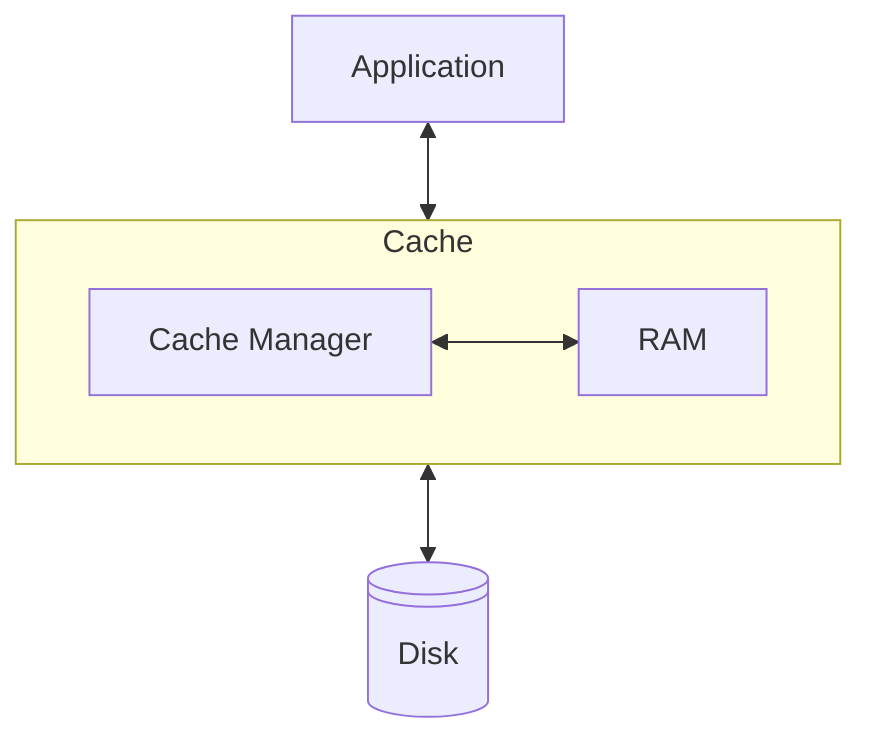
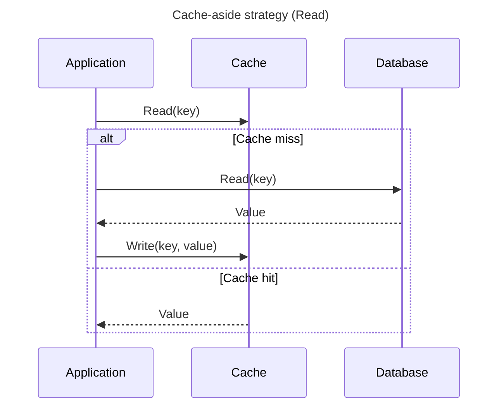
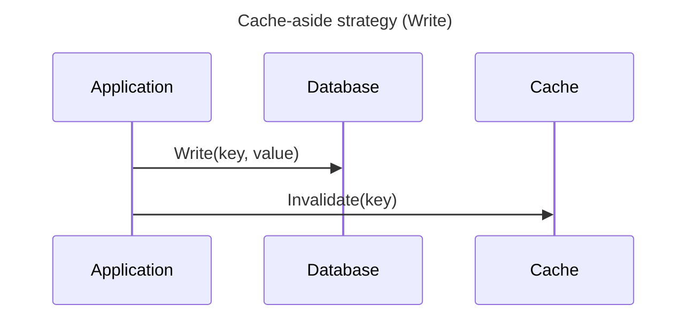
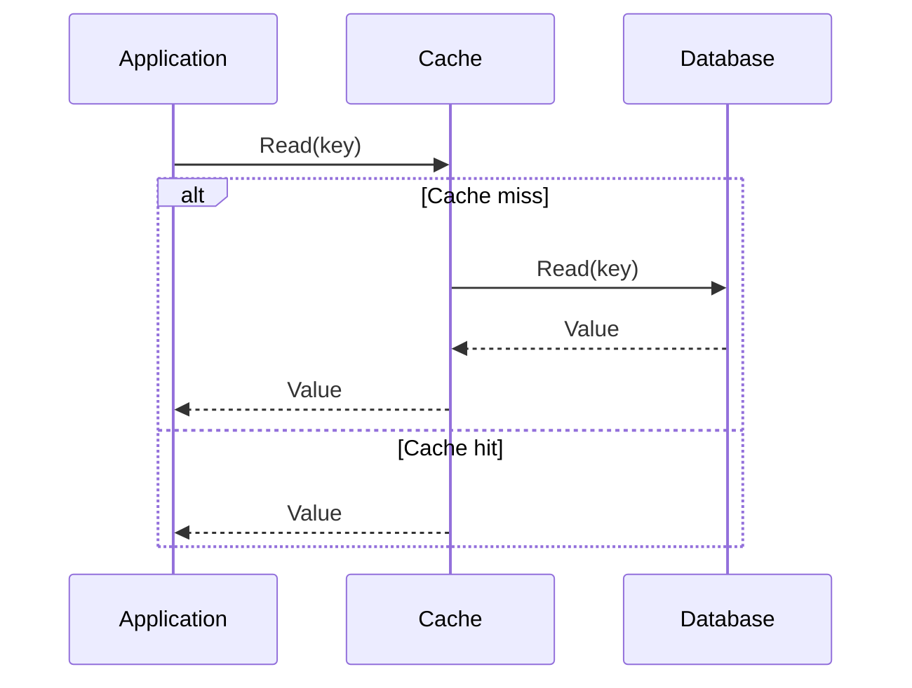
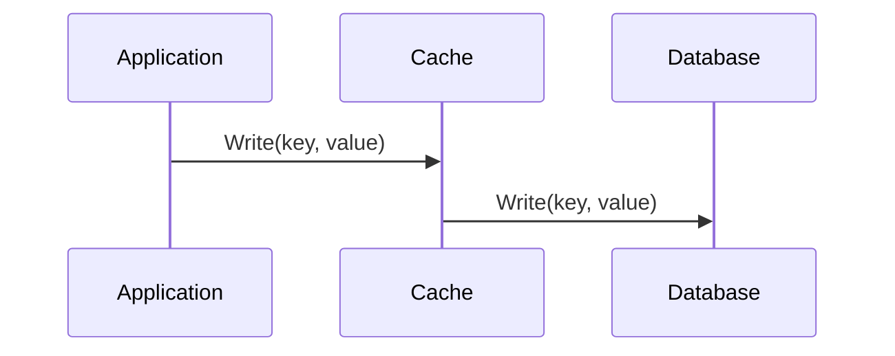
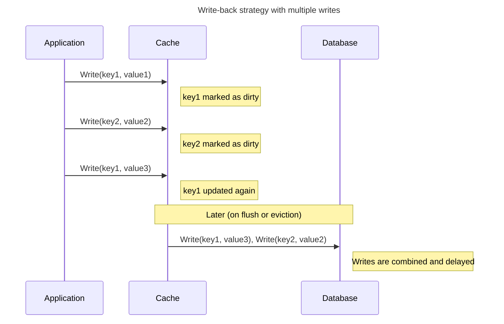
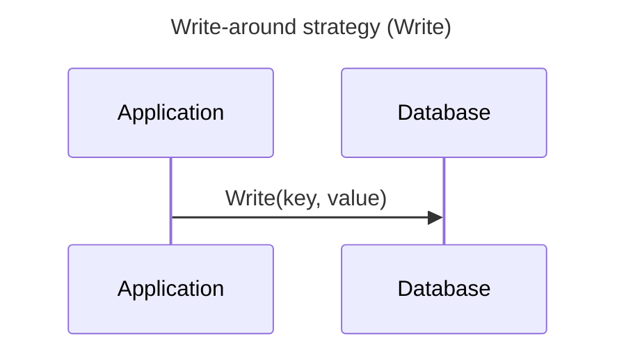
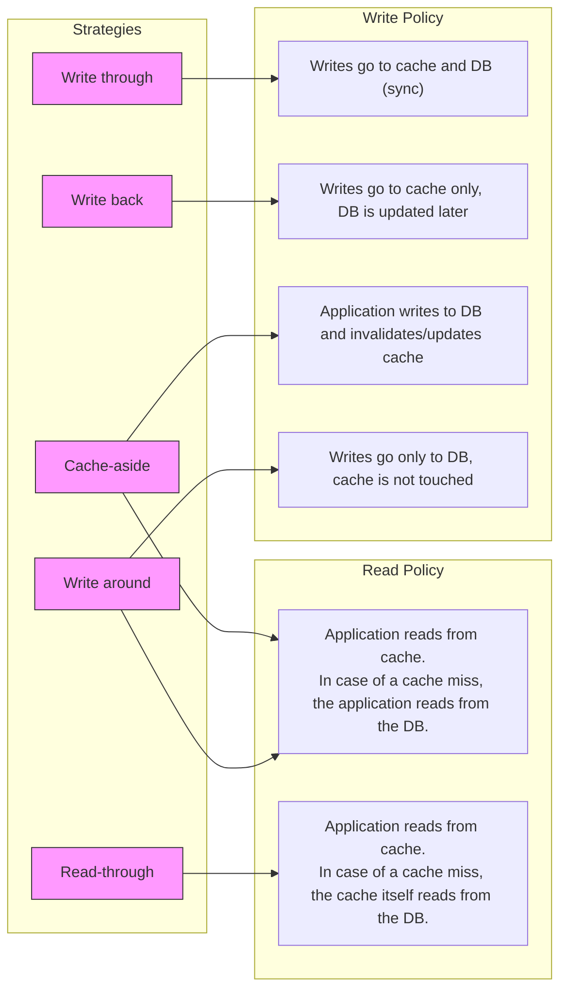

# Caching & Connection Pooling

## Caching introduction
Caching is a technique used to speed up **read operations** between two system components, especially when one component (like a disk or database) is much slower than the other (like RAM or a CPU).

To reduce the time needed to retrieve data, a **cache** stores requently accessed or recently used data in a faster, temporary storage layer - usually in RAM. When the same data is requested again, it can be quickly returned from the cache instead of being fetched from the slower original source.

In the diagram below, three components are shown: the *Application*, the *Cache* and the *Disk*. The application needs to read stored data on the disk, but disk access is relatively slow. To speed up these read operations, a  *Cache Manager* temporarily stores previously read data in RAM. If the application requests the same data again, it can be served directly from the cache - avoiding the slower disk read.

> **Write caching note:**
> Some caching strategies also involve storing writes in the cache. *Write-back caching* improves write performance by temporarily storing data in fast memory before writing it to the slower source at a later time. This strategy will be covered later in this workshop.

Because the cache has limited space, it can’t store everything. That’s why the Cache Manager must decide which data to keep and which to evict. This decision is governed by caching strategies such as LRU (Least Recently Used), LFU (Least Frequently Used) or Write-through / Write-back. We will explore these in the following sections.

### Caching Across System Layers
Caching occurs at multiple levels within a software system. The table below shows typical caching layers, each serving a different purpose to reduce latency and system load.

| **Level**              | **Example**                                    | **Purpose**                                                      |
| ---------------------- | ---------------------------------------------- | ---------------------------------------------------------------- |
| **Operating System**   | File system cache (e.g., Linux page cache)     | Caches disk blocks in RAM to reduce filesystem I/O |
| **Database**           | PostgreSQL shared buffers and query plan cache | Avoids repeated disk reads and redundant query planning           |
| **Application**        | In-memory cache (e.g., Redis, Memcached)       | Caches computed results, sessions or external API data            |
| **Custom aggregation** | Materialized views or precomputed summary tables       | Stores expensive query results for reuse                      |

In this workshop, we focus on caching at the **Application** and **Custom Aggregation** levels — the layers most relevant to application developers. 

## Stale Data and Dirty Data
The concepts **stale data** and **dirty data** are commonly used when discussing caching behavior.
They describe different types of inconsistencies that can occur between the cache and the original data source.

### Stale Data
Cached data can become **stale**, meaning it is outdated, inaccurate, or no longer valid due to changes in the original data source.

> 🔎 **Example:**  
> A customer profile is cached. Later, the customer updates their address.  
> The database is correct, but the cache still returns the old address. This is an example of **stale data**.

There are different strategies to deal with this:

- Time-based invalidation (e.g., "invalidate after 10 minutes")
- Event-based invalidation (e.g., "invalidate if order status changes")
- Manual refresh (e.g., a scheduled job that updates materialized views)

### Dirty Data
Cached data can also be **dirty**, meaning it contains changes that have not yet been written back to the original source. In this case, the original data is outdated and needs to be updated using the cached content.

> 🔎 **Example:**  
> A product’s price is updated in the cache, but not yet written to the database.  
> If another system reads the database directly, it will still see the old price. This is an example of **dirty data**.

## Caching stategies at Application level
Since cache memory is limited and not automatically kept in sync with the original data source, we need to decide - from the application perspective:

- **How to handle writes** — this is called the **write-policy**: should the cache, the data source, or both be updated? 
- **How to handle reads** — this is sometimes called the **read-policy**: the application always queries the cache first. If the data is not found (a cache miss), the cache (or the application, depending on the strategy) will fetch it from the original source and may store it in the cache.

A caching stategy defines either the write-policy, the read-policy or both.

There are five common caching strategies at application level:
- Cache aside (also know as: Lazy loading)
- Read through
- Write through
- Write back
- Write around

Each strategy handles the following aspects in a different way:
- **Cache population** – When and how data enters the cache
- **Stale or dirty data handling** - How consistency between cache and source is maintained
- **Application behavior during cache hits and misses** - What the application does on a cache hit or miss, and how it interacts with the data source
  
### Cache aside (Lazy loading)
In this caching strategy, the **application itself controls access to the cache**. When reading data, the application first checks the cache. If the data is not found (a cache miss), it retrieves the data from the database and stores it in the cache for future use. When writing data, the application **writes directly to the database** and may explicitly invalidate or update the corresponding cache entry.

Cache-aside is a flexible strategy, giving the application full control over how and when the cache is used.  
It is also known as *lazy loading*, because the cache is only populated when needed. Cache-aside defines **both a read and a write strategy** — no additional strategy needs to be combined with it.

The name *cache-aside* refers to the fact that the cache sits “off to the side”, and the application decides when to access or update it.

### Read through
In this caching strategy, **the cache itself is responsible for loading data from the original data source** when a cache miss occurs. The application only reads from the cache — it does not need to know whether the data was already cached or not. If a requested key is not found in the cache, the cache transparently fetches it from the backing store and stores the result for future use.

Read-through is a **read strategy only**, and must be combined with a **separate write strategy** to handle how data updates are propagated to the backing store.

The term *read-through* refers to the idea that the cache “reads through” to the underlying data source if it doesn’t already have the data.

### Write through
In this caching strategy, **write operations are sent to both the cache and the original data source simultaneously**. This ensures that the cache always remains consistent with the backing store. Although this approach guarantees strong consistency, it does **not improve write performance**, because the write operation is only considered complete after it has been persisted in the database.

Write-through is a **write strategy only**, and must be combined with a separate **read strategy** (such as read-through or cache-aside) to handle data retrieval.

The name *write-through* indicates that each write operation passes “through” the cache and directly reaches the backing store as well.

Analogy: It’s like writing a document and immediately saving it to a USB drive after every single keystroke.

### Write back
In this caching strategy, **write operations are optimized** by temporarily storing changes in the cache and deferring writes to the original data source. Multiple write operations can be **bundled into a single write**, reducing the number of write actions to the (slower) backing store.
 
Write-back is a **write strategy only**, and must be combined with a separate **read strategy** to define how data is retrieved from the cache. For example, it is commonly used alongside a cache-aside or read-through read strategy.

In write-back caching, “back” refers to the delayed action of writing data back to the original data source — not to the user or front-end, but to the persistent backing store (e.g., a database or disk). 

Analogy: It’s like writing in a notebook and only saving the contents to a USB drive when you're done or taking a break.

### Write around

In write-around caching, the write path bypasses the cache entirely, writing only to the database.
However, the read path follows a cache-aside pattern: the application checks the cache first, and on a miss, retrieves data from the database and stores it in the cache. As a result, the cache will eventually be populated — but it may contain stale data if older values remain in the cache after updates. 

The term "write-around" refers to the fact that write operations deliberately bypass the cache and go straight to the database. This prevents infrequently read data from polluting the cache.

### Summary

## Connection pooling (TBD)
PgPool or PgBouncer ?

PgPool heeft wel een query result cache

