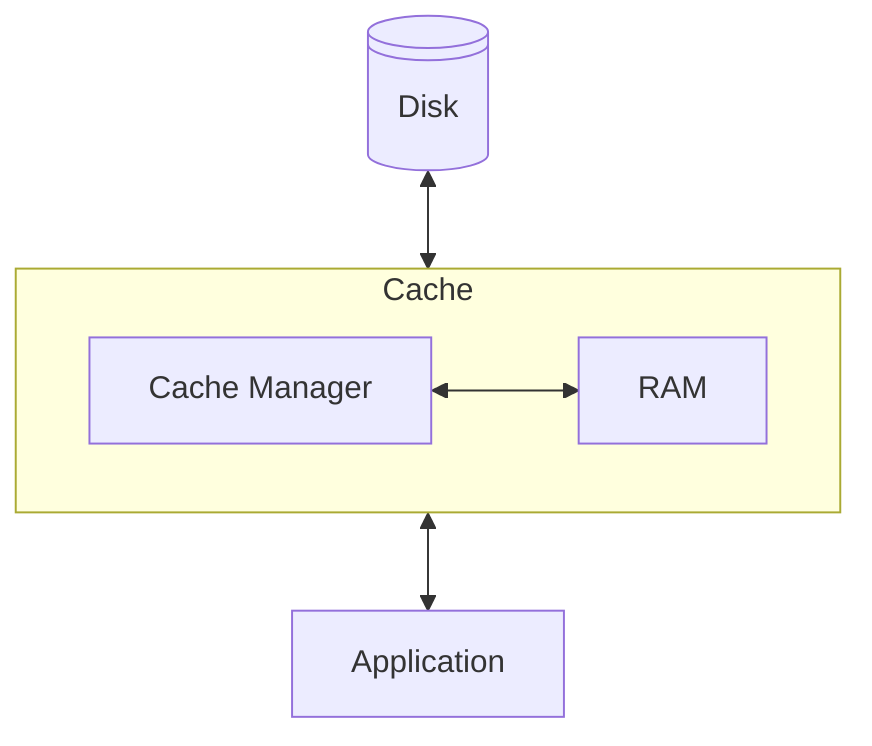

# Caching & Connection Pooling

## Caching (TBD)
Caching is a mechanism used to speed up read and write operations between two components of a system, typically when one component (such as a database or disk) is significantly slower than the other (such as a processor or memory).

To accelerate **read operations**, previously fetched or computed data is stored in a temporary, faster storage layer called a cache. When the same data is requested again, it can be served from the cache instead of retrieving it from the slower original source.

To accelerate **write operations**, new or updated data is temporarily written to the cache first, and then written back to the original source at a later, more optimal time. This is known as write caching.

In the diagram below, two components are shown: the *Application* and the *Disk*. The running application needs to read data from and write data to the disk. To speed up these operations, a cache layer is placed between the two components. The *Cache Manager* stores previously accessed data in RAM, so that when the application requests the same data again, it can be retrieved from RAM instead of the slower disk.

## Caching happens at different Levels
In a system caching happens at different levels. In the table below you see typical caching layers used in systems.

| **Level**              | **Example**                                    | **Purpose**                                                      |
| ---------------------- | ---------------------------------------------- | ---------------------------------------------------------------- |
| **Operating System**   | File system cache (e.g., Linux page cache)     | Reduces disk I/O by caching recently accessed file blocks in RAM |
| **Database**           | PostgreSQL shared buffers and query plan cache | Avoids repeated disk reads and parsing of SQL queries            |
| **Application**        | In-memory cache (e.g., Redis, Memcached)       | Caches frequently used query results or user sessions            |
| **Custom aggregation** | Materialized views or precomputed tables       | Stores expensive query results to be reused                      |

## Cache Staleness and Dirty Data
### Cache Staleness
Cached data can become **stale**, meaning it is outdated, inaccurate, or no longer valid due to changes in the original data source.

There are different strategies to deal with this:

- Time-based invalidation (e.g., "invalidate after 10 minutes")
- Event-based invalidation (e.g., "invalidate if order status changes")
- Manual refresh (e.g., a scheduled job that updates materialized views)

### Diry Data
Cached data can also be **dirty**, meaning it contains changes that have not yet been written back to the original source. In this case, the original data is outdated and needs to be updated using the cache content. This requires a write-through or write-back policy to ensure consistency.

#### Write-through caching
With write-through caching, every time data is written to the cache, it is also immediately written to the original data source (e.g., disk or database).

Pros:
- The cache and the data source are always consistent.
- No data is lost if the system crashes.
  
Cons:
- Slower write performance, because every write involves the slower backing store.

Analogy: It’s like writing a document and immediately saving it to a USB drive after every single keystroke.

#### Write-back caching
With write-back caching, data is initially written only to the cache. The write to the original source happens later, either on a schedule or when the cache entry is evicted.

Pros:
- Faster write performance, since writes happen in fast memory (RAM).
- Multiple writes can be combined into a single update to the source.
  
Cons:
- Risk of data loss if the system crashes before changes are written back.
- Cache and source can temporarily be inconsistent (dirty data).

Analogy: It’s like writing in a notebook and only saving the contents to a USB drive when you're done or taking a break.

## Connection pooling (TBD)
PgPool or PgBouncer ?

PgPool heeft wel een query result cache

