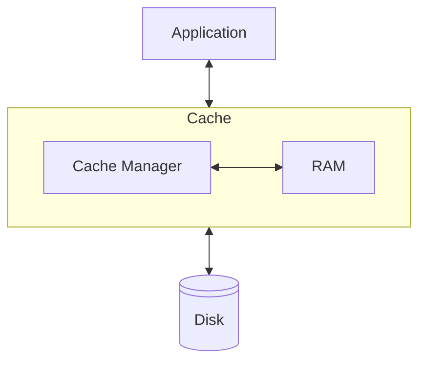
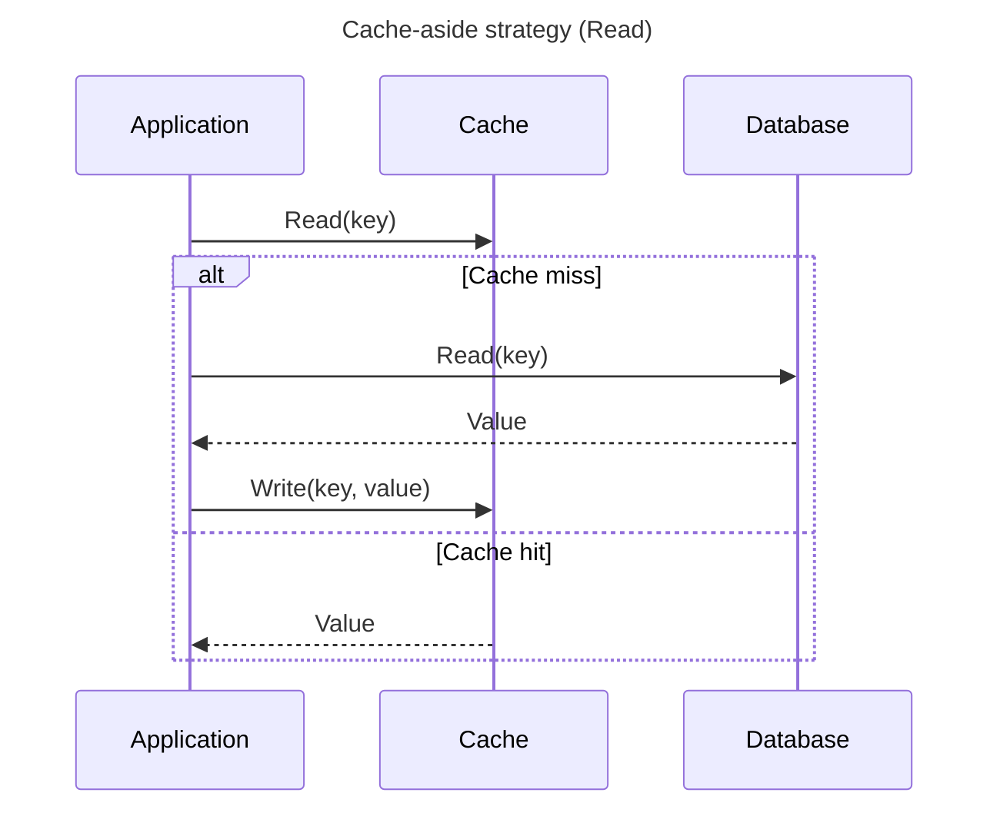
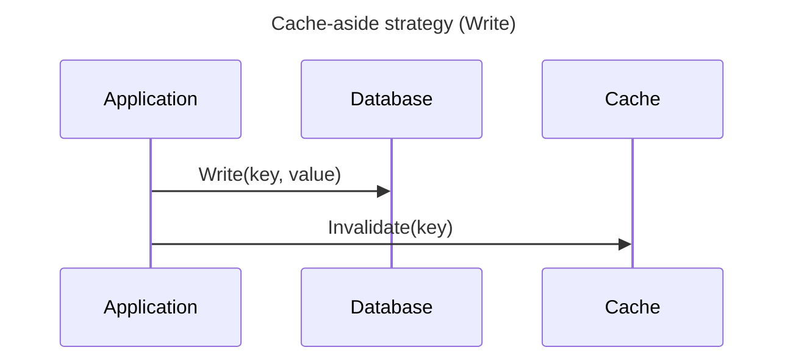
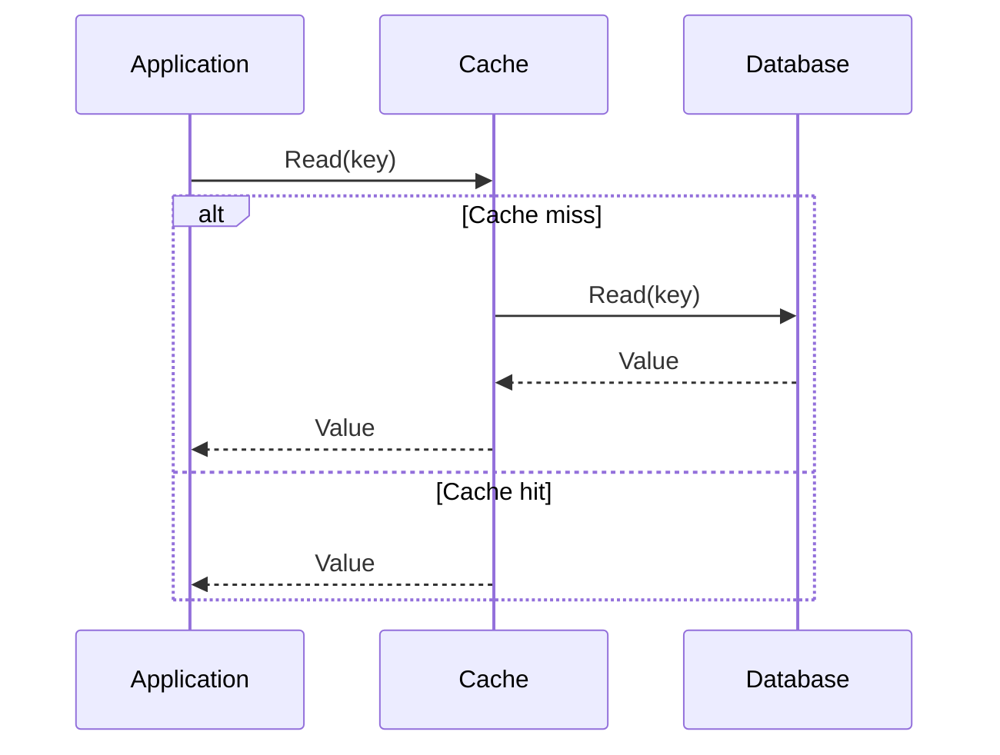
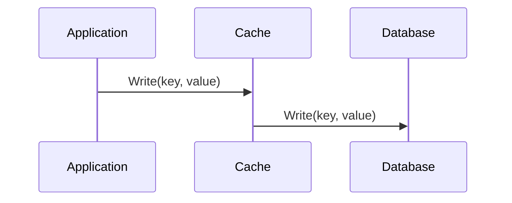
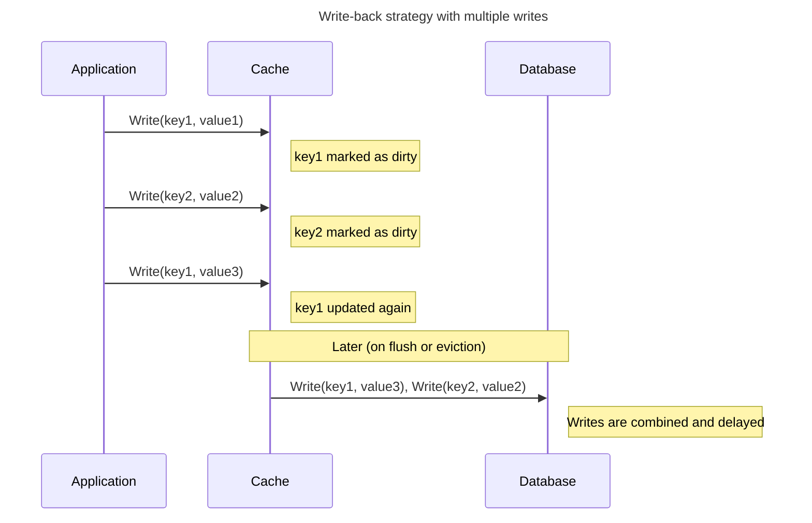
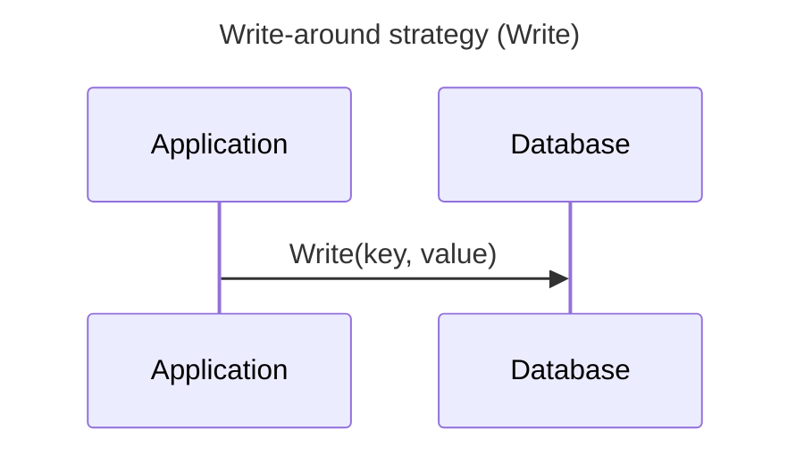
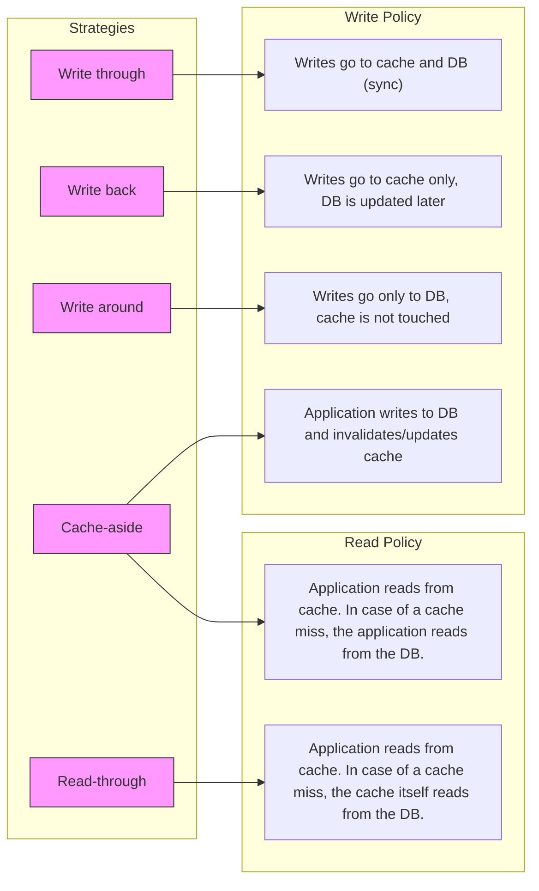
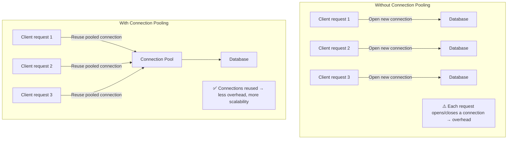

# Caching & Connection pooling

## Caching introduction
Caching is a technique used to speed up **read operations** between two system components, especially when one component (like a disk or database) is much slower than the other (like RAM or a CPU).

To reduce the time needed to retrieve data, a **cache** stores requently accessed or recently used data in a faster, temporary storage layer - usually in RAM. When the same data is requested again, it can be quickly returned from the cache instead of being fetched from the slower original source.

In the diagram below, three components are shown: the *Application*, the *Cache* and the *Disk*. The application needs to read stored data on the disk, but disk access is relatively slow. To speed up these read operations, a  *Cache Manager* temporarily stores previously read data in RAM. If the application requests the same data again, it can be served directly from the cache - avoiding the slower disk read.


> **Write caching note:**
> Some caching strategies also involve storing writes in the cache. *Write-back caching* improves write performance by temporarily storing data in fast memory before writing it to the slower source at a later time. This strategy will be covered later in this workshop.

Because the cache has limited space, it can’t store everything. That’s why the Cache Manager must decide which data to keep and which to evict. This decision is governed by caching strategies such as LRU (Least Recently Used), LFU (Least Frequently Used) or Write-through / Write-back. We will explore these in the following sections.


### Caching Across System Layers
Caching occurs at multiple levels within a software system. The table below shows typical caching layers, each serving a different purpose to reduce latency and system load.

| **Level**              | **Example**                                    | **Purpose**                                                      |
| ---------------------- | ---------------------------------------------- | ---------------------------------------------------------------- |
| **Operating System**   | File system cache (e.g., Linux page cache)     | Caches disk blocks in RAM to reduce filesystem I/O |
| **Database**           | PostgreSQL shared buffers and query plan cache | Avoids repeated disk reads and redundant query planning           |
| **Application**        | In-memory cache (e.g., Redis, Memcached)       | Caches computed results, sessions or external API data            |
| **Custom aggregation** | Materialized views or precomputed summary tables       | Stores expensive query results for reuse                      |

In this workshop, we focus on caching at the **Application** and **Custom Aggregation** levels — the layers most relevant to application developers.

In this course, we will use the term **authoritative data source** to refer to the primary and ultimate source of truth (sometimes also called the *original data source* or *backing store*). To make this concrete: When a relational database is used, the authoritative data source consists of the tables that stores the original records. For consistency, we will always use *authoritative data source* throughout the remainder of this text. 

## Stale Data and Dirty Data
The concepts **stale data** and **dirty data** are commonly used when discussing caching behavior.
They describe different types of inconsistencies that can occur between the cache and the authoritative data source.

### Stale Data
Cached data can become **stale**, meaning it is outdated, inaccurate, or no longer valid due to changes in the authoritative data source.

> 🔎 **Example:**  
> A customer profile is cached. Later, the customer updates their address.  
> The record in the customer table is correct, but the cache still returns the old address. This is an example of **stale data**.

There are different invalidation policies to deal with this. The basic policies are:

- Time-based invalidation (e.g., "invalidate after 10 minutes"). The cached data has a Time to Live (TTL) value associated with it.
- Event-based invalidation (e.g., "invalidate if customer profile changes")
- Manual refresh (e.g., a scheduled job at a fixed time or interval that updates materialized views)

Later in this workshop we discuss caching strategies. Some of these strategies apply the event-based invalidation policy. The other two policies are usually not part of caching strategies: time-based invalidation is an inherent feature of many cache systems, while manual refresh is typically implemented through system-level scheduling (e.g., cron jobs).


### Dirty Data
Cached data can also be **dirty**, meaning it contains changes that have not yet been written back to the authoritative data source. In this case, the authoritative data source is outdated and needs to be updated using the cached content.

> 🔎 **Example:**  
> A product’s price is updated in the cache, but not yet written to the product table.  
> If another system reads the product table directly, it will still see the old price. This is an example of **dirty data**.

Handling dirty data is not typically done with invalidation policies, but with caching strategies that define how and when cached changes are synchronized back to the authoritative data source.

## Caching strategies at Application level
Since cache memory is limited and not automatically kept in sync with the authoritative data source, an application must define:

- **How to handle reads** — this is called the **read-policy**: the application queries the cache first; If the data is not found (a cache miss), the data is fetched from the authoritative data source and may be cached.
- **How to handle writes** — this is called the **write-policy**: should updates go to the cache, the authoritative data source, or both? 

A caching strategy defines either the read-policy, the write-policy or both.

The five most common caching strategies at application level are:

|Caching strategy |Defines read-policy|Defines write-policy|
|-----------------|-------------------|-------------------|
|**Cache aside**  |✔️|✔️|    
|**Read through** |✔️|  |
|**Write through**|  |✔️|
|**Write back**   |  |✔️|
|**Write around** |  |✔️|

Each strategy handles the following aspects in a different way:
- **Cache population** – When and how data enters the cache.
- **Stale or dirty data handling** - How consistency between cache and authoritative data source is maintained.
- **Application behavior during cache hits and misses** - What the application does on a cache hit or miss, and how it interacts with the authoritative data source.

> 💡 **Note:**  
> The terms *Cache aside*, *Read through*, *Write through*, *Write back*, and *Write around* are widely used in practice, but they are **not formally standardized**. Different manuals, blogs, and academic papers may describe them in slightly different ways. Always specify what you mean in your own design or documentation.
  
### Cache aside (also known as Lazy loading)
In this caching strategy, the **application itself controls access to the cache**. When reading data, the application first checks the cache. If the data is not found (a cache miss), it retrieves the data from the authoritative data source and stores it in the cache for future use. When writing data, the application **writes directly to the authoritative data source** and may explicitly invalidate or update the corresponding cache entry.

Cache-aside is a flexible strategy, giving the application full control over how and when the cache is used.  
It is also known as *lazy loading*, because the cache is only populated when needed. Cache-aside defines **both a read- and a write-policy** — no additional caching strategy needs to be combined with it.

The name *cache-aside* refers to the fact that the cache sits “off to the side”, and the application decides when to access or update it.





### Read through
In this caching strategy, **the cache itself is responsible for loading data from the authoritative data source** when a cache miss occurs. The application only reads from the cache — it does not need to know whether the data was already cached or not. If a requested key is not found in the cache, the cache transparently fetches it from the authoritative data source and stores the result for future use.

Read-through is a **read strategy only**, and must be combined with a **separate write strategy** to handle how data updates are propagated to the authoritative data source.

The term *read-through* refers to the idea that the cache “reads through” to the underlying authoritative data source if it doesn’t already have the data.



### Write through
In this caching strategy, **write operations are sent to both the cache and the authoritative data source simultaneously**. This ensures that the cache always remains consistent with the authoritative data source. Although this approach guarantees strong consistency, it does **not improve write performance**, because the write operation is only considered complete after it has been persisted in the authoritative data source.

Write-through is a **write strategy only**, and must be combined with a separate **read strategy** (such as read-through or cache-aside) to handle data retrieval.

The name *write-through* indicates that each write operation passes “through” the cache and directly reaches the authoritative data source as well.

Analogy: It’s like writing a document and immediately saving it to a USB drive after every single keystroke.


### Write back
In this caching strategy, **write operations are optimized** by temporarily storing changes in the cache and deferring writes to the authoritative data source. Multiple write operations can be **bundled into a single write**, reducing the number of write actions to the (slower) authoritative data source.
 
Write-back is a **write strategy only**, and must be combined with a separate **read strategy** to define how data is retrieved from the cache. For example, it is commonly used alongside a cache-aside or read-through read strategy.

In write-back caching, “back” refers to the delayed action of writing data back to the authoritative data source — not to the user or front-end, but to the persistent authoritative data source (e.g., a product table). 

Analogy: It’s like writing in a notebook and only saving the contents to a USB drive when you're done or taking a break.


### Write around

Write-around caching is a write strategy in which the write path bypasses the cache entirely, writing only to the authoritative data source.

By skipping the cache on writes, it prevents infrequently read data from polluting the cache. Since write-around is a **write strategy only**, it must be combined with a separate **read strategy** (such as cache-aside or read-through) to define how the cache is populated and how the application reads data.



### Summary


### Data access patterns determines which caching strategy to use
It depends on the typical data access patterns in your application which caching strategy is best to use. Ask yourself:

- Is the data read often?
- Are writes more frequent than reads?
- Does consistency between cache and authoritative data source matter?

|Strategy         |When to use|
|-----------------|-----------|
|**Cache-aside**  |Use when you want to give the application explicit control over when and what to cache.<br/>Flexible and safe, but more complex logic in the application. |
|**Read-through** |Use when you want automatic cache population on reads.<br/>Simplifies application logic at the cost of flexibility.|
|**Write-through**|Use when reads and writes are equally frequent and you want the cache to stay consistent.<br/>Writes are slower, but the cache and authoritative data source stay in sync.|   
|**Write-back**   |Use when you have many successive writes on the same data.<br/>Reduces load on the authoritative data source but risks data loss on cache failure. |
|**Write-around** |Use when you have many writes of unique or rarely-read data.<br/>Avoids polluting the cache with data that likely won’t be read.|


#### 🧠 Case 1: Banking Transactions

A bank processes hundreds of thousands of transactions per day for multiple account holders.  
An account holder checks their balance and transaction history two or three times per day using the banking app.

<details>
<summary>Click to reveal the answer</summary>

**Recommended caching strategy:**  **Write-around** in combination with **read-through** and **cache-aside**

**Explanation:**  
The number of write operations (incoming money-transactions) far exceeds the number of reads (account holders checking their balance or history). Each money-transaction is unique and typically not accessed immediately — many will never be accessed at all. Caching all of these writes would quickly fill the cache with data that’s unlikely to be reused.

**Why write-around?**  
Write-around writes directly to the authoritative data source and avoids caching data unless it’s later read.  
This keeps the cache reserved for frequently-read data (like account balances), improving overall efficiency.

**Why read-through and cache-aside?**
Once a money transaction is recorded in a banking system, it will never be altered or deleted. The application therefore doesn’t need complex decisions about what and when to cache. With **read-through**, only money transactions that are actually requested will be cached, and the cache is populated automatically on a miss.

For the current balance (derived from all money transactions), a **cache-aside** strategy is typically used: the application computes or fetches the balance from the authoritative data source, stores it in the cache, and invalidates or updates that cache entry when new transactions are written.

**Why not write-through or write-back?**  
- **Write-through** would push every transaction into the cache, wasting memory and evicting more relevant data.  
- **Write-back** would delay writes to the authoritative data source — unacceptable in a banking context where strong consistency and durability are critical.
</details>
<hr>

#### 🧠 Case 2: Real-Time Stock Prices

A stock trading application receives continuous price updates (bid/ask) for many tickers.  
Each price can change multiple times per second. The application must display the most current price to users, but doesn’t need to persist every micro-update in its own database. The authoritative data source in this case is the external market feed. The database of the application is used for storing snapshots of the prices.

<details>
<summary>Click to reveal the answer</summary>

**Recommended caching strategy:**  **Write-back**

**Explanation:**  
The price for a given ticker symbol is updated very frequently. Writing each update directly to the database would cause excessive write load and latency. With write-back, updates are stored in the cache and written back to the database in the background or at regular intervals.

This approach reduces write pressure and ensures fast access to the most recent price or a historical view of prices.

**Why not write-through or write-around?**  
- **Write-through** would send every minor price change to the database immediately, which is unnecessary overhead.  
- **Write-around** would bypass the cache on writes, leading to stale or missing prices in the cache when users request them.

</details>
<hr>

#### 🧠 Case 3: Shared Content in a CMS

A content management system (CMS) manages multiple sub-sites for different organizational units.  
Some parts of the content are maintained by each sub-site, while other parts (such as shared announcements, policies, or branding elements) are managed centrally by the head office. Sub-sites regularly need to display this centrally managed content.

<details>
<summary>Click to reveal the answer</summary>

**Recommended caching strategy:**  **Read-through**

**Explanation:**  
The sub-site application logic only needs the content — it doesn’t care whether it comes from cache or the authoritative data source. With read-through caching, the cache automatically fetches the content from the authoritative data source on a cache miss and stores it, so the caching process is transparent to the application.

This strategy keeps the caching logic centralized and ensures shared content is quickly available once fetched.

Optionally, adding **write-through** at the central publishing path ensures that new or updated shared content is written to the authoritative data source **and** the cache immediately, pre-warming the cache so first reads after publishing won’t miss. If ***only read-through is used***, it is recommended to configure a TTL (Time-To-Live) or apply event-based invalidation to ensure that updated content does not remain stale in the cache.

**Why not cache-aside?**  
Cache-aside requires the sub-site logic to handle cache population explicitly, increasing complexity.

**Why not write-back/write-around?**  
These strategies focus on write performance, but the shared content from the head office is read much more often than written.

</details>
<hr>

#### 🧠 Case 4: Sub-site Own Content Management

Within the same CMS platform, each sub-site also manages its own content — such as news articles, contact pages, and team information.  
This content is updated occasionally by local staff which is then viewed by site visitors. Each sub-site is responsible for loading and managing its own data.

<details>
<summary>Click to reveal the answer</summary>

**Recommended caching strategy:**  **Cache-aside**

**Explanation:**  
Each sub-site has autonomy over its own content and reads it frequently. With cache-aside, the application first checks the cache. If the data isn’t there, it fetches the data from the authoritative data source and explicitly stored it in the cache. This gives the sub-site full control over what is cached and when — useful when some content is rarely accessed and shouldn't occupy memory unnecessarily.

**Why not read-through?**  
Read-through hides the caching logic inside the cache layer, but here each sub-site benefits from having control over cache population and invalidation (e.g. after edits).

**Why not write-through or write-back?**  
Writes are infrequent and do not need immediate caching. Managing cache population manually is more efficient in this case.

</details>
<hr>

#### 🧠 Case 5: Electronic Health Records

A hospital uses an electronic health record (EHR) system where doctors and nurses view and update patient data, such as diagnoses, medications, and vital signs. Any update must be immediately be visible to other users or systems. At the same time, frequently accessed patient data should load quickly to ensure responsiveness in emergency situations.

<details>
<summary>Click to reveal the answer</summary>

**Recommended caching strategy:**  **Combination of Write-through and Read-through**

**Explanation:**  
This system requires both high **data consistency** and **fast access** to frequently used information. When patient data is updated, it must be stored immediately in both the cache and the authoritative data source. This ensures that all reads — whether from cache or the authoritative data source — return the most recent information.

- **Write-through** ensures that every change is immediately written to both the cache and the authoritative data source.  
  ➤ This guarantees consistency between what’s stored (authoritative data source) and what’s shown (the cache).

- **Read-through** allows the application to access patient data through the cache transparently.  
  ➤ If the data isn’t in the cache, it’s automatically loaded from the authoritative data source and cached for next time.

This combination ensures that:
- All data shown to users is up-to-date.
- The cache remains useful for quick access.
- The application logic stays clean and simple.

**Why not cache-aside?**  
Cache-aside requires manual cache invalidation after each write. In a medical context, this is too risky:  
if invalidation fails, users may see **outdated or incorrect patient information** — which can have serious consequences.

**Why not write-back?**  
Write-back delays the write to the authoritative data source, which introduces a **risk of data loss** if the cache crashes before flushing — unacceptable in healthcare systems.

</details>
<hr>

#### 🧠 Case 6: Page-View Logging & Analytics

A high-traffic website records page views for analytics dashboards and reports.  
Events (page views) arrive continuously and in bursts. The application must show near-real-time counters to users (e.g., “current viewers”) while periodically persisting aggregated results to the backend store (data warehouse / analytics DB).

<details>
<summary>Click to reveal the answer</summary>

**Recommended caching strategy:** **Write-back** (buffered logging via queue/stream) + read from cache

**Explanation:**  
Incoming page-view events are first written to an in-memory cache or event buffer (e.g., Redis/Redis Streams or a message queue).  
These entries are **dirty** until they are **flushed** in batches to the authoritative data source (e.g., a data warehouse or analytics database).  
The cache/buffer also serves **low-latency reads** for live counters (last minute/second).

This reduces write pressure on the backend, enables batching/coalescing (e.g., per URL and time bucket), and still provides fast, up-to-date counters.

**Why not write-through?**  
Every single event would synchronously hit the database — excessive write load and higher latency.

**Why not cache-aside?**  
The app would need to manage cache population per event and immediate invalidation per aggregate — high complexity with little benefit at this write volume.

**Operational notes / mitigations:**  
- Ensure durability: replicate the cache/stream or use a **write-ahead log** to avoid data loss on crash.  
- Use **coalescing/batching** (e.g., aggregate per URL per 5–60 seconds) before flush.  
- Design for **at-least-once** delivery and make backfills **idempotent** (upserts on (url, time_bucket)).  
- Apply **backpressure** when the backend is slow to avoid overload.

</details>
<hr>


## Implementing a Caching Strategy (TBD)

The implementation of a caching strategy in an application depends heavily on the tools, frameworks, and overall architecture.  
Most caching solutions — such as Redis and Memcached — are primarily designed for **read caching**.  
There are rarely any “out-of-the-box” solutions to implement a **write-back** caching policy.

---

### Read policy caching

- **Redis** is a key-value store that can store data either in memory or persistently.
- **Memcached** is an in-memory key-value store that supports only string values.

These systems integrate easily with popular frameworks:

- **Django**  
  Functions like `cache.get()`, `cache.set()`, and decorators like `@cache_page` are available.  
  [Django caching documentation](https://docs.djangoproject.com/en/5.2/topics/cache/)
  
- **Laravel**  
  Uses methods like `Cache::remember()`, `Cache::put()`, and others.  
  [Laravel cache documentation](https://laravel.com/docs/12.x/cache)

👉 Tip: Ctrl+click (Windows) or Cmd+click (Mac) to open the framework documentation in a new tab.

These caching mechanisms support strategies like:

- **Cache-aside** (manual cache population and invalidation)
- **Read-through** (automatic cache loading on read)
- **Write-through** (writes go to both cache and authoritative data source synchronously)

#### Example cache-aside in Django
```python
import logging
from django.core.cache import cache
from myapp.models import Product
logger = logging.getLogger(__name__)

def get_product(product_id):
    key = f"product:{product_id}"
    product = cache.get(key)
    if product is None:
        logger.info("Cache miss for product %s. Loading from database...", product_id)
        product = Product.objects.get(id=product_id)
        cache.set(key, product, timeout=60*5)
    return product

```

---

### Write-back caching

Implementing a **write-back** caching policy is much more complex. In this model, the **the cache temporarily holds the authoritative version of the data**, it becomes the primary place where updates are stored. The authoritative data source is updated only later, during a scheduled or triggered flush.

This introduces several challenges:

- **Durability**: If the cache crashes, data that hasn’t yet been written to the authoritative data source may be lost.
- **Consistency**: The cache and authoritative data source can become out of sync if the flush fails or is delayed.
- **Responsibility**: The application logic must manage *dirty data tracking* and define *flush timing* (e.g. scheduled writes or write-on-eviction).

For a write-back strategy, the cache must support **persistence**.  
For example, Redis can be configured with:

- `appendonly yes` (AOF: Append Only File)
- `SAVE` (RDB: snapshotting)

These settings help ensure that data in the cache survives crashes.

Since most frameworks do not support write-back caching directly, a custom implementation is often needed. This usually involves wrapping the cache and database access with your own logic to track changes and flush updates safely.


#### Example write-back with Redis
```python
import redis
import json

class WriteBackRedisCache:
    def __init__(self, db_backend, redis_client, namespace="wb"):
        self.db = db_backend  # Simulated backing store (e.g. dict or ORM)
        self.redis = redis_client
        self.namespace = namespace

    def _key(self, key):
        return f"{self.namespace}:{key}"

    def get(self, key):
        rkey = self._key(key)
        value = self.redis.get(rkey)
        if value is not None:
            return json.loads(value)

        # Cache miss: load from DB
        value = self.db.get(key)
        if value is not None:
            self.redis.set(rkey, json.dumps(value))
        return value

    def set(self, key, value):
        rkey = self._key(key)
        self.redis.set(rkey, json.dumps(value))
        self.redis.sadd(f"{self.namespace}:dirty", key)

    def flush(self):
        dirty_keys = self.redis.smembers(f"{self.namespace}:dirty")
        for key in dirty_keys:
            key = key.decode()  # Redis returns bytes
            rkey = self._key(key)
            value = self.redis.get(rkey)
            if value:
                self.db[key] = json.loads(value)
        self.redis.delete(f"{self.namespace}:dirty")

```

Usage:

```python
# Simulated persistent DB (could also be ORM)
db = {"x": 1, "y": 2}

# Connect to Redis
r = redis.Redis(host="localhost", port=6379, db=0)

# Create cache
cache = WriteBackRedisCache(db_backend=db, redis_client=r)

print("Initial DB:", db)

print("Reading x:", cache.get("x"))
cache.set("x", 42)
cache.set("z", 999)

print("DB before flush:", db)
cache.flush()
print("DB after flush:", db)
```

## Connection Pooling

Connection pooling is not caching of query results, but it uses the same principle of *reuse* to reduce overhead.  
Instead of opening and closing a new database connection for every request, a pool of persistent connections is maintained and reused.  
This reduces connection setup time and allows the database to handle more concurrent users efficiently.

Popular tools include:  
- **PgBouncer** — lightweight connection pooler.  
- **Pgpool-II** — more advanced, supports load balancing and failover.

👉 Conceptually similar to caching (reuse instead of recreate), but applied at the **connection level** rather than the **data level**.

### Visual: Connection Pooling vs No Pooling



### Connection Pooling in Frameworks

Some application frameworks, like **Django** and **Laravel**, already provide a form of connection pooling out of the box.  
- Django’s ORM maintains a persistent connection per application process (or thread), reusing it across multiple queries.
- Laravel uses PDO (PHP Data Objects) under the hood. You can enable persistent connections to let PDO attempt to reuse existing connections instead of creating new ones for each request.    
- This is sometimes called **implicit pooling**, because you don’t see a pool manager, but you still avoid reconnecting on every query.  
- For larger deployments or many concurrent users, an external pooler such as **PgBouncer** is still recommended, since these 'out of the box solutions'does not manage hundreds or thousands of concurrent clients efficiently.

👉 Important to know: frameworks often reduce connection overhead by default, but for true high-concurrency environments you usually combine them with a dedicated pooler.


**Sources:**  
- [Microsoft Lean – Azure PostgreSQL Connection Pooling](https://learn.microsoft.com/en-us/azure/postgresql/flexible-server/concepts-connection-pooling-best-practices) 
- [PgBouncer Official Documentation](https://www.pgbouncer.org/)  
- [Pgpool-II Official Documentation](https://www.pgpool.net/docs/latest/en/html/)
- [Django Persistent connections](https://docs.djangoproject.com/en/5.2/ref/databases/#persistent-connections)
- [PHP Documentation – Persistent connections](https://www.php.net/manual/en/pdo.connections.php)


