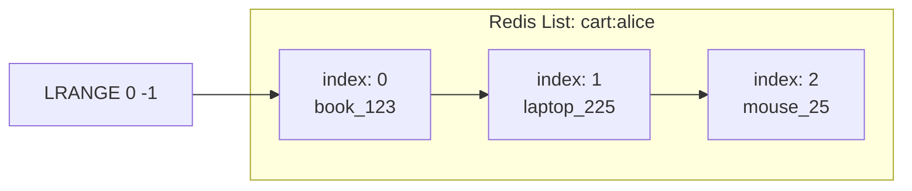

# Working with Key–Value Databases

Key–value databases store data as pairs of a **unique key** and a **value**.  
This is similar to a Python dictionary or a JavaScript object.

In this workshop, we will use **Redis**, a popular open-source key–value database.

---
## Setup Redis


### Setting up Redis locally

You can run Redis locally using Docker:

```bash
docker run -d --name redis-demo -p 6379:6379 redis
```

Connect to the Redis command-line interface:

```bash
docker exec -it redis-demo redis-cli
```

You should see a prompt like this:

```bash
127.0.0.1:6379>
```

### Execute Redis commands in a browser

Via the OneCompiler website it is possible to execute Redis commands in a virtual enviroment. The website address is: [https://onecompiler.com/redis](https://onecompiler.com/redis)


> 💡 **Quoting values with spaces**
>
> When using Redis in an online environment such as **OneCompiler**, always use **single quotes** (`' '`) around values that contain spaces.
>
> Example:
> ```bash
> HSET product:1002 name 'MacBook Air' price 1299 brand 'Apple'
> ```
>
> If you use double quotes (`" "`) instead, the platform may split `"MacBook Air"` into two separate arguments (`MacBook` and `Air`) and Redis will return:
>
> ```
> (error) WRONG NUMBER OF ARGUMENTS FOR 'hset' command
> ```
>
> Using **single quotes** ensures the entire string is treated as one value.


## Basic Commands

**Storing and retrieving values**
```bash
SET product:1001 "Laptop"
GET product:1001
```
Redis stores the value "Laptop" under the key "product:1001".

**Updating values**
```bash
SET product:1001 "Laptop – Dell XPS 13"
GET product:1001
```
The SET command overwrites the existing value for the same key.

> **About key naming conventions**
>
>In Redis, a key such as `product:1005` is **not** a real namespace — it is simply a **naming convention**.
>
>Redis stores all keys in a single global keyspace.  
>The colon (`:`) has no technical meaning; it is just part of the key name.
>
>Developers use the `:` convention to make keys easier to read and group logically:
>
>| Example Key | Meaning |
>|--------------|----------|
>| `product:1005` | Product with ID 1005 |
>| `cart:alice` | Shopping cart belonging to user Alice |
>| `session:uid123` | Session for user with ID 123 |
>
>This makes it easy to filter related keys:
>
>```bash
>KEYS product:*
>```


**Using hashes for structured data**\
Instead of a single string, you can store multiple fields using a hash:

```bash
HSET product:1002 name "MacBook Air" price 1299 brand "Apple"
```
The value of the key ```product:1002``` is a mapping on its own:
```javascript
 product:1002 = {
  "name": "MacBook Air",
  "price": "1299",
  "brand": "Apple"
}
```

To get all values from this mapping:
```
HGETALL product:1002
```
Output:
```bash
1) "name"
2) "MacBook Air"
3) "price"
4) "1299"
5) "brand"
6) "Apple"
```

To get a specific field from this mapping:

```
HGET product:1002 price
```

Output:
```
1299
```

**Lists**\
Lists store ordered values. You can use them as queues or logs.

```bash
RPUSH cart:alice "book_123"
RPUSH cart:alice "laptop_225"
RPUSH cart:alice "mouse_25"
LRANGE cart:alice 0 -1
```
- The ```RPUSH``` command stands for Right push, so it pushes a element at the end of the list. The ```LPUSH``` command pushes a element at the start of the list.
- The ```LRANGE``` command returns elements within a given range. It takes two arguments: the start and stop index. ```0``` represents the first element, ```-1``` the last element.

The result:
```bash
1) "book_123"
2) "laptop_225"
3) "mouse_25"
```



**Expiring Keys**\
You can make a key temporary — useful for sessions or caches.
```bash
SET session:alice "logged_in"
EXPIRE session:alice 60
TTL session:alice
```
This sets a time-to-live of 60 seconds for the key.

## Practice Questions

🧠 1. Create a new hash for a product "product:2001" with the following fields:
```bash
name = "Smartphone", brand = "Samsung", price = 799.
```
<details><summary>Click to reveal answer</summary>
HSET product:2001 name "Smartphone" brand "Samsung" price 799
HGETALL product:2001
</details>

\
🧠 2. Use a list to simulate a shopping cart for Bob with three items:

```bash
book_101, laptop_225, and phone_331.
```

Retrieve all items from his cart.
<details><summary>Click to reveal answer</summary>
LPUSH cart:bob "book_101" "laptop_225" "phone_331"
LRANGE cart:bob 0 -1
</details>

\
🧠 3. Set a temporary key for "discount:today" with the value "15%", expiring after 120 seconds.
<details><summary>Click to reveal answer</summary>
SET discount:today "15%"
EXPIRE discount:today 120
TTL discount:today
</details>

\
🧠
4. How could you store user login sessions with automatic expiry?
<details><summary>Click to reveal discussion</summary> You can use one key per session ID, e.g.: 
\
`SET session:uid123 "active" EXPIRE session:uid123 3600` 
\
This key expires automatically after one hour. </details>

---

## Searching in Key–Value Databases

Key–value databases such as Redis are **optimized for speed**, not for complex queries.  
They can retrieve a value extremely fast — but **only if you already know the key**.

For example:
```bash
GET product:1005
```
returns the value immediately, because Redis looks up the key directly in memory.
This makes access times almost instantaneous.
However, you cannot search inside the value.
Redis has no concept of “fields” or “columns” like an SQL or document database.


If you store:

```
HSET product:1005 name "Laptop" brand "Dell" price 899
```

you cannnot ask:

```
# Not possible
FIND all products WHERE brand = "Dell"
```

Redis doesn’t understand what a brand or price field means — it simply stores bytes under the key ```product:1005```.

If you need to search by field values (e.g. all products by brand),
you must model such queries yourself, for example by creating additional index-like structures:

```
SADD brand:Dell product:1005
SADD brand:Apple product:1006
SMEMBERS brand:Dell
```
This returns all keys for Dell products. The commands ```SADD``` and ```SMEMBERS``` are used to work with sets. A set is a collection of unique unordered elements. We will discuss sets further in the next chapter.