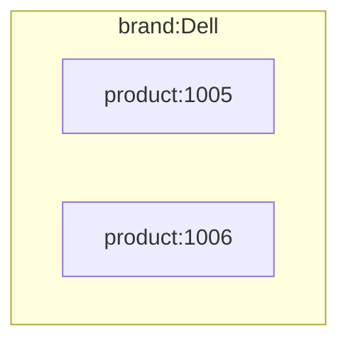
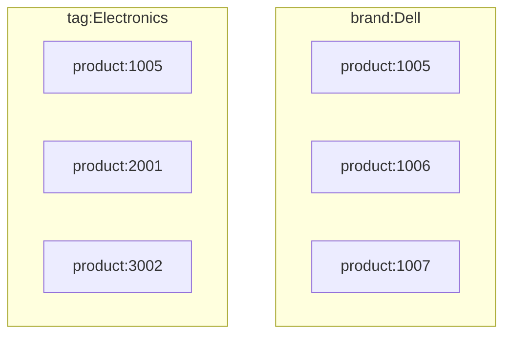
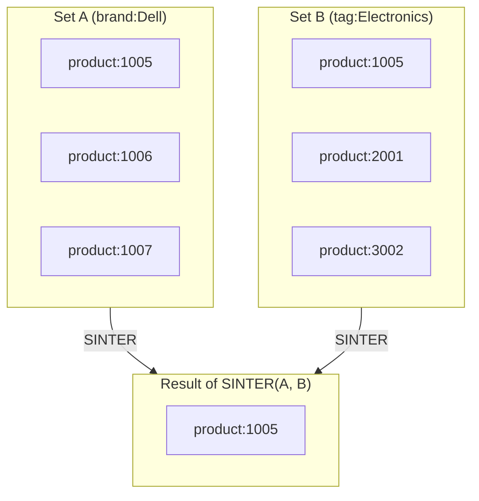
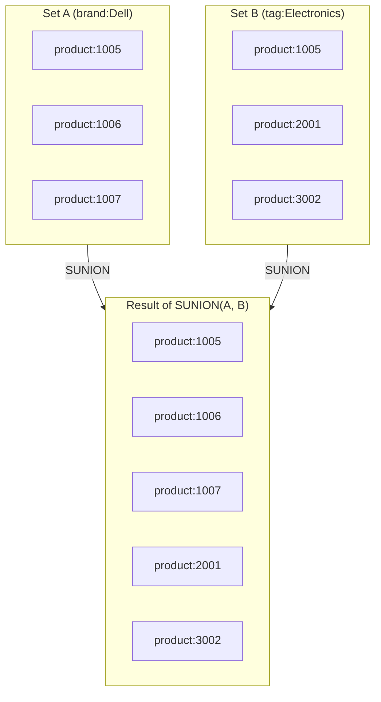
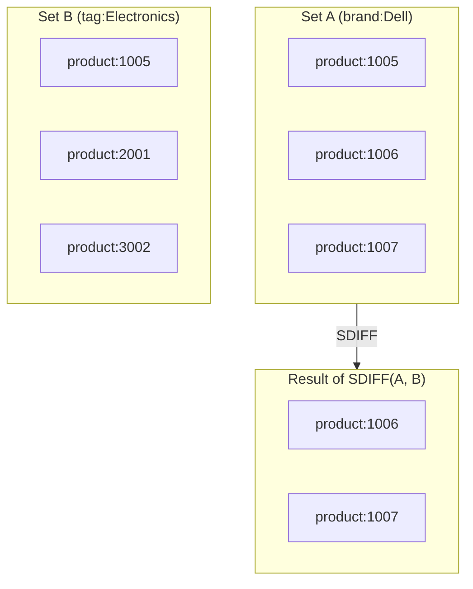

# Working with Redis Sets

Redis supports several *collection types*, and one of the most useful is the **Set**.
A Set is an **unordered collection of unique values**, similar to a Python `set` or a mathematical set.

 Sets are often used to group related keys — for example, all products by brand, or all users with a specific role.

### Example
 ```bash
 SADD brand:Dell product:1005
 SADD brand:Dell product:1006
 SADD brand:Apple product:2001
 ```
 Redis automatically creates the sets if they don’t exist.

 You can now list all products that belong to Dell:
 ```bash
 SMEMBERS brand:Dell
 ```
 Output:
 ```
 1) "product:1005"
 2) "product:1006"
 ```

 ---

 ### Common Set Commands

 | Command | Description | Example | Result |
 |----------|--------------|----------|---------|
 | `SADD key value` | Add one or more elements to a set | `SADD tag:laptop` | `1` (new element added) |
 | `SMEMBERS key` | Get all elements in the set | `SMEMBERS tag:laptop` | `"product:1005"` |
 | `SISMEMBER key value` | Check if an element exists | `SISMEMBER tag:laptop product:1005` | `1` (true) |
 | `SREM key value` | Remove an element from the set | `SREM tag:laptop product:1005` | `1` |
 | `SUNION key1 key2` | Return the union of two sets | `SUNION tag:laptop tag:tablet` | All unique elements from both sets |
 | `SINTER key1 key2` | Return intersection (common elements) | `SINTER tag:electronics tag:laptop` | Common product IDs |
 | `SDIFF key1 key2` | Return difference | `SDIFF tag:electronics tag:laptop` | Items in first but not second set |


### Visualizing Sets in Redis

Redis **sets** are perfect for modeling simple relationships — such as grouping products by brand or tagging items with categories.  
Because sets can overlap (the same element can exist in multiple sets), they are similar to *mathematical sets* in discrete mathematics.


---

### Example 1 – A single set


This shows one Redis set called brand:Dell, containing two products.
Each product key is unique and belongs to that brand.

### Example 2 – A overlapping set


Here, the key ```product:1005``` appears in both sets.
This overlap represents a product that belongs to brand Dell and is tagged as “Electronics.”
Such overlaps are the foundation for set operations like intersections and unions.

### Example 3 - Set operations

**The intersection**

The intersection returns all elements which occur in both set A and in set B.

**The union**

The union returns all unique elements that are present in set A, set B, or both.

***The difference***

The difference returns the elements that exist only in set A and are not shared with set B.\
\
In this visualization, there is only an arrow from set A to set C, because only set A serves as the data source. Set B is used for comparison only.

 ### Why Sets Are Useful

 Sets are great for modeling relationships or categories, for example:
 - Products grouped by brand (`brand:Dell`, `brand:Apple`)
 - Users grouped by role (`role:admin`, `role:student`)
 - Tags or labels (`tag:featured`, `tag:sale`)
 - Active sessions or online users

 Example:
 ```bash
 SADD role:admin user:101 user:102
 SADD role:student user:201 user:202
 SMEMBERS role:admin
 ```

 ---

### Summary
 - A Redis *Set* is an unordered collection of unique elements.  
 - Use `SADD` to add, `SMEMBERS` to list, and `SISMEMBER` to check membership.  
 - Sets are ideal for grouping related items or creating simple lookup relationships.  
 - They are often used to **simulate indexes** — e.g., all products that belong to a specific category or brand.


# Practice Questions

🧠 1. We have two sets:

Set A = { book, laptop, phone }\
Set B = { tablet, phone, camera }


What is the **intersection** of A and B?

<details><summary>Click to reveal answer</summary>

SINTER A B \
→ { phone }


The intersection returns only elements that appear in **both sets**.
</details>

---

🧠 2. Union of two sets

Set A = { pen, notebook } \
Set B = { notebook, charger, mouse }

What is the **union** of A and B?

<details><summary>Click to reveal answer</summary>

SUNION A B \
→ { pen, notebook, charger, mouse }


The union combines all the elements from **both sets**.
</details>

---

🧠 3. Difference between two sets

Set A = { apple, banana, kiwi, orange } \
Set B = { kiwi, mango }

What is the **difference** (A - B)?

<details><summary>Click to reveal answer</summary>

SDIFF A B \
→ { apple, banana, orange }


The difference return the elements of set A which are not in set B.
</details>


