# Graph Databases

In previous workshops we explored how data can be stored as individual records — either as key–value pairs or as JSON documents.
In this workshop, we focus on a different way of storing and querying data: the graph model.

While relational and document databases are good at representing entities (such as users, products, or orders), a graph database focuses on the relationships between those entities.

In many real-world systems, the relationships are the most important part of the data — for example, who follows whom, which customers bought the same products, or which cities are connected by a train route.

## The graph model
A graph database stores data as nodes (entities) and edges (relationships).
Each node can have properties, and each edge can also have its own properties — for example, the date when a relationship was created or a rating given by a user.

Example (social network data):
```
(:Person {name: "Alice"})
(:Person {name: "Bob"})
(:Person {name: "Charlie"})

(:Alice)-[:FOLLOWS]->(:Bob)
(:Bob)-[:FOLLOWS]->(:Charlie)
(:Alice)-[:LIKES]->(:Post {title: "Understanding NoSQL"})
```
> Note:The examples above use Cypher-like notation to show how nodes and relationships are connected.

```mermaid
graph LR
    %% Personen
    Alice(["👤 Alice"])
    Bob(["👤 Bob"])
    Charlie(["👤 Charlie"])
    
    %% Post
    Post(["📝 Post<br/>"Understanding NoSQL""])

    %% Relaties
    Alice -->|FOLLOWS| Bob
    Bob -->|FOLLOWS| Charlie
    Alice -->|LIKES| Post
```



In a graph query language such as Cypher (used by Neo4j), you can query these relationships directly:

```
MATCH (a:Person)-[:FOLLOWS]->(b:Person)
RETURN a.name, b.name
```
In a graph query you start with the question: "Which relation to investigate?" followed by "Which nodes are connected through that relation?". So the above query translates to: "Find all ``Person nodes`` connected through a outgoing ```Follows relation```". 

The above query will yield the nodes:
- Alice, Bob
- Bob, Charlie


## Typical use cases
| Type       | Typical use | Examples|
| -----------|-------------| --------|
| **Graph database** | Social networks, recommendation engines, route planning, fraud detection | Neo4j, ArangoDB, Amazon Neptune |

---
🧠 Question:
Why would a graph database be more efficient than a relational database for finding “friends of friends” in a social network?
<details> <summary>Click to reveal the answer</summary>
Because a graph database stores relationships as direct connections between nodes.
When querying “friends of friends,” the database can simply traverse these connections without performing costly join operations across multiple tables, as would be required in a relational model.
</details>

---

🧠 Question: Why are graph databases often used for fraud detection?

<details> <summary>Click to reveal the answer</summary>
Fraud rarely involves a single isolated event.
Instead, it often depends on hidden relationships between multiple entities — such as people, accounts, IP addresses, phone numbers, or credit cards.

A graph database can represent these relationships directly as nodes and edges:

```
(:Person)-[:USES]->(:CreditCard)
(:CreditCard)-[:USED_FROM]->(:IP_Address)
(:Person)-[:SHARES_PHONE_WITH]->(:Person)
```

Because relationships are stored as first-class elements, the database can quickly traverse the network and discover indirect links.
For example, it can find “all people who share a credit card with someone already flagged as suspicious” using a simple query like:

```
MATCH (p1:Person)-[:USES]->(c:CreditCard)<-[:USES]-(p2:Person)
WHERE p1.flagged = true
RETURN DISTINCT p2
```
This ability to follow multi-level connections makes graph databases ideal for detecting complex fraud patterns that would be very hard to uncover with traditional SQL joins.
</details>


