# Working with Graph Queries

In this part of the workshop you will start writing simple Cypher queries to create and explore data in a graph database.  
Cypher is a **declarative query language** (similar to SQL) but designed for graphs.  
You describe **patterns** of nodes and relationships, and the database returns the matches.

In this workshop we will use Neo4j as graph database.


## Getting started with Neo4j Sandbox

Before writing your first Cypher queries, you can use the Neo4j Sandbox — a free online environment where you can try out graph databases without installing anything.

1. Open the Sandbox\
Go to [https://sandbox.neo4j.com](https://sandbox.neo4j.com)
2. Sign in\
You can sign in with a Google or GitHub account.
Neo4j will automatically create a personal sandbox environment for you.
3. Create a new project\
Click “+ New Project” and choose “Blank Sandbox” (an empty database).
You can also explore the other templates later (for example Recommendations or Network Analysis).
4. Launch the Neo4j Browser\
Once the sandbox is ready, click “Open” to start the Neo4j Browser.
A web interface will open where you can type and execute Cypher commands.
5. Connect to the database\
If asked, confirm the connection.
You will see a prompt like this:
neo4j>
This is where you can start entering your own Cypher queries.

## Creating two nodes and one relationship
In this example two Person nodes will be created. One person follows the other, like in a social network. 

### 1 Creating nodes and relationships

Each node represents an entity, and each relationship describes how two nodes are connected.

Example:

```cypher
CREATE (a:Person {name: "Alice"})-[:FOLLOWS]->(b:Person {name: "Bob"});
```

This creates two `Person` nodes and one `FOLLOWS` relationship. A relationship always has a direction. This is indicated with the arrow ```->``` in the query. So in this example, ```Alice``` followes ```Bob``` and ```Bob``` is followed by ```Alice```.

The direction of a relationship gives semantic meaning to the connection.
A graph database can traverse the relationship in either direction.

```mermaid
graph LR
    %% Personen
    p1(["👤 Alice"])
    p2(["👤 Bob"])
            
    %% Relaties
    p1 -->|FOLLOWS| p2    
```




### 2 Query the relationship
The data about Alice and Bob can be queried in several ways:

```cypher
MATCH (a:Person)-[:FOLLOWS]->(b:Person)
RETURN a.name, b.name;
```
Returns who follows whom: ```Alice -> Bob```

```cypher
MATCH (a:Person)<-[:FOLLOWS]-(b:Person)
RETURN a.name, b.name;
```
Returns who is followed by whom: ```Bob <- Alice```

```cypher
MATCH (a:Person)-[:FOLLOWS]-(b:Person)
RETURN a.name, b.name
```
Returns everyone who is connected through a FOLLOWS relationship, regardless of direction: ```Alice - Bob``` and ```Bob - Alice```

🧠 **Question:**  
List all persons currently stored in the database.

<details>
<summary>Click to reveal the answer</summary>

```cypher
MATCH (p:Person)
RETURN p;
```
</details>

---

### 3 Remove all relationships and nodes
Let’s remove the existing relationships and nodes before continuing with a more advanced example.

```cypher
MATCH (n)
DETACH DELETE n;
```

The ```MATCH``` selects all the nodes in the database. Two actions are performed: ```DETACH``` removes any attached relationships, and ```DELETE``` removes the nodes themselves.

```DETACH DELETE``` is a safe way to clear the database — it deletes nodes and automatically removes any relationships connected to them.

## Building a small dataset for fraud detection

The following example models a simplified scenario for fraud detection.

```cypher
CREATE
  (p1:Person {name: "Alice", flagged: true}),
  (p2:Person {name: "Bob"}),
  (p3:Person {name: "Charlie"}),
  (c1:CreditCard {number: "1111"}),
  (c2:CreditCard {number: "2222"}),
  (ip1:IP_Address {address: "203.0.113.42", flagged: true}),
  (ip2:IP_Address {address: "198.51.100.12"}),
  (p1)-[:USES]->(c1)-[:USED_FROM]->(ip1),
  (p2)-[:USES]->(c2)-[:USED_FROM]->(ip1),
  (p3)-[:USES]->(c2)-[:USED_FROM]->(ip2);
```


```mermaid
graph LR
    %% Personen
    p1(["👤 Alice<br/>(flagged)"])
    p2(["👤 Bob"])
    p3(["👤 Charlie"])
    
    %% Creditcards
    c1(["💳 Card 1111"])
    c2(["💳 Card 2222"])
    
    %% IP-adressen
    ip1(["🌐 IP 203.0.113.42<br/>(flagged)"])
    ip2(["🌐 IP 198.51.100.12"])
    
    %% Relaties
    p1 -->|USES| c1
    c1 -->|USED_FROM| ip1

    p2 -->|USES| c2
    c2 -->|USED_FROM| ip1

    p3 -->|USES| c2
    c2 -->|USED_FROM| ip2
```

The diagram above shows how nodes and relationships in the graph are connected.
Each shape represents a node, and each arrow represents a relationship between two nodes. This visualization helps you think in connections rather than tables.
Instead of looking up rows in different tables and joining them, you can visually follow paths like:
```
Alice → Card 1111 → IP 203.0.113.42
```
Such a path directly expresses a real-world relationship between entities.


## Understanding MATCH and pattern matching
Before writing queries, it is important to understand how Cypher finds data. Cypher does not work with tables — instead, it matches patterns in a graph.

### Nodes
Nodes are written between parentheses ```()```.
Example:
```cypher
(p:Person)
```
means: a node ```p``` with the label ```Person```. Properties can also be included:
```
(p:Person {name: "Alice"})
```

### Relationships
Relationships are written between square brackets ```[]```, with arrows indicating the direction.

| Pattern     | Meaning  
| ----------- | ---------------- |
| `()-[:FOLLOWS]->()`         | an outgoing *FOLLOWS* relationship                   |
| `()<-[r:USES]-()`           | an incoming *USES* relationship, given the alias `r` |
| `(p1)-[:USED_WITH]-(p2)` | relationship in either direction                     |

**Combining patterns**\
A full pattern connects multiple nodes and relationships:
```
MATCH (p:Person)-[:USES]->(c:CreditCard)-[:USED_FROM]->(ip:IP_Address)
RETURN p.name, c.number, ip.address;
```
Think of this as: "Find all persons who uses a credit card, which in turn is connected to an IP address". Cypher then finds all occurrences of this pattern in the graph — it doesn’t “join” tables, it traverses connections.

With ```WHERE``` it is possible to specify conditions which the pattern must satisfy. 
```
MATCH (ip:IP_Address) WHERE ip.flagged = true RETURN ip.address;
```

🧠 **Question:**  
Write a query that lists all people who used a credit card from a *flagged* IP address.

<details>
<summary>Click to reveal the answer</summary>

```cypher
MATCH (p:Person)-[:USES]->(:CreditCard)-[:USED_FROM]->(ip:IP_Address)
WHERE ip.flagged = true
RETURN DISTINCT p.name, ip.address;
```

If you ran this query, you see that **Charlie** is also included in the results — even though he never used a flagged IP address directly. This happens because Cypher matches patterns of connections, not individual transactions. The query asks the database to find any person connected to a credit card that is, in turn, connected to a flagged IP address. This is an example of how graph traversal can reveal indirect associations that wouldn’t appear in a flat SQL query.

Graph queries are relational, not transactional.
Cypher looks for all paths that fit the described pattern, regardless of when or how the relationships were created.

</details>


---

## Traversing relationships

Because relationships are stored directly in the graph, you can easily follow them to find indirect connections.

🧠 **Question:**  
Which people share an IP address with someone who is already flagged as suspicious?

<details>
<summary>Click to reveal the answer</summary>

```cypher
MATCH (p1:Person)-[:USES]->(:CreditCard)-[:USED_FROM]->(ip:IP_Address)<-[:USED_FROM]-(:CreditCard)<-[:USES]-(p2:Person)
WHERE p1.flagged = true AND p1 <> p2
RETURN DISTINCT p1.name AS flagged_person,
       p2.name AS connected_person,
       ip.address;
```
or alternative:

```cypher
MATCH (p1:Person {flagged:true})-[:USES]->(:CreditCard)-[:USED_FROM]->(ip:IP_Address)<-[:USED_FROM]-(:CreditCard)<-[:USES]-(p2:Person)
WHERE p1 <> p2
RETURN DISTINCT p1.name AS flagged_person,
       p2.name AS connected_person,
       ip.address;
```
You can specify property filters (conditions on node attributes) directly inside the node pattern. Both queries return the same result.
</details>

---

## Finding nodes without relationships
Sometimes you want to find nodes that are not connected to any other nodes —
for example, people who follow no one, or who are not followed by anyone.
Cypher allows you to check for the absence of relationships directly in a MATCH query.

### Clear the database and create a new dataset.
To remove all existing nodes and relationships, execute the following query.

```
// Clear the database
MATCH (n)
DETACH DELETE n;
```

Then create a new dataset with people and their relations. In this example a **constraint** is introduced. 

A ```CONSTRAINT``` defines data integrity rules that the database will automatically enforce. Here, the constraint ensures that every ```Person``` node has a unique value for the property name. This prevents duplicate persons from being created with the same name — similar to a UNIQUE constraint in a relational database.

Other examples of constraints include requiring that certain properties exist or that values are of a specific type.

```
// Create persons
CREATE
  (a:Person {name: "Alice"}),
  (b:Person {name: "Bob"}),
  (c:Person {name: "Charlie"}),
  (d:Person {name: "Diana"}),
  (e:Person {name: "Eve"}),
  (f:Person {name: "Frank"});

//Ensure the name property is unique
CREATE CONSTRAINT person_name_unique
  FOR (p:Person)
  REQUIRE p.name IS UNIQUE;

// Create relationships
MATCH (a:Person{name: "Alice"}) 
MATCH (b:Person{name: "Bob"})
CREATE (a)-[:FOLLOWS]->(b);

MATCH (b:Person{name: "Bob"})
MATCH (c:Person{name: "Charlie"})
CREATE (b)-[:FOLLOWS]->(c);

MATCH (c:Person{name: "Charlie"})
MATCH (a:Person{name: "Alice"})
CREATE (c)-[:FOLLOWS]->(a);

MATCH (a:Person {name: "Alice"})
MATCH (c:Person {name: "Charlie"})
CREATE (a)-[:FOLLOWS]->(c);

MATCH (d:Person{name: "Diana"})
MATCH (a:Person{name: "Alice"})
CREATE (d)-[:FOLLOWS]->(a);


```


```mermaid
graph LR
    %% Personen
    A(["👤 Alice"])
    B(["👤 Bob"])
    C(["👤 Charlie"])
    D(["👤 Diana"])
    E(["👤 Eve<br/>(no relationships)"])
    F(["👤 Frank<br/>(no relationships)"])

    %% Relaties
    A -->|FOLLOWS| B
    B -->|FOLLOWS| C
    C -->|FOLLOWS| A
    A -->|FOLLOWS| C
    D -->|FOLLOWS| A
    
```

This diagram shows the relationships between people in the dataset:
Alice, Bob, and Charlie form a small mutual network (each follows or is followed by someone).
Diana follows Alice, but no one follows Diana back.
Eve and Frank have no relationships — they are isolated nodes.

### People with no relationships at all
To find isolated nodes (persons not connected to anything):
```cypher
MATCH (p:Person)
WHERE NOT (p)--()
RETURN p.name;
```
This matches all Person nodes that have no incoming or outgoing relationships of any type.

### People who follow no one
To find people with no outgoing FOLLOWS relationships:

```cypher
MATCH (p:Person)
WHERE NOT (p)-[:FOLLOWS]->(:Person)
RETURN p.name;
```
These people exist in the graph but do not follow anyone.

### People who are not followed by anyone
To find people with no incoming FOLLOWS relationships:

```cypher
MATCH (p:Person)
WHERE NOT (:Person)-[:FOLLOWS]->(p)
RETURN p.name;
```
This returns people who are not followed by anyone —
they might follow others, but no one follows them.

### Using OPTIONAL MATCH (similar to SQL LEFT JOIN)
If you want to keep all persons in the result and show also those without a match:

```cypher
MATCH (p:Person)
OPTIONAL MATCH (p)-[:FOLLOWS]->(f:Person)
RETURN p.name, f.name;
```
This is similar to LEFT JOIN ... WHERE NULL in SQL:
OPTIONAL MATCH includes all nodes and leaves f as NULL when no match exists.

---
🧠 Question 1:
Return the names of all people.
<details> <summary>Click to reveal the answer</summary>

```cypher
MATCH (p:Person)
RETURN p.name;
```
</details>

---

---
🧠 Question 2:
Return who follows whom.
<details> <summary>Click to reveal the answer</summary>

```
MATCH (a:Person)-[:FOLLOWS]->(b:Person)
RETURN a.name AS follower, b.name AS follows;
```
</details>

---

---
🧠 Question 3:
Return people who follow Alice.
<details> <summary>Click to reveal the answer</summary>

```
MATCH (p:Person)-[:FOLLOWS]->(a:Person {name:"Alice"})
RETURN p.name;
```
</details>

---

---
🧠 Question 4:
Return people that Alice follows.
<details> <summary>Click to reveal the answer</summary>

```
MATCH (a:Person {name:"Alice"})-[:FOLLOWS]->(others)
RETURN others.name;
```
</details>

---

---
🧠 Question 5:
Find all pairs of people connected by a FOLLOWS relationship, regardless of direction.
<details> <summary>Click to reveal the answer</summary>

```
MATCH (p1:Person)-[:FOLLOWS]-(p2:Person)
RETURN DISTINCT p1.name, p2.name;
```
</details>

---

---
🧠 Question 6:
Find people who follow no one.
(Expected: Eve, Frank)
<details> <summary>Click to reveal the answer</summary>

```
MATCH (p:Person)
WHERE NOT (p)-[:FOLLOWS]->(:Person)
RETURN p.name;

```
</details>

---

---
🧠 Question 7:
Find people who are not followed by anyone.
(Expected: Diana, Eve, Frank)
<details> <summary>Click to reveal the answer</summary>

```
MATCH (p:Person)
WHERE NOT (:Person)-[:FOLLOWS]->(p)
RETURN p.name;


```
</details>

---
🧠 Question 8:
Show everyone and the number of people they follow.
<details> <summary>Click to reveal the answer</summary>

```
MATCH (p:Person)
OPTIONAL MATCH (p)-[:FOLLOWS]->(f:Person)
RETURN p.name, COUNT(f) AS follows_count;
```
</details>

---

🧠 Question 9:
Who follows someone who (directly) follows Alice?
(Hint: this is a two-step pattern.)

<details> <summary>Click to reveal the answer</summary>

```
MATCH (p:Person)-[:FOLLOWS]->(:Person)-[:FOLLOWS]->(a:Person {name:"Alice"})
RETURN DISTINCT p.name;

```
</details>

---

🧠 Question 10:
Who are the mutual followers — people who follow each other?
(In this dataset: Alice ↔ Charlie)

<details> <summary>Click to reveal the answer</summary>

```
MATCH (a:Person)-[:FOLLOWS]->(b:Person),
      (b)-[:FOLLOWS]->(a)
RETURN a.name, b.name;


```
</details>

---

## Summary

Graph queries like these are much easier to express in Cypher than in a traditional SQL database. In a relational model, you would need several join tables and long SQL statements to follow the same pattern of relationships. Graph databases store connections as first-class elements, which makes pattern detection (such as fraud networks) straightforward and efficient.
