# Working with properties on relationships

In Neo4j, not only nodes but also relationships can have properties.
This makes it possible to store context or metadata directly on the connection between two entities — for example, the time of an action or a rating value.

The following example models a simple webshop where customers can like products. Each like has its own creation date and rating. Products also belong to one or more categories.

```cypher
CREATE
  // Customers
  (c1:Customer {name: "Alice"}),
  (c2:Customer {name: "Bob"}),

  // Products
  (p1:Product {name: "Laptop"}),
  (p2:Product {name: "Smartphone"}),

  // Categories
  (cat1:Category {name: "Electronics"}),

  // Relationships between products and categories
  (p1)-[:HAS_CATEGORY]->(cat1),
  (p2)-[:HAS_CATEGORY]->(cat1),

  // Alice liked Laptop and Smartphone
  (c1)-[:LIKED {created_at: date("2025-10-01"), rating: 5}]->(p1),
  (c1)-[:LIKED {created_at: date("2025-10-03"), rating: 4}]->(p2),

  // Bob liked Smartphone
  (c2)-[:LIKED {created_at: date("2025-10-02"), rating: 3}]->(p2);
```



```mermaid
graph LR
    %% Customers
    c1(["👤 Alice"])
    c2(["👤 Bob"])

    %% Products
    p1(["💻 Laptop"])
    p2(["📱 Smartphone"])

    %% Category
    cat1(["🛍️ Electronics"])

    %% Relationships
    c1 -->|LIKED<br/>⭐5<br/>2025-10-01| p1
    c1 -->|LIKED<br/>⭐4<br/>2025-10-03| p2
    c2 -->|LIKED<br/>⭐3<br/>2025-10-02| p2
    p1 -->|HAS_CATEGORY| cat1
    p2 -->|HAS_CATEGORY| cat1
```

This diagram shows customers, products, and categories, connected through relationships. Each ```LIKED``` relationship stores its own rating and created_at property, giving extra meaning to the connection between a customer and a product.

### Querying relationships with properties

**Products liked by Alice**

```cypher
MATCH (c:Customer {name: "Alice"})-[r:LIKED]->(p:Product)
RETURN p.name, r.rating, r.created_at;
```
This query returns the products that Alice liked, together with the rating and the date she liked them.

**Average rating per product**

```cypher
MATCH (:Customer)-[r:LIKED]->(p:Product)
RETURN p.name, avg(r.rating) AS average_rating;
```

Relationships can be aggregated just like nodes.
In this case, the rating property is used to calculate the average rating per product.

**Products liked by multiple customers**
```cypher
MATCH (c1:Customer)-[:LIKED]->(p:Product)<-[:LIKED]-(c2:Customer)
WHERE c1 <> c2
RETURN DISTINCT p.name, collect(DISTINCT c1.name + " & " + c2.name) AS shared_by;
```
This shows products that were liked by more than one customer.

```collect()``` is an aggregation function in Cypher that gathers multiple values into a single list.
It is similar to GROUP_CONCAT() in SQL or creating a list from grouped data in Python. 

```cypher
MATCH (c:Customer)-[:LIKED]->(p:Product)
RETURN p.name, collect(c.name) AS customers;
```
will result in:
| p.name     | customers        |
| ---------- | ---------------- |
| Laptop     | ["Alice"]        |
| Smartphone | ["Alice", "Bob"] |

Instead of returning one row per customer, the results are grouped by product, and all customer names are collected into a single list.

🧠 Question:
List all products together with:
- the number of customers who liked them, and
- the list of those customers.
<details> <summary>Click to reveal the answer</summary>

```cypher
MATCH (c:Customer)-[:LIKED]->(p:Product)
RETURN
  p.name AS product,
  COUNT(c) AS likes_count,
  collect(c.name) AS customers;
```

Explanation:
MATCH finds all (Customer)-[:LIKED]->(Product) patterns.
COUNT(c) counts how many customers liked each product.
collect(c.name) gathers all customer names into a list.

Result:
| product    | likes_count | customers        |
| ---------- | ----------- | ---------------- |
| Laptop     | 1           | ["Alice"]        |
| Smartphone | 2           | ["Alice", "Bob"] |
</details>

\
**Filtering by category**
```cypher
MATCH (c:Customer)-[:LIKED]->(p:Product)-[:HAS_CATEGORY]->(cat:Category)
WHERE cat.name = "Electronics"
RETURN c.name, p.name, cat.name;
```

The same MATCH pattern can traverse across different relationship types to include category information.

🧠 Question:
Return all customers who liked a product in the Electronics category with a rating of 4 or higher.

<details> <summary>Click to reveal the answer</summary>

```cypher
MATCH (c:Customer)-[r:LIKED]->(p:Product)-[:HAS_CATEGORY]->(cat:Category)
WHERE cat.name = "Electronics" AND r.rating >= 4
RETURN c.name, p.name, r.rating;
```

This query looks for customers (c) who liked a product (p) in the Electronics category and gave it a rating of 4 or higher.

- MATCH describes a three-step pattern:
(Customer)-[:LIKED]->(Product)-[:HAS_CATEGORY]->(Category)
This means: find all customers who are connected to a product that belongs to a specific category.
- The WHERE clause adds two filters:
    - cat.name = "Electronics" limits the result to products in that category.
    - r.rating >= 4 filters out low ratings.
- RETURN displays the customer name, the product name, and the rating from the LIKED relationship.


</details>

## Comparing graph queries and relational databases
At first glance, the webshop example could also be implemented in a relational database.
You would create three tables:

|Table|Purpose|
|-----|-------|
|customer| Stores cutomer information|
|products| Stores product information|
|likes|Connects customer and products with columns ```created_at``` and ```rating```|


A simple SQL query can easily return who liked what:

```sql
SELECT customers.name, products.name, likes.rating, likes.created_at
FROM customers
JOIN likes   ON customers.id = likes.customer_id
JOIN products ON likes.product_id = products.id;

```
### When a graph database becomes more powerful
The real difference appears when you start asking multi-hop or pattern-based questions —
questions that go beyond a single join.

**Example 1 — “Which customers like similar products?”**

In SQL you would need a self-join on the likes table:

```sql
SELECT a.name AS customer1, b.name AS customer2, p.name AS common_product
FROM likes l1
JOIN likes l2 ON l1.product_id = l2.product_id AND l1.customer_id <> l2.customer_id
JOIN customers a ON l1.customer_id = a.id
JOIN customers b ON l2.customer_id = b.id
JOIN products p ON l1.product_id = p.id;
```

In Cypher, the same logic is expressed more intuitively:

```cypher
MATCH (c1:Customer)-[:LIKED]->(p:Product)<-[:LIKED]-(c2:Customer)
WHERE c1 <> c2
RETURN DISTINCT c1.name, c2.name, p.name;

```
**Example 2 — “Find customers who liked a product in the same category as something Alice liked.”**

In SQL, this would require three joins and a subquery:
```sql
SELECT DISTINCT c2.name
FROM likes l1
JOIN products p1 ON l1.product_id = p1.id
JOIN categories cat ON p1.category_id = cat.id
JOIN products p2 ON p2.category_id = cat.id
JOIN likes l2 ON l2.product_id = p2.id
JOIN customers c1 ON l1.customer_id = c1.id
JOIN customers c2 ON l2.customer_id = c2.id
WHERE c1.name = 'Alice' AND c1.id <> c2.id;
```

In Cypher, this pattern is much easier to express and read:

```cypher
MATCH (a:Customer {name:"Alice"})-[:LIKED]->(:Product)-[:HAS_CATEGORY]->(cat:Category)<-[:HAS_CATEGORY]-(:Product)<-[:LIKED]-(others:Customer)
WHERE a <> others
RETURN DISTINCT others.name, cat.name;
```

### Visual comparison: relational vs graph model

```mermaid
flowchart LR
    %% Relational model (left)
    subgraph R[Relational model]
      c[customers]
      p[products]
      l[likes]
      c -->|customer_id| l
      p -->|product_id| l
    end

    %% Graph model (right)
    subgraph G[Graph model]
      C1(["👤 Alice"])
      C2(["👤 Bob"])
      P1(["💻 Laptop"])
      P2(["📱 Smartphone"])
      Cat(["🛍️ Electronics"])

      C1 -->|LIKED<br/>⭐5| P1
      C1 -->|LIKED<br/>⭐4| P2
      C2 -->|LIKED<br/>⭐3| P2
      P1 -->|HAS_CATEGORY| Cat
      P2 -->|HAS_CATEGORY| Cat
    end

    %% Connector between models
    R -.->|Joins become traversals| G
```



In a relational database, connections are stored indirectly using foreign keys and join tables. In a graph database, connections are first-class citizens — they are part of the data itself.

As a result:
- Queries involving multiple joins (e.g. "friends of friends", "customers with similar tastes") become simple pattern matches in Cypher.
- Relationships can also store their own properties (like rating or created_at),giving richer context to every connection.

## Using WITH to control query flow
In Cypher, the keyword ```WITH``` is used to chain multiple query parts together.
It works like a temporary handover of variables — you decide which data is passed from one part of the query to the next.\
\
**Why WITH is needed**\
Some queries in Cypher are built in steps:
- First you find or aggregate some data
- Then you filter, sort, or return part of it

Because of this, ```WITH``` acts as a bridge between query stages.
You can think of it as a “pipeline” operator — it keeps the query readable and separates logical steps.

**Example 1 – Filter after aggregation**

The following query lists products that have an average rating of 4 or higher.

```cypher
MATCH (c:Customer)-[r:LIKED]->(p:Product)
WITH p, avg(r.rating) AS average_rating
WHERE average_rating >= 4
RETURN p.name, average_rating;
```
Explanation:
- MATCH finds all customers and products connected by a LIKED relationship.
- WITH groups the results by product (p) and calculates the average rating for each product.
- The WHERE clause filters products using the aggregated value average_rating.
- Finally, RETURN displays only the product name and its average rating.

**Example 2 – Passing additional variables**

You can pass multiple variables through ```WITH```, not just aggregates.
For example, if you also want to list the customers who liked those products:

```cypher
MATCH (c:Customer)-[r:LIKED]->(p:Product)
WITH p, avg(r.rating) AS average_rating, collect(c.name) AS customers
WHERE average_rating >= 4
RETURN p.name, average_rating, customers;
```
Here, both the aggregated values and the collected customer names are available after the WITH.

| Concept                               | Description                                                           | Analogy                                                   |
| ------------------------------------- | --------------------------------------------------------------------- | --------------------------------------------------------- |
| `WITH`                                | Passes selected variables to the next part of the query               | Like a pipeline or temporary result table                 |
| `MATCH` → `WITH` → `WHERE` → `RETURN` | Common flow in multi-step queries                                     | Similar to SQL: `FROM ... GROUP BY ... HAVING ... SELECT` |
| Why use it?                           | Keeps complex queries readable and allows filtering after aggregation | Enables modular thinking in Cypher                        |

\
🧠 Question:
Return all product categories that have an average rating of 4 or higher,
and show for each category:
- the average rating, and
- the list of products in that category.
<details> <summary>Click to reveal the answer</summary>

```cypher
MATCH (:Customer)-[r:LIKED]->(p:Product)-[:HAS_CATEGORY]->(cat:Category)
WITH cat, avg(r.rating) AS average_rating, collect(DISTINCT p.name) AS products
WHERE average_rating >= 4
RETURN cat.name AS category, average_rating, products;
```
Explanation:
- MATCH traverses the pattern from customers → products → categories.
- WITH groups all results by category (cat) and calculates the average rating of all likes in that category.
- collect(DISTINCT p.name) gathers the product names per category.
- WHERE filters categories that have an average rating of at least 4.
- RETURN lists the category, average rating, and the products that belong to it.

Result:
| category    | average_rating | products                 |
| ----------- | -------------- | ------------------------ |
| Electronics | 4.0            | ["Laptop", "Smartphone"] |

</details>

## Summary
This example demonstrates how relationships in a graph database can carry their own data.
Properties such as rating or created_at make it possible to capture not only who is connected to what, but also how and when that connection occurred.
This is especially useful for use cases such as recommendation systems, fraud detection, and social networks, where the details of interactions are as important as the entities themselves.

