# Modifying Relationships

## There is no “primary key” in a graph

Graph databases do not use primary keys like SQL tables do.  
Each node has an internal ID, but it is **not stable** and should not be used as a functional identifier.

Instead, you can define a property as unique using a *constraint*:

```cypher
CREATE CONSTRAINT person_name_unique
FOR (p:Person)
REQUIRE p.name IS UNIQUE;
```

This ensures that every `Person` node has a unique `name` value — effectively acting as a primary key.


## Creating, updating and merging relationships

In Cypher, relationships can be created, updated, or merged just like nodes.  
When modifying data, it is important to understand the difference between  
`CREATE`, `MATCH`, and `MERGE`.

---

## Creating new relationships
`CREATE` always creates something new — even if an identical relationship already exists.

```cypher
MATCH (a:Person {name: "Alice"})
MATCH (b:Person {name: "Bob"})
CREATE (a)-[:FOLLOWS]->(b);
```

This command creates a new `FOLLOWS` relationship from Alice to Bob.  
If such a relationship already exists, Cypher will create another one.

---

## Matching existing relationships
`MATCH` only finds relationships that already exist.  
It does not create or modify data.

```cypher
MATCH (a:Person {name: "Alice"})-[r:FOLLOWS]->(b:Person {name: "Bob"})
RETURN r;
```

If no relationship exists between Alice and Bob, this query simply returns nothing.

---

## Merging data safely
`MERGE` is a powerful command that combines the logic of `MATCH` and `CREATE`.  
If the specified pattern exists, Neo4j reuses it; if not, it creates it.  
This makes `MERGE` ideal for importing data or avoiding duplicates.

```cypher
MATCH (a:Person {name: "Alice"})
MATCH (b:Person {name: "Bob"})
MERGE (a)-[:FOLLOWS]->(b);
```

If the `FOLLOWS` relationship already exists, it will not be created again.  
If it does not exist, Neo4j will create it once.

---

## Using `MERGE` with `ON CREATE` and `ON MATCH`

`MERGE` can also execute different actions depending on whether a pattern  
was newly created or already existed.

```cypher
MERGE (a:Person {name: "Alice"})
ON CREATE SET a.created_at = date()
ON MATCH SET a.last_seen = date();
```

**Explanation:**  
- `ON CREATE` runs only if the node is new.  
- `ON MATCH` runs only if the node already existed.  
This is useful for logging, synchronisation, or incremental data imports.

---

## Merging relationships with properties

You can also use `MERGE` for relationships and set properties when they are first created.

```cypher
MATCH (a:Person {name: "Alice"}), (b:Person {name: "Bob"})
MERGE (a)-[r:FOLLOWS]->(b)
ON CREATE SET r.since = date("2025-01-01");
```

If the `FOLLOWS` relationship did not exist, it is created and timestamped.  
If it already existed, no duplicate is made.

---

## Merging on composite keys

Neo4j does not use composite primary keys, but you can simulate them with `MERGE`  
by combining multiple properties in the same pattern.

```cypher
MERGE (p:Purchase {order_id: 101, product_id: 55})
ON CREATE SET p.created_at = datetime();
```

This prevents duplicate records for the same `(order_id, product_id)` pair.  
It is especially useful when importing transactional or event data.

---

## Summary

| Command | Behaviour | When to use |
|----------|------------|-------------|
| `CREATE` | Always creates a new node or relationship | When duplicates are acceptable |
| `MATCH` | Only finds existing patterns | For reading or updating existing data |
| `MERGE` | Finds or creates a pattern | For safe imports or idempotent updates |

---

### Optional Visualization

```mermaid
graph TD
  subgraph Actions
    A[CREATE] -->|Always creates| X1((🔗 Relationship))
    B[MATCH] -->|Finds existing only| X2((🔗 Relationship))
    C[MERGE] -->|Creates if missing| X3((🔗 Relationship))
  end
```



**Explanation:**  
`CREATE` adds data blindly, `MATCH` only reads existing data, and `MERGE` intelligently decides whether to create or reuse existing elements.  

---

🧠 **Question:**  
Add a `FOLLOWS` relationship between Alice and Diana, but only if it does not already exist.  
If it is created, set the property `since` to today’s date.

<details>
<summary>Click to reveal the answer</summary>

```cypher
MATCH (a:Person {name: "Alice"}), (d:Person {name: "Diana"})
MERGE (a)-[r:FOLLOWS]->(d)
ON CREATE SET r.since = date();
```

**Explanation:**  
- `MERGE` checks whether the relationship already exists.  
- If it doesn’t, a new `FOLLOWS` relationship is created with the current date.  
- If it already exists, no duplicate is created.  

</details>
