# Access Control

## Vertical Partitioning

In an earlier workshop vertical partitioning was discussed in the context of performance optimization. In this workshop we look at the same concept from a security perspective. By applying vertical partitioning, access for a specific group of people to specific data can be managed at the database level. The method is to isolate sensitive data in a separate table or schema with tighter privileges.

### What is a database schema?
A schema is a logical container inside a database. It groups together related database objects such as tables, views, and functions. You can think of it as a namespace or folder within the database:

- It helps organize data and avoid name conflicts (two tables with the same name can exist in different schemas).
- It provides a security boundary, because you can assign privileges at the schema level.
- It allows you to separate sensitive data (e.g., PII) from non-sensitive data, making access control more transparent.

### Security boundary for PII

Place personally identifiable information (PII) in a **separate schema** with stricter privileges.

```sql
-- Core table: contains basic identifiers (still PII, but less sensitive).
CREATE TABLE customer_core (
    customer_id BIGINT GENERATED BY DEFAULT AS IDENTITY PRIMARY KEY,
    full_name   TEXT NOT NULL,
    email       TEXT NOT NULL UNIQUE,
    created_at  TIMESTAMP NOT NULL DEFAULT now()
);


-- Dedicated schema for more sensitive PII with stricter privileges.
CREATE SCHEMA pii AUTHORIZATION db_admin;

CREATE TABLE pii.customer_pii (
    customer_id BIGINT PRIMARY KEY
        REFERENCES public.customer_core(customer_id) ON DELETE CASCADE,
    social_security_number         TEXT,
    address     TEXT
);

-- Grant minimal privileges
REVOKE ALL ON SCHEMA pii FROM app_read;
REVOKE ALL ON pii.customer_pii FROM app_read;
GRANT SELECT ON public.customer_core TO app_read;
```
>💡 Note: In this example, ```app_read``` represents an application user with limited privileges. The user can query non-sensitive data in public.customer_core, but not the PII data stored in pii.customer_pii. How to create and configure such users and roles in PostgreSQL will be covered in a separate lesson.


***Figure***: The customer_core table (public schema) contains basic identifiers (name, email), while the customer_pii table (pii schema) holds more sensitive data (SSN, address).

```mermaid
flowchart LR
  subgraph PUBLIC["public schema"]
    CCORE[customer_core - basic PII]
  end

  subgraph PII["pii schema (restricted)"]
    CPII[customer_pii - sensitive PII]
  end

  %% Relatie tussen tabellen
  CCORE -- "customer_id PK ⇒ FK" --> CPII

  %% Rollen
  APPREAD[role: app_read]
  DBA[role: db_admin]

  %% Toegang
  APPREAD --> CCORE
  APPREAD -. no access .-> CPII
  DBA --> CPII

```


***Figure***: The app_read role can only access the public schema (customer_core), not the pii schema (customer_pii). This separation enforces stricter access control for sensitive PII.

### Risk-based approach
Strictly speaking, both ```full_name``` and ```email``` are also PII. In practice, however, not all PII carries the same level of sensitivity. In this example, the ```customer_core``` table contains basic identifiers that are commonly needed by applications, while the ```pii.customer_pii``` table isolates more sensitive identifiers such as social security number and physical address. This separation allows stronger access control where it matters most.


