# Access Control
Access control is the process of defining **who** can access **which data** and **what actions** they are allowed to perform.  
The goal is to ensure that sensitive information is only available to authorized parties, while minimizing the risk of misuse or data leakage.  

In databases, access control is typically implemented using **roles** and **privileges**. Roles reflect responsibilities within an organization (e.g., application service, HR administrator, database administrator) and are mapped to the privileges needed for those responsibilities. By designing access rights according to the principle of *least privilege*, users and applications receive only the minimum privileges needed to perform their tasks.

## Vertical Partitioning

In an earlier workshop vertical partitioning was discussed in the context of performance optimization. In this workshop we look at the same concept from a security perspective. By applying vertical partitioning, access for a specific group of people to specific data can be managed at the database level. The method is to isolate sensitive data in a separate table or schema with tighter privileges.

### What is a database schema in PostgreSQL (and Oracle & MS SQL)
In PostgreSQL a schema is a logical container inside a database. It groups together related database objects such as tables, views, and functions. You can think of it as a namespace or folder within the database:

- It helps organize data and avoid name conflicts (two tables with the same name can exist in different schemas).
- It provides a security boundary, because you can assign privileges at the schema level.
- It allows you to separate sensitive data (e.g., PII) from non-sensitive data, making access control more transparent.

> Note: The word “schema” has two meanings.
> - In **data modeling**, “schema” often refers to the entire structure of the database.
> - In **PostgreSQL, Oracle, and MS SQL**, a “schema” is a namespace inside a database, used to organize objects and control privileges.
> - In **MySQL** the terms *schema* and *database* mean the same thing — there is no separate namespace layer.

### Security boundary for PII

Place personally identifiable information (PII) in a **separate schema** with stricter privileges. In the following SQL code some steps are omitted (e.g. creating the roles). It focus on the main steps:

- Create a ```customer_core``` table
- Create a ```customer_pii``` table in a seperate schema
- Setup privileges

```sql
-- Core table: contains basic identifiers (still PII, but less sensitive).
CREATE TABLE customer_core (
    customer_id BIGINT GENERATED BY DEFAULT AS IDENTITY PRIMARY KEY,
    full_name   TEXT NOT NULL,
    email       TEXT NOT NULL UNIQUE,
    created_at  TIMESTAMP NOT NULL DEFAULT now()
);

-- Dedicated schema for more sensitive PII with stricter privileges.
-- The role 'dba' will be the owner of this schema.
CREATE SCHEMA pii AUTHORIZATION dba;

--- PII table: contains sensitive identifiers. This table is placed in the 'pii' schema.
CREATE TABLE pii.customer_pii (
    customer_id BIGINT PRIMARY KEY
        REFERENCES public.customer_core(customer_id) ON DELETE CASCADE,
    social_security_number         TEXT,
    address     TEXT
);

-- Grant minimal privileges
REVOKE ALL ON SCHEMA pii FROM app_read;
REVOKE ALL ON pii.customer_pii FROM app_read;
GRANT USAGE ON SCHEMA public TO app_read;
GRANT SELECT ON public.customer_core TO app_read;
```

The example above shows how privileges are granted and revoked at the schema and table level. This illustrates the principle of least privilege:
First, remove all default rights from the role (REVOKE). Then, explicitly grant only the permissions that are needed (GRANT).

>💡 Note: In this example, ```app_read``` represents an application user with limited privileges. This user can query non-sensitive data in public.customer_core, but not the PII data stored in pii.customer_pii. How to create and configure such users and roles in PostgreSQL will be covered later on.


***Figure***: The customer_core table (public schema) contains basic identifiers (name, email), while the customer_pii table (pii schema) holds more sensitive data (SSN, address).

```mermaid
flowchart LR
  subgraph PUBLIC["public schema"]
    CCORE[customer_core - basic PII]
  end

  subgraph PII["pii schema (restricted)"]
    CPII[customer_pii - sensitive PII]
  end

  %% Relatie tussen tabellen
  CCORE -- "customer_id PK ⇒ FK" --> CPII

  %% Rollen
  APPREAD[role: app_read]
  DBA[role: db_admin]

  %% Toegang
  APPREAD --> CCORE
  APPREAD -. no access .-> CPII
  DBA --> CPII

```


***Figure***: The app_read role can only access the public schema (customer_core), not the pii schema (customer_pii). This separation enforces stricter access control for sensitive PII.

### Risk-based approach
Strictly speaking, both ```full_name``` and ```email``` are also PII. In practice, however, not all PII carries the same level of sensitivity. In this example, the ```customer_core``` table contains basic identifiers that are commonly needed by applications, while the ```pii.customer_pii``` table isolates more sensitive identifiers such as social security number and physical address. This separation allows stronger access control where it matters most.


## Role-Based Access Control (RBAC)

Role-Based Access Control (RBAC) is a security model that restricts access to resources based on defined roles rather than individual user accounts.
- ***Roles*** represent organizational responsibilities (e.g., application user, HR administrator, database administrator). Each role is then mapped to a set of permissions on the relevant data objects.
- ***Users*** are assigned to one or more roles.
- ***Permissions*** are granted to roles, not directly to users.

This approach simplifies management: instead of configuring privileges for each user separately, you manage them at the role level. When a user’s responsibilities change, you only need to update their role membership. RBAC can be applied in a way that supports the principle of **least privilege**, by carefully defining roles so that users receive only the access they need to perform their job.

### RBAC in PostgreSQL

PostgreSQL distinguishes two kinds of roles: **group roles** and **login roles**.

- **Group roles** represent responsibilities and hold privileges on schemas, tables, sequences and functions.
- **Login roles** are the principals that connect to the database. Application processes authenticate to PostgreSQL using these principals.
- **Privileges are granted to group-roles** Login roles inherit the necessary rights via membership in the group roles.
- **End-user authorization** remains in the application and/or via **Row-Level Security (RLS)**; database roles are not mapped one-to-one to app users.

### Planning access rights

#### Step 1 – Data classification
Before designing tables and roles, it is important to classify the attributes according to their sensitivity. This determines what needs extra protection.

| **Attribute**           |    **Classification**        | **Notes**                                |**Planned table** |
|-------------------------|---------------------------|---------------------------|------------------------------------------|
| customer_id             | Technical identifier      | Needed for joins, not sensitive by itself | customer_core |
| full_name               | Basic PII                 | Identifies a person directly              | customer_core |
| email                   | Basic PII                 | Often required for login / communication  |  customer_core |
| created_at              | Non-sensitive metadata    | Timestamp only, low sensitivity           |  customer_core |
| social_security_number  | Highly sensitive PII      | Requires strict access control            | customer_pii |
| address                 | Highly sensitive PII      | Identifies a person’s physical location   | customer_pii|


#### Step 2 – Schema design (vertical partitioning)

Based on the classification, sensitive attributes are placed in a separate table (and schema) so that privileges can be restricted more strictly.

- `customer_core` contains basic identifiers and metadata needed for most applications.  
- `customer_pii` (in the `pii` schema) contains highly sensitive data with tighter access control.  


#### Step 3 – Access control matrix
Once the tables (data objects) are clear, define how application actors will access them. 

a) **Identify application actors and data objects.**
   List the application components (actors) that connect to the database (e.g. web app, background jobs, admin tools) and the data objects they need. For each actor, decide which login role(s) (principals) it will use to connect. An application may use different login roles for different operations (e.g., read-only vs. write).       

b) **Map login roles to group roles.**
   Map each login role to one or more group roles that hold the required priviliges.
   *Note:* This mapping is many-to-many: multiple login roles may share the same group role, and a single login role can be a member of multiple group roles when justified.

| Login role     | Purpose                  | Group role          |
|----------------|--------------------------|----------------------|
| app_service    | Web app runtime          | app_read             |
| app_mobile     | iOS app                  | app_read             |
| app_update     | Maintenance/update job   | app_write            |
| hr_manager     | HR console               | hr_admin             |
| report_job     | Nightly BI extracts      | app_read, hr_admin   |
| dba_admin      | Database maintenance     | dba                  |


c) **Fill in an access control matrix.**  
   Rows are group roles, columns are the data objects. In each cell, specify the privileges for that group role on that object (e.g., `SELECT`, `INSERT`, `UPDATE`, `DELETE`, `ALL`).  This makes the model easy to understand, communicate, and audit.       

*Example of a access control matrix*

| **Group role**   | **customer_core** | **customer_pii** | **orders** |
|------------|-------------------|------------------|------------|
| app_read   | SELECT            | —                | SELECT     |
| app_write  | SELECT, INSERT    | —                | SELECT, INSERT, UPDATE, DELETE|
| hr_admin   | —                 | SELECT, INSERT, UPDATE   | —          |
| dba        | ALL               | ALL              | ALL        |

*Notes:*  
- “**ALL**” in PostgreSQL also includes `TRIGGER`, `TRUNCATE`, and `REFERENCES`. Grant it only if you truly need everything.  
- “**dba**” is an abbreviation of *database administrator*; it manages the database and typically owns the objects.

**Repeat steps a, b & c iteratively**, refining the application actors, data objects, and role mappings each pass until the access control matrix meets your requirements.


🧠 Question: Consider this access control matrix and the login roles -> group roles mapping carefully. Should something be refined?

<details>
<summary>Click to reveal the answer</summary>
    
The mapping ```report_job``` → ```hr_admin``` **grants INSERT/UPDATE on PII** via ```hr_admin```, which is excessive. Prefer a dedicated report_read group role with ```SELECT``` on ```pii.customer_pii``` (or a view), and map ```report_job``` to that role.

Consider splitting ```hr_admin``` into ```hr_pii_read``` and ```hr_pii_write```.
</details>


  
#### Step 4 – SQL implementation in PostgreSQL
Once the required permissions are clear, we can implement them by creating roles in PostgreSQL and assigning the privileges accordingly.
Roles are created and managed within the PostgreSQL database itself:

***Create roles (groups and users)***
- NOLOGIN roles are used as groups of privileges.
  
```sql
-- Group roles (no direct login)
CREATE ROLE app_read NOLOGIN;
CREATE ROLE app_write NOLOGIN;
CREATE ROLE hr_admin NOLOGIN;
CREATE ROLE dba NOLOGIN;
```

- LOGIN roles are user accounts or service accounts that can connect.
  
```sql
-- Login roles (accounts)
CREATE ROLE app_service LOGIN PASSWORD 'secure_password';
CREATE ROLE app_mobile LOGIN PASSWORD 'secure_password';
CREATE ROLE app_update LOGIN PASSWORD 'secure_password';
CREATE ROLE hr_manager  LOGIN PASSWORD 'secure_password';
CREATE ROLE report_job  LOGIN PASSWORD 'secure_password';
CREATE ROLE db_admin LOGIN PASSWORD 'super_secret_password';
```

**Assign user-roles to group-roles**
```sql
-- Assign role membership
GRANT app_read  TO app_service;
GRANT app_read  TO app_mobile;
GRANT app_write TO app_update;
GRANT hr_admin  TO hr_manager;
GRANT app_read, app_write TO report_job;
GRANT dba TO db_admin;
```

**Create the tables and schema**
```sql
-- Core table: contains basic identifiers (still PII, but less sensitive).
CREATE TABLE customer_core (
    customer_id BIGINT GENERATED BY DEFAULT AS IDENTITY PRIMARY KEY,
    full_name   TEXT NOT NULL,
    email       TEXT NOT NULL UNIQUE,
    created_at  TIMESTAMP NOT NULL DEFAULT now()
);

-- Dedicated schema for more sensitive PII with stricter privileges.
-- The role 'dba' will be the owner of this schema.
CREATE SCHEMA pii AUTHORIZATION dba;

--- PII table: contains sensitive identifiers. This table is placed in the 'pii' schema.
CREATE TABLE pii.customer_pii (
    customer_id BIGINT PRIMARY KEY
        REFERENCES public.customer_core(customer_id) ON DELETE CASCADE,
    social_security_number         TEXT,
    address     TEXT
);

--- Orders table: contains information about the orders.
CREATE TABLE orders (
    order_id BIGINT GENERATED BY DEFAULT AS IDENTITY PRIMARY KEY,
    created_at  TIMESTAMP NOT NULL DEFAULT now(),
    paid_at    TIMESTAMP,
    customer_id BIGINT
        REFERENCES public.customer_core(customer_id) ON DELETE NO ACTION  
);
```

**Change owership of the tables**

Created tables are owned by the user-role who executed the SQL ```create table``` command. We change the ownership of the tables to 'dba'.
```sql
ALTER TABLE pii.customer_pii OWNER TO dba;     
ALTER TABLE public.customer_core OWNER TO dba; 
ALTER TABLE public.orders        OWNER TO dba;
```

**Assign privileges to the group-roles**
- Access to schemas, tables, and functions is granted to group-roles, not directly to individuals.

```sql
-- Revoke object-creation in schema public from anyone. Revoke all privileges in schema pii from anyone.
REVOKE CREATE ON SCHEMA public FROM PUBLIC;
REVOKE ALL ON SCHEMA pii FROM PUBLIC;

```

```sql
-- Grante privilege 'usage' on schema `public` and `pii` to the roles
GRANT USAGE ON SCHEMA public TO app_read, app_write;
GRANT USAGE ON SCHEMA pii    TO hr_admin;
```


```sql
-- Grant table privileges according to the access matrix
-- customer_core
REVOKE ALL ON public.customer_core FROM PUBLIC;
GRANT SELECT           ON public.customer_core TO app_read;
GRANT SELECT, INSERT   ON public.customer_core TO app_write;
GRANT ALL              ON public.customer_core TO dba;
```
  
```sql
-- Grant table privileges according to the access matrix
-- customer_pii
REVOKE ALL ON pii.customer_pii FROM PUBLIC;
GRANT SELECT, INSERT, UPDATE   ON pii.customer_pii TO hr_admin;
GRANT ALL  ON pii.customer_pii TO dba;
```

```sql
-- Grant table privileges according to the access matrix
-- orders
REVOKE ALL ON public.orders FROM PUBLIC;
GRANT SELECT           ON public.orders TO app_read;
GRANT SELECT, INSERT, UPDATE, DELETE ON public.orders TO app_write;
GRANT ALL              ON public.orders TO dba;
```

```sql
-- Sequences (for identity columns in 'public' and 'pii')
GRANT USAGE, SELECT ON ALL SEQUENCES IN SCHEMA public TO app_write, dba;
GRANT USAGE, SELECT ON ALL SEQUENCES IN SCHEMA pii TO hr_admin, dba;
```
**Check the assigned privileges**

To check the assigned privileges for the tables, query the views in the ```information_schema``` schema.

> The ```information_schema``` is a set of read-only views defined in the ANSI SQL standard. These views expose metadata about the database tables, columns, constraints, privileges, etc. It provides a uniform way to query the database structure, regardless the underlying RDBMS.   

```sql
SELECT grantee, privilege_type, is_grantable
FROM information_schema.table_privileges
WHERE table_schema='public' AND table_name='customer_core'
ORDER BY grantee, privilege_type;
```

```sql
SELECT grantee, privilege_type, is_grantable
FROM information_schema.table_privileges
WHERE table_schema='pii' AND table_name='customer_pii'
ORDER BY grantee, privilege_type;
```

```sql
SELECT grantee, privilege_type, is_grantable
FROM information_schema.table_privileges
WHERE table_schema='public' AND table_name='orders'
ORDER BY grantee, privilege_type;
```

It is also possible to use the ```has_table_privilege``` function. This is a PostgreSQL specific function.

```sql
SELECT has_table_privilege('app_read',  'public.customer_core', 'SELECT') AS can_select;
```

In the ```information_schema``` schema the view ```schema_privileges``` is defined. Unfortunally PostgreSQL does not implement this view. Instead, use the ```has_schema_privilege``` function.

```sql
SELECT has_schema_privilege('app_read', 'public', 'USAGE')  AS can_use_schema;
SELECT has_schema_privilege('app_read', 'public', 'CREATE') AS can_create_in_schema;
```

To list the owners of the tables, query the ```pg_tables``` view.

```sql
SELECT schemaname, tablename, tableowner
FROM pg_tables
WHERE schemaname='public' AND tablename in ('customer_core', 'orders');
```
```sql
SELECT schemaname, tablename, tableowner
FROM pg_tables
WHERE schemaname='pii' AND tablename in ('customer_pii');
```
**See the privileges in action**\
Use the ```SET ROLE <user_role>``` command to switch to a specific role in the current SQL session.  
Alternativly use the ```\c <db_name> <user_role>``` commands in the ```psql shell``` to connect to a specific database as a specfic user_role. Depending on the authentication configuration of PostgreSQL this is allowed without a password, with a password or not at all. The authentification configuration is stored in the file ```pg_hba.conf```. 

[PostgreSQL The SET ROLE command](https://www.postgresql.org/docs/current/sql-set-role.html)\
[PostgreSQL The pg_hba.conf File](https://www.postgresql.org/docs/current/auth-pg-hba-conf.html)

Connect as user_role 'app_service'

```psql
-- Set the current role to 'app_service'
SET ROLE app_service;
-- The user-role 'app_service' is allowed to query table 'public.customer_core'
SELECT customer_id, full_name FROM customer_core LIMIT 5;
-- The user-role 'app_service' is not allowed to query table 'pii.customer_pii'
SELECT customer_id, social_security_number FROM pii.customer_pii LIMIT 5;
-- The user-role 'app_service' is not allowed to insert data into table 'public.customer_core'
INSERT INTO public.customer_core(full_name, email) VALUES ('Alice', 'alice@example.com');
```

Connect as user_role 'app_update'

```psql
-- Connect to database 'hr_test' as user_role 'app_update'
SET ROLE app_update;
-- The user-role 'app_update' is allowed to insert data into table 'public.customer_core'
INSERT INTO public.customer_core(full_name, email) VALUES ('Alice', 'alice@example.com');
-- The user-role 'app_update' is not allowed to update data in table 'public.customer_core'
UPDATE public.customer_core SET full_name = 'Alice Hooper' WHERE email = 'alice@example.com';
```

### Summary of the steps
Security starts with understanding the data, not with SQL commands. First classify data, then design the schema, define access rights in a matrix, and finally implement them in PostgreSQL.


**Figure**: Four-step workflow from classification to SQL implementation.


### Questions
These questions are to practic with data-classification and schema design. Please read the case and then answer the questions.

***Case — Mailing list (newsletter)***

You manage a mailing list with the following data per subscriber: email address, name, gender, and their topic preferences for newsletters.
- The Marketing team creates and sends newsletters.
- The Recipient must be able to update their own data (subscribe/unsubscribe).
- The Marketing director wants to see how many people subscribed per topic.
- Customer Relations can view the personal details of customers.

🧠 Q1. Which group roles can we define?

<details>
<summary>Click to reveal the answer</summary>
    
- ***app_user*** → self-service updates to their own record (via the application).
- ***marketing_team*** → manage content & send campaigns; needs read of audience and ability to manage topic preferences.
- ***marketing_director*** → analytics-only (aggregated counts), no direct access to raw PII.
- ***customer_relations*** → view personal details (read PII).
- ***dba*** → full administrative access.

The above group roles are not by definition the correct answer. It is a possible setup.
</details>

🧠 Q2. Classify the attributes (PII / non-PII)?

<details>
<summary>Click to reveal the answer</summary>
    
- ***email*** → Basic PII (direct identifier; needed for delivery)
- ***name*** → Basic PII (direct identifier)
- ***gender*** → Potentially sensitive (treat conservatively; minimize use)
- ***topic_preferences*** → Non-sensitive business data (preferences about content, not identity)
- ***consent_status / subscribed_at (if stored)*** → Compliance metadata (low sensitivity but important for audits)
</details>

🧠 Q3. How would you split tables (schema design)?

<details>
<summary>Click to reveal the answer</summary>
    
- ***public.subscriber_core (subscriber_id, topic_preferences, consent_status, subscribed_at)***
Mostly non-sensitive data needed by sending/segmentation logic.

- ***pii.subscriber_pii (subscriber_id, email, name, gender)***
PII isolated under stricter privileges.
</details>

🧠 Q4. Which permissions should each role have?

<details>
<summary>Click to reveal the answer</summary>

| **Group role**        | **subscriber\_core** | **subscriber\_pii** | **analytics views** |
| --------------------- | -------------------- | ------------------- | ------------------- |
| app\_user             | UPDATE*        | —                   | —                   |
| marketing\_team       | SELECT               | —                   | SELECT (aggregates) |
| marketing\_director   | —                    | —                   | SELECT (aggregates) |
| customer\_relations   | SELECT               | SELECT              | —                   |
| dba                   | ALL                  | ALL                 | ALL                 |

\* At minimum a UPDATE limitation on the whole table. This should be supplemented with app-level checks. Later on we will cover  Row-Level Security (RLS). RLS is a mechanism to enforce access policies at the row level within a table.
</details>

🧠 Q5. Should the director see raw tables or only aggregated views?

<details>
<summary>Click to reveal the answer</summary>
Prefer aggregated, non-PII views (e.g., analytics.subscriber_counts_by_topic) instead of raw table access. This reduces exposure and aligns with data minimization.
</details>

🧠 Q6. How can recipients update only their own record?
<details>
<summary>Click to reveal the answer</summary>
By granting UPDATE to the end-user role supplemented with checks in the application. In the database Row-Level Security (RLS) can also be configured for this situation. RLS is a mechanism to enforce access policies at the row level within a table. RLS will be covered later on.    
</details>


## PostgreSQL privileges, roles & authentification
The table below list the most common privileges for a schema and table. For a complete reference refer to:

[PostgreSQL Privileges](https://www.postgresql.org/docs/current/ddl-priv.html)

| **Type**             | **Privilege** | **Meaning**                                                                 |
|-----------------------|---------------|------------------------------------------------------------------------------|
| **Schema privileges** | USAGE         | Allows access to objects in the schema (can reference them, but not read data). |
|                       | CREATE        | Allows creating new objects (tables, views, functions) in the schema.        |
|                       | ALTER / DROP  | Allows altering or dropping the schema itself.                               |
| **Table privileges**  | SELECT        | Read rows from the table.                                                    |
|                       | INSERT        | Add new rows to the table.                                                   |
|                       | UPDATE        | Modify existing rows in the table.                                           |
|                       | DELETE        | Remove rows from the table.                                                  |
|                       | TRUNCATE      | Empty the entire table.                                                      |
|                       | REFERENCES    | Create foreign keys referencing the table.                                   |
|                       | TRIGGER       | Create triggers on the table.                                                |


### PostgreSQL managing configured roles
Every dbms stores the roles configured in a database in a system-catalog. The system-catalog are tables in which the dbms itself stores meta-information about the database. In PostgreSQL the roles are stored in the ```pg_authid``` table. The view ```pg_roles``` provides a view on this table, with the password field blanked out.


```sql
--- Display the roles configured in the database
SELECT rolname FROM pg_roles;

--- Display the roles configured in the database which can login
SELECT rolname FROM pg_roles WHERE rolcanlogin = true;
```

To remove a group role, use the ```DROP``` command.

```sql
DROP ROLE app_read;
```

Any table, view, etc in a dbms has a owner. The role which created the data-object is the owner. When a role is owner of a data-object, it is not allowed to drop the role. The data-objects must be assigned a other owner first.

```sql
ALTER TABLE customer_core OWNER TO db_admin;
```

To see which privileges a role has on the data-objects, the view ```role_table_grants``` in the ```information_schema``` schema can be consulted.

```sql
SELECT table_catalog, table_schema, table_name, privilege_type FROM information_schema.role_table_grants WHERE grantee = 'app_read';
````


### Authentication outside PostgreSQL
Authentication and authorization are handled in two distinct stages within PostgreSQL. This adheres to the *separation of concerns* principle: each stage is only responsible for a single, specific task.

**Separation of concerns**:
- Outside PostgreSQL (authentication): you define how a role proves its identity (password, client-certificate, etc) and from where it may connect. This is authentication.
- Inside PostgreSQL (authorization): you define what a role may do (RBAC, grants on schemas/tables). This is authorization.
  
The authentication is configured within the ```pg_hba.conf``` file. For specific configuration details, refer to the PostgreSQL documentation.

[PostgreSQL Client Authentication](https://www.postgresql.org/docs/current/client-authentication.html)
  
