# Access Control

## Vertical Partitioning

In an earlier workshop vertical partitioning was discussed in the context of performance optimization. In this workshop we look at the same concept from a security perspective. By applying vertical partitioning, access for a specific group of people to specific data can be managed at the database level. The method is to isolate sensitive data in a separate table or schema with tighter privileges.

### What is a database schema in PostgreSQL (and Oracle & MS SQL)
In PostgreSQL a schema is a logical container inside a database. It groups together related database objects such as tables, views, and functions. You can think of it as a namespace or folder within the database:

- It helps organize data and avoid name conflicts (two tables with the same name can exist in different schemas).
- It provides a security boundary, because you can assign privileges at the schema level.
- It allows you to separate sensitive data (e.g., PII) from non-sensitive data, making access control more transparent.

> Note: The word “schema” has two meanings.
> - In **data modeling**, “schema” often refers to the entire structure of the database.
> - In **PostgreSQL, Oracle, and MS SQL**, a “schema” is a namespace inside a database, used to organize objects and control privileges.
> - In **MySQL** the terms *schema* and *database* mean the same thing — there is no separate namespace layer.

### Security boundary for PII

Place personally identifiable information (PII) in a **separate schema** with stricter privileges.

```sql
-- Core table: contains basic identifiers (still PII, but less sensitive).
CREATE TABLE customer_core (
    customer_id BIGINT GENERATED BY DEFAULT AS IDENTITY PRIMARY KEY,
    full_name   TEXT NOT NULL,
    email       TEXT NOT NULL UNIQUE,
    created_at  TIMESTAMP NOT NULL DEFAULT now()
);


-- Dedicated schema for more sensitive PII with stricter privileges.
CREATE SCHEMA pii AUTHORIZATION db_admin;

CREATE TABLE pii.customer_pii (
    customer_id BIGINT PRIMARY KEY
        REFERENCES public.customer_core(customer_id) ON DELETE CASCADE,
    social_security_number         TEXT,
    address     TEXT
);

-- Grant minimal privileges
REVOKE ALL ON SCHEMA pii FROM app_read;
REVOKE ALL ON pii.customer_pii FROM app_read;
GRANT USAGE ON SCHEMA public TO app_read;
GRANT SELECT ON public.customer_core TO app_read;
```
>💡 Note: In this example, ```app_read``` represents an application user with limited privileges. The user can query non-sensitive data in public.customer_core, but not the PII data stored in pii.customer_pii. How to create and configure such users and roles in PostgreSQL will be covered in a separate lesson.


***Figure***: The customer_core table (public schema) contains basic identifiers (name, email), while the customer_pii table (pii schema) holds more sensitive data (SSN, address).

```mermaid
flowchart LR
  subgraph PUBLIC["public schema"]
    CCORE[customer_core - basic PII]
  end

  subgraph PII["pii schema (restricted)"]
    CPII[customer_pii - sensitive PII]
  end

  %% Relatie tussen tabellen
  CCORE -- "customer_id PK ⇒ FK" --> CPII

  %% Rollen
  APPREAD[role: app_read]
  DBA[role: db_admin]

  %% Toegang
  APPREAD --> CCORE
  APPREAD -. no access .-> CPII
  DBA --> CPII

```


***Figure***: The app_read role can only access the public schema (customer_core), not the pii schema (customer_pii). This separation enforces stricter access control for sensitive PII.

### Risk-based approach
Strictly speaking, both ```full_name``` and ```email``` are also PII. In practice, however, not all PII carries the same level of sensitivity. In this example, the ```customer_core``` table contains basic identifiers that are commonly needed by applications, while the ```pii.customer_pii``` table isolates more sensitive identifiers such as social security number and physical address. This separation allows stronger access control where it matters most.

## PostgreSQL roles & authentification

### Role-Based Access Control (RBAC)

Role-Based Access Control (RBAC) is a security model that restricts access to resources based on defined roles rather than individual user accounts.
- ***Roles*** represent sets of permissions (e.g., read-only, data entry, administrator).
- ***Users*** are assigned to one or more roles.
- ***Permissions*** are granted to roles, not directly to users.

This approach simplifies management: instead of configuring privileges for each user separately, you manage them at the role level. When a user’s responsibilities change, you only need to update their role membership. RBAC can be applied in a way that supports the principle of **least privilege**, by carefully defining roles so that users receive only the access they need to perform their job.

#### Roles inside PostgreSQL

Roles are created and managed within the PostgreSQL database itself:

```sql
-- Create a role that groups privileges
CREATE ROLE app_read NOLOGIN;

-- Create a login role (user account)
CREATE ROLE app_service LOGIN PASSWORD 'secure_scram_password';

-- Make user 'app_read' member of role 'app_service'
GRANT app_read TO app_service;
```

- NOLOGIN roles are used as groups of privileges.
- LOGIN roles are user accounts or service accounts that can connect.
- Access to schemas, tables, and functions is granted to roles, not directly to individuals.

#### Permissions inside PostgreSQL
The example below shows how privileges are granted and revoked at the schema and table level. This illustrates the principle of least privilege:
First, remove all default rights from the role (REVOKE). Then, explicitly grant only the permissions that are needed (GRANT).

```sql
-- Grant minimal privileges
REVOKE ALL ON SCHEMA pii FROM app_read;
REVOKE ALL ON pii.customer_pii FROM app_read;
GRANT USAGE ON SCHEMA public TO app_read;
GRANT SELECT ON public.customer_core TO app_read;
```
In this case, the ```app_read``` role can query non-sensitive data in customer_core, but has no access at all to the ```pii``` schema and therefore no access to the sensitive table ```customer_pii```.


| **Type**             | **Privilege** | **Meaning**                                                                 |
|-----------------------|---------------|------------------------------------------------------------------------------|
| **Schema privileges** | USAGE         | Allows access to objects in the schema (can reference them, but not read data). |
|                       | CREATE        | Allows creating new objects (tables, views, functions) in the schema.        |
|                       | ALTER / DROP  | Allows altering or dropping the schema itself.                               |
| **Table privileges**  | SELECT        | Read rows from the table.                                                    |
|                       | INSERT        | Add new rows to the table.                                                   |
|                       | UPDATE        | Modify existing rows in the table.                                           |
|                       | DELETE        | Remove rows from the table.                                                  |
|                       | TRUNCATE      | Empty the entire table.                                                      |
|                       | REFERENCES    | Create foreign keys referencing the table.                                   |
|                       | TRIGGER       | Create triggers on the table.                                                |


[PostgreSQL Privileges](https://www.postgresql.org/docs/current/ddl-priv.html)


