# Access Control
Access control is the process of defining **who** can access **which data** and **what actions** they are allowed to perform.  
The goal is to ensure that sensitive information is only available to authorized users, while minimizing the risk of misuse or data leaks.  

In databases, access control is typically implemented using **roles** and **permissions**. Roles reflect responsibilities within an organization (e.g., application user, HR administrator, database administrator) and are mapped to the privileges needed for those responsibilities. By designing access rights carefully, we can apply the principle of *least privilege*: users and applications only get the minimum rights required to perform their tasks.

## Vertical Partitioning

In an earlier workshop vertical partitioning was discussed in the context of performance optimization. In this workshop we look at the same concept from a security perspective. By applying vertical partitioning, access for a specific group of people to specific data can be managed at the database level. The method is to isolate sensitive data in a separate table or schema with tighter privileges.

### What is a database schema in PostgreSQL (and Oracle & MS SQL)
In PostgreSQL a schema is a logical container inside a database. It groups together related database objects such as tables, views, and functions. You can think of it as a namespace or folder within the database:

- It helps organize data and avoid name conflicts (two tables with the same name can exist in different schemas).
- It provides a security boundary, because you can assign privileges at the schema level.
- It allows you to separate sensitive data (e.g., PII) from non-sensitive data, making access control more transparent.

> Note: The word “schema” has two meanings.
> - In **data modeling**, “schema” often refers to the entire structure of the database.
> - In **PostgreSQL, Oracle, and MS SQL**, a “schema” is a namespace inside a database, used to organize objects and control privileges.
> - In **MySQL** the terms *schema* and *database* mean the same thing — there is no separate namespace layer.

### Security boundary for PII

Place personally identifiable information (PII) in a **separate schema** with stricter privileges.

```sql
-- Core table: contains basic identifiers (still PII, but less sensitive).
CREATE TABLE customer_core (
    customer_id BIGINT GENERATED BY DEFAULT AS IDENTITY PRIMARY KEY,
    full_name   TEXT NOT NULL,
    email       TEXT NOT NULL UNIQUE,
    created_at  TIMESTAMP NOT NULL DEFAULT now()
);


-- Dedicated schema for more sensitive PII with stricter privileges.
CREATE SCHEMA pii AUTHORIZATION db_admin;

CREATE TABLE pii.customer_pii (
    customer_id BIGINT PRIMARY KEY
        REFERENCES public.customer_core(customer_id) ON DELETE CASCADE,
    social_security_number         TEXT,
    address     TEXT
);

-- Grant minimal privileges
REVOKE ALL ON SCHEMA pii FROM app_read;
REVOKE ALL ON pii.customer_pii FROM app_read;
GRANT USAGE ON SCHEMA public TO app_read;
GRANT SELECT ON public.customer_core TO app_read;
```
>💡 Note: In this example, ```app_read``` represents an application user with limited privileges. The user can query non-sensitive data in public.customer_core, but not the PII data stored in pii.customer_pii. How to create and configure such users and roles in PostgreSQL will be covered later on.


***Figure***: The customer_core table (public schema) contains basic identifiers (name, email), while the customer_pii table (pii schema) holds more sensitive data (SSN, address).

```mermaid
flowchart LR
  subgraph PUBLIC["public schema"]
    CCORE[customer_core - basic PII]
  end

  subgraph PII["pii schema (restricted)"]
    CPII[customer_pii - sensitive PII]
  end

  %% Relatie tussen tabellen
  CCORE -- "customer_id PK ⇒ FK" --> CPII

  %% Rollen
  APPREAD[role: app_read]
  DBA[role: db_admin]

  %% Toegang
  APPREAD --> CCORE
  APPREAD -. no access .-> CPII
  DBA --> CPII

```


***Figure***: The app_read role can only access the public schema (customer_core), not the pii schema (customer_pii). This separation enforces stricter access control for sensitive PII.

### Risk-based approach
Strictly speaking, both ```full_name``` and ```email``` are also PII. In practice, however, not all PII carries the same level of sensitivity. In this example, the ```customer_core``` table contains basic identifiers that are commonly needed by applications, while the ```pii.customer_pii``` table isolates more sensitive identifiers such as social security number and physical address. This separation allows stronger access control where it matters most.


## Role-Based Access Control (RBAC)

Role-Based Access Control (RBAC) is a security model that restricts access to resources based on defined roles rather than individual user accounts.
- ***Roles*** represent organizational responsibilities (e.g., application user, HR administrator, database administrator). Each role is then mapped to a set of permissions on the relevant data objects.
- ***Users*** are assigned to one or more roles.
- ***Permissions*** are granted to roles, not directly to users.

This approach simplifies management: instead of configuring privileges for each user separately, you manage them at the role level. When a user’s responsibilities change, you only need to update their role membership. RBAC can be applied in a way that supports the principle of **least privilege**, by carefully defining roles so that users receive only the access they need to perform their job.

### Planning access rights

#### Step 1 – Data classification
Before designing tables and roles, it is important to classify the attributes according to their sensitivity. This determines what needs extra protection.

| **Attribute**           |    **Classification**        | **Notes**                                |**Planned table** |
|-------------------------|---------------------------|---------------------------|------------------------------------------|
| customer_id             | Technical identifier      | Needed for joins, not sensitive by itself | customer_core |
| full_name               | Basic PII                 | Identifies a person directly              | customer_core |
| email                   | Basic PII                 | Often required for login / communication  |  customer_core |
| created_at              | Non-sensitive metadata    | Timestamp only, low sensitivity           |  customer_core |
| social_security_number  | Highly sensitive PII      | Requires strict access control            | customer_pii |
| address                 | Highly sensitive PII      | Identifies a person’s physical location   | customer_pii|


#### Step 2 – Schema design (vertical partitioning)

Based on the classification, sensitive attributes are placed in a separate table (and schema) so that privileges can be restricted more strictly.

- `customer_core` contains basic identifiers and metadata needed for most applications.  
- `customer_pii` (in the `pii` schema) contains highly sensitive data with tighter access control.  


#### Step 3 – Access control matrix
Once the tables are designed, we can map roles to data objects. 

1. **Identify roles and data objects.**  
   Start by listing the different roles in the organization (e.g., application user, HR admin, DBA) and the data objects they should interact with (e.g., `customer_core`, `customer_pii`, `orders`).  

2. **Fill in an access control matrix.**  
   In the rows we place the roles, in the columns the data objects. In every cell we define what that role can do with that object (e.g., `SELECT`, `INSERT`, `ALL`). This makes the model easy to understand, communicate, and audit.       

*Example of a simple access control matrix*

| **Role**   | **customer_core** | **customer_pii** | **orders** |
|------------|-------------------|------------------|------------|
| app_read   | SELECT            | —                | SELECT     |
| app_write  | SELECT, INSERT    | —                | ALL        |
| hr_admin   | —                 | SELECT, UPDATE   | —          |
| dba        | ALL               | ALL              | ALL        |

The matrix shows which role can do what on each table.

#### Step 4 – SQL implementation in PostgreSQL
Once the required permissions are clear, we can implement them by creating roles in PostgreSQL and assigning the privileges accordingly.
Roles are created and managed within the PostgreSQL database itself:

```sql
-- Group roles (no direct login)
CREATE ROLE app_read NOLOGIN;
CREATE ROLE app_write NOLOGIN;
CREATE ROLE hr_admin NOLOGIN;

-- Login roles (accounts)
CREATE ROLE app_service LOGIN PASSWORD 'secure_scram_password';
CREATE ROLE hr_manager  LOGIN PASSWORD 'secure_scram_password';

-- Assign role membership
GRANT app_read  TO app_service;
GRANT hr_admin  TO hr_manager;

-- Grant minimal privileges
REVOKE ALL ON SCHEMA pii FROM app_read;
REVOKE ALL ON pii.customer_pii FROM app_read;
GRANT USAGE ON SCHEMA public TO app_read;
GRANT SELECT ON public.customer_core TO app_read;
```

- NOLOGIN roles are used as groups of privileges.
- LOGIN roles are user accounts or service accounts that can connect.
- Access to schemas, tables, and functions is granted to roles, not directly to individuals.

### Summary of the steps
Security starts with understanding the data, not with SQL commands. First classify data, then design the schema, define access rights in a matrix, and finally implement them in PostgreSQL.


**Figure**: Four-step workflow from classification to SQL implementation.


### Questions
These questions are to practic with data-classification and schema design. Please read the case and then answer the questions.

***Case — Mailing list (newsletter)***

You manage a mailing list with the following data per subscriber: email address, name, gender, and their topic preferences for newsletters.
- The Marketing team creates and sends newsletters.
- The Recipient must be able to update their own data (subscribe/unsubscribe).
- The Marketing director wants to see how many people subscribed per topic.
- Customer Relations can view the personal details of customers.

🧠 Q1. Which organizational roles do we define?

<details>
<summary>Click to reveal the answer</summary>
    
- ***app_user (Recipient)*** → self-service updates to their own record (via the application).
- ***marketing_team*** → manage content & send campaigns; needs read of audience and ability to manage topic preferences.
- ***marketing_director*** → analytics-only (aggregated counts), no direct access to raw PII.
- ***customer_relations*** → view personal details (read PII).
- ***dba*** → full administrative access. 
</details>

🧠 Q2. Classify the attributes (PII / non-PII)?

<details>
<summary>Click to reveal the answer</summary>
    
- ***email*** → Basic PII (direct identifier; needed for delivery)
- ***name*** → Basic PII (direct identifier)
- ***gender*** → Potentially sensitive / special-category adjacent (treat conservatively; minimize use)
- ***topic_preferences*** → Non-sensitive business data (preferences about content, not identity)
- ***consent_status / subscribed_at (if stored)*** → Compliance metadata (low sensitivity but important for audits)
</details>

🧠 Q3. How would you split tables (schema design)?

<details>
<summary>Click to reveal the answer</summary>
    
- ***public.subscriber_core (subscriber_id, topic_preferences, consent_status, subscribed_at)***
Mostly non-sensitive data needed by sending/segmentation logic.

- ***pii.subscriber_pii (subscriber_id, email, name, gender)***
PII isolated under stricter privileges.
</details>

🧠 Q4. Which permissions should each role have?

<details>
<summary>Click to reveal the answer</summary>

| **Role**              | **subscriber\_core** | **subscriber\_pii** | **analytics views** |
| --------------------- | -------------------- | ------------------- | ------------------- |
| app\_user (recipient) | self-update\*        | —                   | —                   |
| marketing\_team       | SELECT               | —                   | SELECT (aggregates) |
| marketing\_director   | —                    | —                   | SELECT (aggregates) |
| customer\_relations   | SELECT               | SELECT              | —                   |
| dba                   | ALL                  | ALL                 | ALL                 |

* Self-update via application with RLS or app-level checks; not blanket UPDATE on the whole table.

</details>

🧠 Q5. Should the director see raw tables or only aggregated views?

<details>
<summary>Click to reveal the answer</summary>
Prefer aggregated, non-PII views (e.g., analytics.subscriber_counts_by_topic) instead of raw table access. This reduces exposure and aligns with data minimization.
</details>

🧠 Q6. How can recipients update only their own record?
<details>
<summary>Click to reveal the answer</summary>
Use application-mediated updates and/or Row-Level Security (RLS): policies that allow UPDATE only on the row where subscriber_id = current_app_user_id(). Avoid granting broad table UPDATE to end-user roles.
</details>


## PostgreSQL roles & authentification
The example below shows how privileges are granted and revoked at the schema and table level. This illustrates the principle of least privilege:
First, remove all default rights from the role (REVOKE). Then, explicitly grant only the permissions that are needed (GRANT).

```sql
-- Grant minimal privileges
REVOKE ALL ON SCHEMA pii FROM app_read;
REVOKE ALL ON pii.customer_pii FROM app_read;
GRANT USAGE ON SCHEMA public TO app_read;
GRANT SELECT ON public.customer_core TO app_read;
```
In this case, the ```app_read``` role can query non-sensitive data in customer_core, but has no access at all to the ```pii``` schema and therefore no access to the sensitive table ```customer_pii```.


| **Type**             | **Privilege** | **Meaning**                                                                 |
|-----------------------|---------------|------------------------------------------------------------------------------|
| **Schema privileges** | USAGE         | Allows access to objects in the schema (can reference them, but not read data). |
|                       | CREATE        | Allows creating new objects (tables, views, functions) in the schema.        |
|                       | ALTER / DROP  | Allows altering or dropping the schema itself.                               |
| **Table privileges**  | SELECT        | Read rows from the table.                                                    |
|                       | INSERT        | Add new rows to the table.                                                   |
|                       | UPDATE        | Modify existing rows in the table.                                           |
|                       | DELETE        | Remove rows from the table.                                                  |
|                       | TRUNCATE      | Empty the entire table.                                                      |
|                       | REFERENCES    | Create foreign keys referencing the table.                                   |
|                       | TRIGGER       | Create triggers on the table.                                                |


[PostgreSQL Privileges](https://www.postgresql.org/docs/current/ddl-priv.html)

#### Authentication outside PostgreSQL

***Separation of concerns***:
- Inside PostgreSQL: you define what a role may do (RBAC, grants on schemas/tables). This is authorization.
- Outside PostgreSQL: you define how a role proves its identity and from where it may connect. This is authentication.

postgresql.conf (global settings)

```
# Use modern password hashing
password_encryption = scram-sha-256
# Optional: network interface binding (default is 'localhost')
# listen_addresses = '0.0.0.0,::'
```

pg_hba.conf (host-based authentication)

Anatomy (left→right): connection type, database, user, address, auth method, [options].
Order matters: first matching line wins.
If nothing matches → connection is rejected.

```
# 1) Local superuser via OS account (no password on the server itself)
local   all                 postgres                               peer

# 2) App service account from a specific subnet, password via SCRAM
host    mydb                app_service        10.10.20.0/24        scram-sha-256

# 3) DBA account only over VPN range, password via SCRAM
host    all                 dba_user           10.99.0.0/16         scram-sha-256

# 4) (Optional) mTLS: require a valid client certificate
#    - Postgres must be configured with ssl=on and a CA that signs client certs.
hostssl mydb                app_service        10.10.20.0/24        cert clientcert=1
```

Common auth methods (when to use)
- ***scram-sha-256*** default for passwords; strong and simple.
- ***peer*** local admin from the OS; convenient for postgres user on the server.
- ***cert/hostssl*** mutual TLS with client certificates; strongest identity guarantee.
- ***ldap / pam / gss / sspi*** integrate with enterprise identity (AD/SSO).

[PostgreSQL Client Authentication](https://www.postgresql.org/docs/current/client-authentication.html)
  
